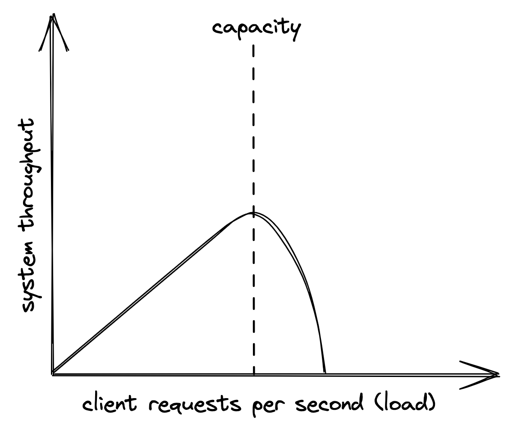
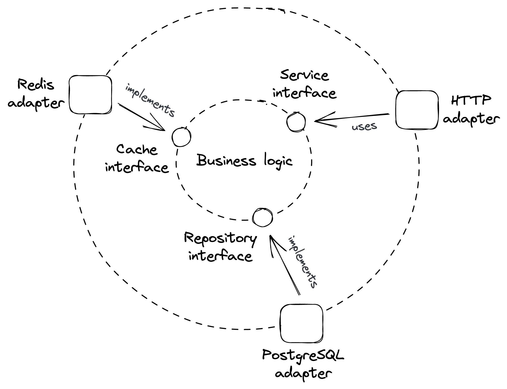

# 简介

> “分布式系统是这样一种系统，其中你甚至不知道存在的计算机发生故障会导致你自己的计算机无法使用。”
>
> ——莱斯利·兰波特

简单地说，分布式系统是一组节点，它们通过在通信链路上交换消息来完成某些任务。节点通常可以指代物理机器，如电话，或软件进程，如浏览器。

为什么我们首先要费心构建分布式系统？

一些应用程序本质上是分布式的。例如，Web 是你非常熟悉的分布式系统。你可以使用在你的手机、平板电脑、台式机或 Xbox 上运行的浏览器访问它。它与全球其他数十亿台设备一起构成了一个分布式系统。

构建分布式系统的另一个原因是某些应用程序需要高可用性，并且需要对单节点故障具有弹性。例如，Dropbox 会跨多个节点复制你的数据，因此丢失一个节点不会导致你的数据丢失。

一些应用程序需要处理太大而无法容纳在单个节点上的工作负载，无论它多么强大。例如，谷歌每秒从全球接收数以万计的搜索请求。单个节点无法处理。

最后，一些应用程序的性能要求在物理上是单节点无法实现的。 Netflix 可以将电影以高分辨率无缝流式传输到你的电视，因为它有一个靠近你的数据中心。

本书解决了设计、构建和操作分布式系统需要解决的基本挑战。

## 1.1 通信

第一个挑战源于节点通过网络相互通信的需要。例如，当你的浏览器想要加载一个网站时，它会从 URL 中解析服务器的 IP 地址并向其发送 HTTP 请求。反过来，服务器返回带有页面内容的响应。

网络上的请求和响应消息是如何表示的？当出现临时网络中断或某些故障网络交换机翻转消息中的几位时会发生什么？服务器如何保证没有中介可以窥探通信？

尽管假设某些网络库将抽象所有通信问题会很方便，但实际上，这并不是那么简单，因为抽象会泄漏1，并且你需要了解网络堆栈在发生这种情况时是如何工作的。

## 1.2 协同

构建分布式系统的另一个艰巨挑战是，需要某种形式的协同来使各个节点朝着一个共同的目标协同工作。在出现故障的情况下，这尤其具有挑战性。 “两将”问题就是一个著名的思想实验，它展示了这一点。

假设两个将军（节点），每个都指挥自己的军队，需要商定一个时间来联合攻击一个城市。军队之间有一定的距离（网络），唯一的交流方式是通过信使，信使可以被敌人俘虏（网络故障）。在这些假设下，有没有办法让将军们就时间达成一致？

好吧，将军 1 可以向将军 2 发送一条带有建议时间的消息。但是由于可以捕获信使，将军 1 不会知道该消息是否实际传递。你可能会争辩说，将军 2 可以发送一个带有响应的信使，以确认它收到了原始消息。然而，和以前一样，将军 2 不知道响应是否实际传递，需要再次确认。事实证明，无论经过多少轮确认，任何一位将军都无法确定对方军队是否会同时攻城略地。如你所见，这个问题比最初出现的要难解决。

因为协同是一个如此重要的话题，所以本书的第二部分致力于理解用于实现它的基本分布式算法。

## 1.3 可扩展性

应用程序的性能代表它处理负载的效率。直观地说，负载是消耗系统资源的任何东西，例如 CPU、内存和网络带宽。由于负载的性质取决于应用程序的用例和架构，因此有不同的方法来衡量它。例如，并发用户的数量或写入与读取的比率是不同形式的负载。

对于本书中讨论的应用程序类型，性能通常以吞吐量和响应时间来衡量。吞吐量是应用程序每秒处理的请求数，而响应时间是从向应用程序发送请求到收到响应所经过的时间（以秒为单位）。

随着负载的增加，应用程序最终将达到其容量，即当资源耗尽时它可以承受的最大负载。如图 1.1 所示，该点的性能要么停滞不前，要么恶化。如果系统上的负载继续增长，它最终会达到大多数操作失败或超时的地步。

图 1.1：y 轴上的系统吞吐量是客户端请求的子集（x 轴），可以无错误地处理且响应时间短，也称为吞吐量。

分布式系统的容量取决于其架构、实现以及复杂的物理限制网络，例如节点的内存大小和时钟周期以及网络链接的带宽和延迟。对于可扩展的应用程序，负载增加不应降低应用程序的性能。这就需要随意增加应用的容量。

一种快速简便的方法是购买性能更好的更昂贵的硬件，这也称为扩展。不幸的是，当这种硬件不存在时，这种方法迟早会碰壁。另一种方法是通过向系统中添加更多商品机器并让它们一起工作来扩展。

尽管在几十年前随意采购额外的机器可能令人生畏，但云提供商的兴起使这变得微不足道。 2006 年，亚马逊推出了亚马逊网络服务 (AWS)，其中包括通过其弹性计算云 (EC22) 服务租用虚拟机的能力。从那时起，云提供商和云服务的数量只会增加，从而使创建可扩展应用程序的能力民主化。

在本书的第三部分，我们将探索可扩展的云原生应用程序的核心架构模式和构建块。

## 1.4 弹性

当分布式系统即使在发生故障时也能继续完成其工作时，它是有弹性的。在规模上，任何可能出错的事情都会出错。每个组件都有发生故障的概率——节点可能崩溃，网络链接可能被切断等等。无论这个概率有多小，组件越多，系统执行的操作越多，故障的数量就会越高。而且情况会变得更糟，因为如果组件没有很好地隔离，一个组件的故障会增加另一个组件发生故障的可能性。

未检查的故障会影响系统的可用性3，即系统可用的时间百分比。这是一个比率，定义为应用程序可以服务请求的时间量（正常运行时间）除以测量的总时间（正常运行时间加上停机时间，即应用程序不能服务请求的时间）。

可用性通常用 “9” 来描述，这是一种表示可用性百分比的简写方式。三个 9 通常被用户认为是可以接受的，超过 4 个 “9” 的任何东西都被认为是高度可用的。

可用性 每天停机时间百分比

- 90%（“一九”）2.40小时
- 99%（“两个九”）14.40 分钟
- 99.9%（“三个九”）1.44 分钟
- 99.99%（“四个九”）8.64 秒
- 99.999%（“五个九”）864 毫秒

如果系统对故障没有弹性，它的可用性将不可避免地下降。正因为如此，分布式系统需要接受故障并准备好使用冗余、故障隔离和自我修复机制等技术来承受故障，我们将在第四部分，弹性中讨论这些问题。

## 1.5 可维护性

众所周知的事实是，软件的大部分成本都花在了最初开发后的维护活动上，例如修复错误、添加新功能和运行它。因此，我们应该立志使我们的系统易于修改、扩展和操作，以便易于维护。

任何变化都是等待发生的潜在事件。良好的测试——以单元、集成和端到端测试的形式——是修改或扩展系统的最低要求，而不必担心系统会崩溃。并且一旦将更改合并到代码库中，就需要安全地将其发布到生产环境中，而不会影响系统的可用性。

此外，运营商需要监控系统的运行状况，调查性能下降并在无法自我修复时恢复服务。这需要在不更改代码的情况下更改系统的行为，例如，切换功能标志或通过更改配置扩展服务。

从历史上看，开发人员、测试人员和运维人员属于不同的团队，但微服务和 DevOps 的兴起改变了这一点。如今，设计和实施系统的同一团队也负责测试和操作它。这是一件好事，因为没有比随叫随到更好的方法来发现系统的不足之处。第五部分将探讨测试和操作分布式系统的最佳实践。

## 1.6 分布式系统剖析

分布式系统有各种形状和大小。在本书中，我们主要关注在商业机器上运行并实现某种业务服务的后端应用程序。所以你可以说分布式系统是一组通过网络链接进行通信的机器。但是，从运行时的角度来看，分布式系统是一组软件进程，它们通过 HTTP 等进程间通信 (IPC) 机制进行通信。从实现的角度来看，分布式系统是一组松散耦合的组件（服务），它们通过 API 进行通信。所有这些都是有效且有用的架构观点。在本书的其余部分，我们将根据哪个更适合讨论特定主题来切换它们。

服务实现了整个系统功能的一个特定部分。服务的核心是业务逻辑，它公开接口以便与外界通信。一些接口定义了服务向其用户提供的操作。相反，其他定义了服务可以在其他服务上调用的操作，例如数据存储、消息代理等。

由于进程不能直接调用彼此的接口，因此需要适配器将 IPC 机制连接到服务接口。入站适配器是服务的应用程序编程接口 (API) 的一部分；它通过调用服务接口中定义的操作来处理从 IPC 机制（如 HTTP）接收到的请求。相反，出站适配器授予业务逻辑访问外部服务的权限，例如数据存储。这种架构风格也称为端口和适配器架构4。这个想法是业务逻辑不依赖于技术细节；相反，技术细节取决于业务逻辑（依赖倒置原则5）。这个概念如图 1.2 所示。

图 1.2：在本例中，业务逻辑使用由 PostgreSQL 适配器实现的存储库接口来访问数据库。相反，HTTP 适配器通过调用服务接口中定义的操作来处理传入请求。

展望未来，我们将把运行服务的进程称为服务器，将向服务器发送请求的进程称为客户端。有时，一个进程既是客户端又是服务器。为简单起见，我们假设服务的单个实例完全在单个服务器进程中运行。同样，我们还将假设一个进程有一个线程。这些假设将允许我们忽略一些实施细节，这些细节只会使讨论复杂化而不会增加太多价值。

1. “泄漏抽象法则”，https://www.joelonsoftware.com/2002/11/11/the-law-of-leaky-abstractions/
2. “亚马逊 EC2”，https://aws.amazon.com/ec2/
3. “AWS 架构完善的框架，可用性”，https://docs.aws.amazon.com/wellarchitected/latest/reliability-pillar/availability.html
4. “端口和适配器架构”，http://wiki.c2.com/?PortsAndAdaptersArchitecture
5. “依赖倒置原则”，https://en.wikipedia.org/wiki/Dependency_inversion_principle