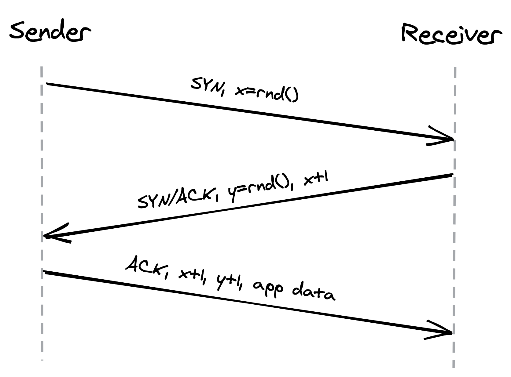
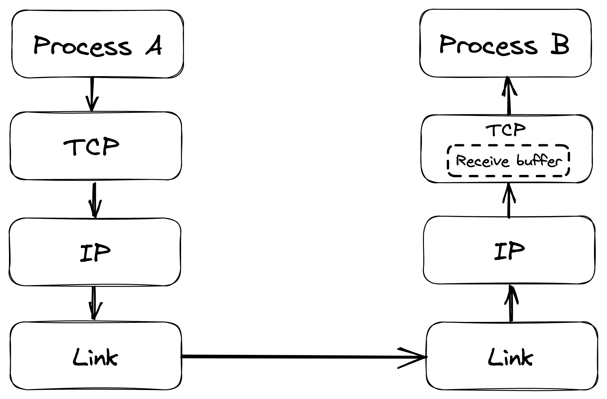
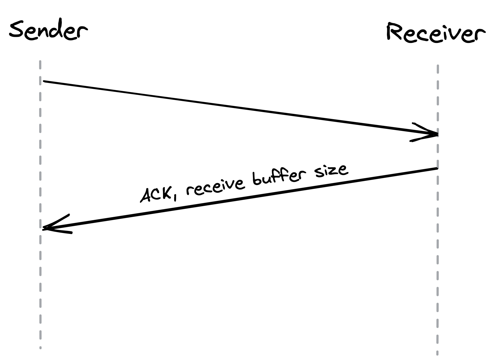
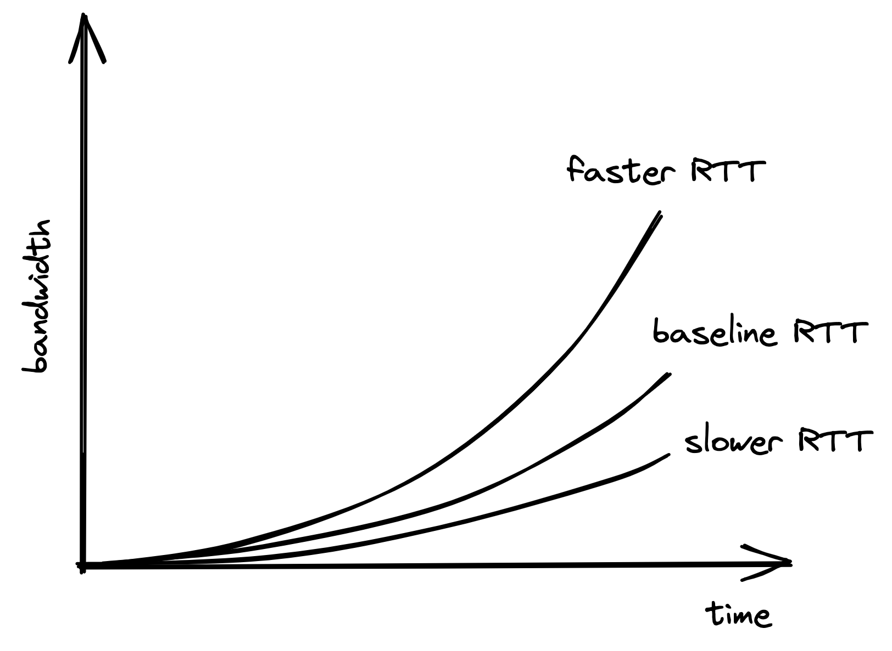

# 可靠链接

在互联网层，两个节点之间的通信是通过将数据包从一个路由器路由到下一个路由器来实现的。为此需要两个要素：寻址节点的方法和跨路由器路由数据包的机制。

寻址由 IP 协议处理。例如，IPv6 提供 128 位的地址空间，允许2 ^128^ 地址。为了决定将数据包发送到哪里，路由器需要查阅本地路由表。该表将目标地址映射到通往该目标的路径上的下一个路由器的地址。跨路由器构建和通信路由表的责任在于边界网关协议 (BGP1)。

现在，IP 不能保证通过 Internet 发送的数据会到达目的地。例如，如果路由器过载，它可能会开始丢弃数据包。这就是 TCP 2 的用武之地，它是一种传输层协议，它在 IP 之上公开两个进程之间的可靠通信通道。 TCP 保证字节流按顺序到达，没有间隙、重复或损坏。 TCP 还实现了一组稳定性模式以避免网络和接收器不堪重负。

## 2.1 可靠性

为了创造可靠通道的假象，TCP 将字节流划分为称为段的离散数据包。这些段按顺序编号，这允许接收器检测孔洞和重复。发送的每个段都需要由接收方确认。如果没有发生这种情况，发送端会触发一个计时器并重新传输该段。为确保数据在传输过程中没有损坏，接收方使用校验和来验证已交付段的完整性。

## 2.2 连接生命周期

在 TCP 通道上传输任何数据之前，需要打开连接。操作系统通过套接字管理两端的连接状态。套接字在其生命周期内跟踪连接的状态变化。在高层次上，连接可以处于三种状态：

- 正在创建连接的打开状态。
- 连接打开且正在传输数据的已建立状态。
- 正在关闭连接的关闭状态。

实际上，这是一种简化，因为状态 3 比上述三个多。

在建立连接之前，服务器必须监听来自客户端的连接请求。 TCP 使用三次握手来创建一个新的连接，如图 2.1 所示：

1. 发送方选择一个随机序列号 x 并向接收方发送一个 SYN 段。
2. 接收方增加 x，选择一个随机序列号 y，然后发回一个 SYN/ACK 段。
3. 发送者增加序列号并回复 ACK 段和应用程序数据的第一个字节。

TCP 使用序列号来确保数据按顺序传递且没有漏洞。

握手引入了一个完整的往返过程，其中不发送应用程序数据。因此，在打开连接之前，带宽基本上为零。往返时间越短，建立连接的速度就越快。因此，让服务器更靠近客户端有助于减少这种冷启动损失。

数据传输完成后，需要关闭连接，释放两端的所有资源。该终止阶段涉及多次往返。如果可能很快会发生另一次传输，则保持连接打开以避免再次支付冷启动税是有意义的。

此外，关闭套接字并不会立即处理它，因为它会转换到持续几分钟的等待状态（TIME_WAIT）并丢弃在等待期间收到的任何段。等待防止来自关闭连接的延迟段被视为新连接的一部分。但是如果很多连接快速打开和关闭，处于等待状态的套接字数量会不断增加，直到达到可以打开的最大套接字数，导致新的连接尝试失败。这是进程通常维护连接池以避免重复重新创建连接的另一个原因。

## 2.3 流量控制

流量控制是 TCP 实现的一种退避机制，用于防止发送方压倒接收方。接收器将等待应用程序处理的传入 TCP 段存储到接收缓冲区中，如图 2.2 所示。

图 2.2：接收缓冲区存储目标进程尚未处理的数据。

每当接收方确认一个时段，它也会将缓冲区的大小传达给发送方，如图 2.3 所示。假设它遵守协议，发送方会避免发送超出接收方缓冲区容量的数据。

图 2.3：接收缓冲区的大小在确认段的标头中传达。

这种机制与服务级别的速率限制并无太大不同，后者是一种在超过特定配额时拒绝请求的机制（参见第 28.3 节）。但是，TCP 不是对 API 密钥或 IP 地址进行速率限制，而是对连接级别进行速率限制。

## 2.4 拥塞控制

TCP 不仅可以防止使接收方不堪重负，还可以防止淹没底层网络。发送方维护一个所谓的拥塞窗口，它表示无需对方确认即可发送的未完成段的总数。拥塞窗口越小，在任何给定时间可以传输的字节越少，使用的带宽就越少。

当建立新连接时，拥塞窗口的大小设置为系统默认值。然后，对于每个确认的数据段，窗口会以指数方式增加其大小，直到达到上限。这意味着我们不能在建立连接后立即使用网络的全部容量。往返时间 (RTT) 越短，发送方就可以越快开始利用底层网络的带宽，如图 2.4 所示。

图 2.4：往返时间越短，发送方越快开始利用底层网络的带宽。

如果数据段段丢失了怎么办？当发送方通过超时检测到丢失的确认时，一种称为拥塞避免的机制就会启动，并减小拥塞窗口的大小。从那以后，时间的流逝将窗口大小增加了一定量，而超时又减少了一个量。

如前所述，拥塞窗口的大小定义了在没有收到确认的情况下可以发送的最大字节数。因为发送方需要等待一个完整的往返行程才能得到确认，所以我们可以通过将拥塞窗口的大小除以往返时间得出最大理论带宽：

带宽 = 窗口大小 / 往返时间

等式 5 表明带宽是延迟的函数。 TCP 将非常努力地优化窗口大小，因为它对往返时间无能为力。但是，这并不总是产生最佳配置。由于拥塞控制的工作方式，往返时间越短，底层网络带宽的利用就越好。这更有理由让服务器在地理位置上靠近客户端。

## 2.5 自定义协议

TCP 的可靠性和稳定性是以低于底层网络所能提供的带宽和更高延迟为代价的。如果我们放弃 TCP 提供的稳定性和可靠性机制，我们会得到一个名为用户数据报协议 6 (UDP) 的简单协议——一种可用作 TCP 替代品的无连接传输层协议。

与 TCP 不同，UDP 不向其客户端公开字节流的抽象。因此，客户端只能发送大小有限的离散数据包，称为数据报。 UDP 不提供任何可靠性，因为数据报没有序列号并且不被确认。 UDP 也不实现流量和拥塞控制。总体而言，UDP 是一种精简且简单的协议。它用于引导自定义协议，这些协议提供 TCP 提供的部分但不是全部的稳定性和可靠性保证7。

例如，在多人游戏中，客户端每秒对游戏手柄事件进行多次采样，并将它们发送到跟踪全局游戏状态的服务器。同样，服务器每秒对游戏状态进行多次采样，并将这些快照发送回客户端。如果快照在传输过程中丢失，那么随着游戏的实时发展，重新传输它就没有任何价值；当重新传输的快照到达目的地时，它已经过时了。这是 UDP 大放异彩的用例；相反，TCP 会尝试重新传递丢失的数据并降低游戏体验。

---------------------

1. “RFC 4271：边界网关协议 4 (BGP-4)”，https://datatracker.ietf.org/doc/html/rfc4271
2. “RFC 793：传输控制协议”，https://tools.ietf.org/html/rfc793
3. “TCP 状态图”，https://en.wikipedia.org/wiki/Transmission_Control_Protocol#/media/File:Tcp_state_diagram_fixed_new.svg
4. “CUBIC：一种新的 TCP 友好型高速 TCP 变体”，https://citeseerx.ist.psu.edu/viewdoc/download?doi=10.1.1.153.3152&rep=rep1&type=pdf
5. “带宽延迟产品”，https://en.wikipedia.org/wiki/Bandwidth-delay_product
6. “RFC 768：用户数据报协议”，https://datatracker.ietf.org/doc/html/rfc768
7. 正如我们稍后会看到的，HTTP 3 基于 UDP 来避免 TCP 的一些缺点。