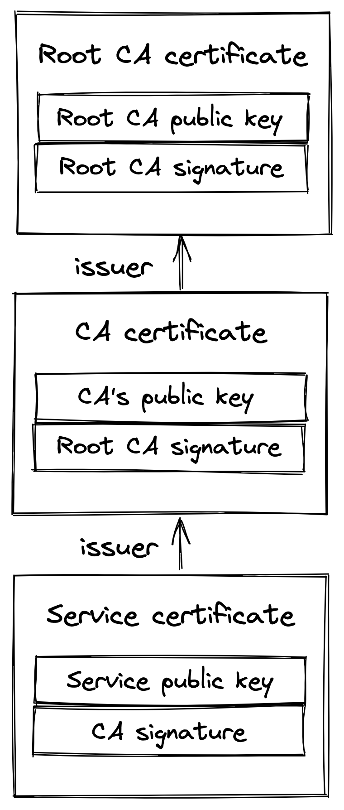

# 安全链接

我们现在知道如何通过网络可靠地将字节从一个进程发送到另一个进程。问题是这些字节是明文发送的，中间人可以拦截通信。为了防止这种情况，我们可以使用传输层安全性[^1] (TLS) 协议。 TLS 在 TCP 之上运行并加密通信通道，以便应用层协议（如 HTTP）可以利用它进行安全通信。简而言之，TLS 提供加密、身份验证和完整性的校验功能。

## 3.1 加密

加密保证客户端和服务器之间传输的数据是混淆的，并且只能由通信进程读取。

首次打开 TLS 连接时，客户端和服务器使用非对称加密协商共享加密密钥。首先，每一方生成一个由私钥和公钥组成的密钥对。然后，这些进程可以通过交换它们的公钥来创建共享秘密。这要归功于密钥对的一些数学特性[^2]。这种方法的美妙之处在于，共享秘密永远不会通过网络进行通信。

尽管非对称加密速度慢且成本高，但它仅用于创建共享加密密钥。之后，使用对称加密，既快速又便宜。共享密钥会定期重新协商，以最大限度地减少共享密钥被破坏时可以破译的数据量。

加密传输中的数据会消耗 CPU，但由于现代处理器具有专用的加密指令，因此可以忽略不计。因此，TLS 应该用于所有通信，即使是那些不通过公共互联网的通信。

## 3.2 认证

尽管我们有办法混淆通过网络传输的数据，但客户端仍然需要对服务器进行身份验证，以验证它的身份。同样，服务器可能想要验证客户端的身份。

TLS 使用基于非对称加密的数字签名实现身份验证。服务器生成具有私钥和公钥的密钥对，并与客户端共享其公钥。当服务器向客户端发送消息时，它会使用其私钥对其进行签名。客户端使用服务器的公钥来验证数字签名实际上是用私钥签名的。这要归功于密钥对的数学特性[^3]。

这种方法的问题是客户端不知道服务器共享的公钥是否真实。因此，该协议使用证书来证明公钥的所有权。证书包括有关拥有实体、到期日期、公钥和颁发证书的第三方实体的数字签名的信息。证书的颁发实体称为证书颁发机构 (CA)，它也用证书表示。这将创建一个以根 CA 颁发的证书结尾的证书链，如图 3.1 所示，该证书对其证书进行自签名。

要使设备信任 TLS 证书，该证书或其祖先之一必须存在于客户端的受信任存储中。受信任的根 CA，例如 Let's Encrypt[^4]，通常由操作系统供应商默认包含在客户端的受信任存储中。

图 3.1：证书链以根 CA 颁发的自签名证书结束。

当 TLS 连接打开时，服务器将完整的证书链发送到客户端，从服务器的证书开始，到根 CA 结束。客户端通过扫描证书链来验证服务器的证书，直到找到它信任的证书。然后，从链中的该点以相反的顺序验证证书。验证会检查几件事，例如证书的到期日期以及数字签名是否实际上是由发行 CA 签署的。如果验证到达路径中的最后一个证书（服务器自己的证书）且没有错误，则验证路径，并验证服务器。

使用 TLS 时最常见的错误之一是让证书过期。发生这种情况时，客户端将无法验证服务器的身份，并且打开与远程进程的连接将失败。这可能会导致整个应用程序崩溃，因为客户端无法再与其连接。出于这个原因，自动监控和自动更新接近到期的证书是非常值得的投资。

## 3.3 诚信

即使数据被混淆，中间人仍然可以篡改它；例如，可以交换消息中的随机位。为了防止篡改，TLS 通过计算消息摘要来验证数据的完整性。安全散列函数用于创建消息验证码 [^5] (HMAC)。当进程接收到消息时，它会重新计算消息的摘要并检查它是否与消息中包含的摘要匹配。如果不是，则消息在传输过程中已损坏或已被篡改。在这种情况下，消息被丢弃。

TLS HMAC 还可以防止数据损坏，而不仅仅是篡改。如果 TCP 应该保证数据的完整性，你可能想知道如何破坏数据。虽然 TCP 确实使用校验和来防止数据损坏，但它并不是 100% 可靠[^6]：它无法检测到大约 1600 万到 100 亿个数据包中的 1 个错误。对于 1 KB 的数据包，预计每传输 16 GB 到 10 TB 就会发生一次。

## 3.4 握手

当建立新的 TLS 连接时，客户端和服务器之间会发生握手，在此期间：

1. 各方同意使用的密码套件。密码套件指定客户端和服务器打算用来创建安全通道的不同算法，例如：
   1. 用于生成共享秘密的密钥交换算法；
   2. 用于签署证书的签名算法；
   3. 用于加密应用程序数据的对称加密算法；
   4. HMAC 算法用于保证应用程序数据的完整性和真实性。
2. 各方使用密钥交换算法来创建共享秘密。对称加密算法使用共享密钥来加密未来安全通道上的通信。
3. 客户端验证服务器提供的证书。验证过程确认服务器就是它所说的那个人。如果验证成功，客户端可以开始向服务器发送加密的应用数据。服务器还可以选择验证客户端证书（如果可用）。

这些操作不一定按此顺序发生，因为现代实现使用多种优化来减少往返。例如，握手通常需要使用 TLS 1.2 进行 2 次往返，而使用 TLS 1.3 只需进行一次。底线是创建一个新的连接不是免费的：这也是让你的服务器在地理上更靠近客户端并尽可能重用连接的另一个原因。

------------------------

[1] "RFC 8446：传输层安全 (TLS) 协议版本 1.3": https://datatracker.ietf.org/doc/html/rfc8446

[2] "关于椭圆曲线密码学的（相对容易理解的）入门: "https://blog.cloudflare.com/a-relatively-easy-to-understand-primer-on-elliptic-curve-cryptography/

[3] "数字签名": https://en.wikipedia.org/wiki/Digital_signature

[4] "让我们加密：一个非营利的证书颁发机构": https://letsencrypt.org/

[5] "RFC 2104：HMAC：用于消息身份验证的密钥哈希":  https://datatracker.ietf.org/doc/html/rfc2104

[6] "当 CRC 和 TCP 校验和不一致时": https://dl.acm.org/doi/10.1145/347057.347561