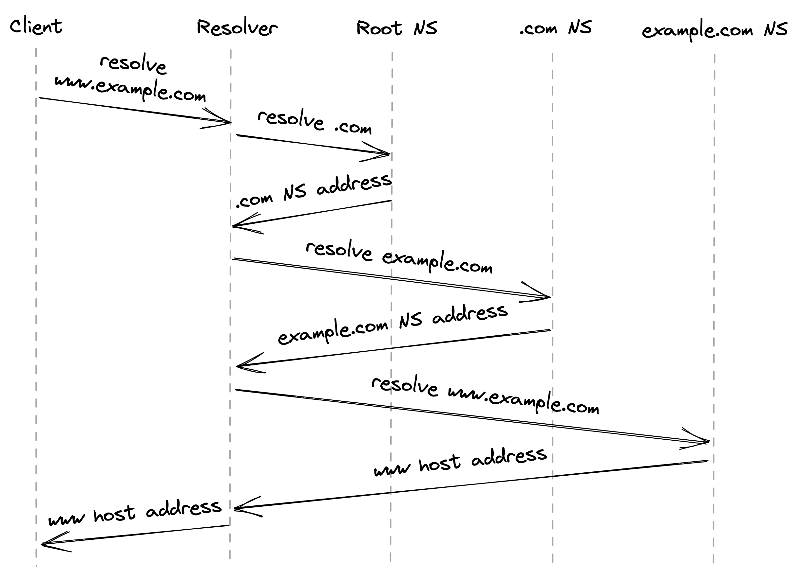

# 发现

到目前为止，我们已经探索了如何在不同机器上运行的两个进程之间创建可靠且安全的通道。但是，要创建与远程进程的新连接，我们必须首先以某种方式发现其 IP 地址。最常见的方法是通过互联网的电话簿：域名系统[^1] (DNS) — 一种分布式、分层且最终一致的键值存储。

在本章中，我们将了解 DNS 解析[^2] 在浏览器中是如何工作的，但其他类型的客户端的过程类似。当你在浏览器中输入 URL 时，第一步是解析主机名的 IP 地址，然后使用该地址打开新的 TLS 连接。例如，让我们看看当你在浏览器中键入 ```www.example.com``` 时 DNS 解析是如何工作的（见图 4.1）。

1. 浏览器检查其本地缓存以查看它之前是否已解析主机名。如果是，则返回缓存的 IP 地址；否则，它将请求路由到 DNS 解析器，该服务器通常由你的 Internet 服务提供商 (ISP) 托管。
2. 解析器负责为其客户端迭代解析主机名。其迭代的原因将在一瞬间变得显而易见。解析器首先检查其本地缓存中是否有缓存条目，如果找到，则将其返回给客户端。如果不是，则将查询发送到根名称服务器（根 NS）。
3. 根名称服务器将请求的顶级域 (TLD)（即 .com）映射到负责它的名称服务器的地址。
4. 解析器将 ```example.com``` 的解析请求发送到 TLD 名称服务器。
5. TLD 名称服务器将 example.com 域名映射到负责该域的权威名称服务器的地址。
6. 最后，解析器向权威名称服务器查询 ```www.example.com```，它返回 www 主机名的 IP 地址。

如果查询包含 ```example.com``` 的子域，例如 news.example.com，则权威名称服务器将返回负责子域的名称服务器的地址，并且需要额外的请求。



图 4.1：DNS 解析过程

出于效率原因，最初的 DNS 协议主要通过 UDP 发送纯文本消息。然而，由于这允许任何监控传输的人窥探，该行业大多转向安全替代方案，例如基于 TLS[^3] 的 DNS。

在最坏的情况下，解析过程涉及多次往返，但它的美妙之处在于根名称服务器的地址是解析主机名所需的全部。也就是说，如果每个请求都必须经过多次名称服务器查找，则解析速度会很慢。不仅如此，还要考虑名称服务器处理全局解析负载所需的规模。所以缓存被用来加速解析过程，因为域名到 IP 地址的映射不会经常改变——浏览器、操作系统和 DNS 解析器都在内部使用缓存。

这些缓存如何知道记录何时到期？每个 DNS 记录都有一个生存时间 (TTL)，它通知缓存条目的有效时间。但是不能保证客户端玩得很好并强制执行 TTL。因此，当你更改 DNS 条目并发现少数客户端在 TTL 过期很久后仍在尝试连接到旧地址时，请不要感到惊讶。

设置 TTL 需要做出权衡。如果你使用较长的 TTL，许多客户端将在很长一段时间内看不到变化。但是，如果你将其设置得太短，则会增加名称服务器的负载和请求的平均响应时间，因为客户端将不得不更频繁地解析主机名。

如果你的名称服务器因任何原因变得不可用，那么记录的 TTL 越小，受影响的客户端数量就越多。 DNS 很容易成为单点故障——如果你的 DNS 名称服务器已关闭并且客户端无法找到你的应用程序的 IP 地址，他们将无法连接它。这可能导致大规模中断[^4]。

这给我们带来了一个有趣的观察。如果 DNS 缓存在无法到达名称服务器时为陈旧条目提供服务，而不是将 TTL 视为定时炸弹，那么 DNS 对故障的鲁棒性可能会大得多。由于条目很少更改，因此提供陈旧的条目可以说比根本不提供任何条目要强大得多。即使依赖关系受损，系统也应继续运行的原则也称为"静态稳定性"；我们将在本书的弹性部分详细讨论它。

--------------------

[1] "RFC 1035：域名 - 实施和规范": https://datatracker.ietf.org/doc/html/rfc1035

[2] "深入了解 DNS": https://www.youtube.com/watch?v=drWd9HIhJdU

[3] "RFC 7858：DNS over Transport Layer Security (TLS) 规范": https://en.wikipedia.org/wiki/DNS_over_TLS

[4] "对 Dyn 的 DDoS 攻击": https://en.wikipedia.org/wiki/2016_Dyn_cyberattack