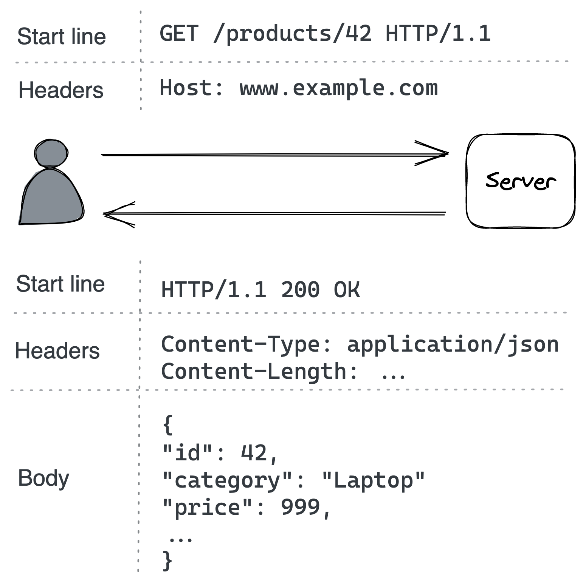

# API

现在我们知道客户端如何发现服务器的 IP 地址并与它创建可靠且安全的通信链接，我们希望客户端调用服务器提供的操作。为此，服务器使用一个适配器——它定义了它的应用程序编程接口（API）——将从通信链路接收到的消息转换为由它的业务逻辑实现的接口调用（见图 1.2）。

客户端和服务器之间的通信方式可以是直接的或间接的，这取决于客户端是直接与服务器通信还是通过代理间接通信。直接通信要求两个进程都已启动并运行，通信才能成功。但是，有时这种保证不是必需的，或者很难实现，在这种情况下，间接通信更合适。间接通信的一个例子是消息传递。在该模型中，发送方和接收方不直接通信，而是通过消息通道（代理）交换消息。发送者向通道发送消息，而在另一端，接收者从中读取消息。稍后在第 23 章中，我们将看到消息通道是如何实现的以及如何最好地使用它们。

在本章中，我们将重点关注一种称为请求-响应的直接通信方式，其中客户端向服务器发送请求消息，服务器以响应消息进行回复。这类似于函数调用，但跨越进程边界和网络。

请求和响应消息包含以与语言无关的格式序列化的数据。格式的选择决定了消息的序列化和反序列化速度，是否人类可读，以及随着时间的推移演变它的难度。像 JSON[^1] 这样的文本格式是自描述和人类可读的，但代价是增加了冗长和解析开销。另一方面，像 Protocol Buffers[^2] 这样的二进制格式比文本格式更精简、更高效，但牺牲了人类的可读性。

当客户端向服务器发送请求时，它可以阻塞并等待响应到达，从而使通信同步。或者，它可以要求出站适配器在收到响应时调用回调，从而使通信异步。

同步通信效率低下，因为它阻塞了可以用来做其他事情的线程。一些语言，如 JavaScript、C# 和 Go，可以通过 async/await[^3] 等语言原语完全隐藏回调。这些原语使编写异步代码与编写同步代码一样简单。

用于请求-响应交互的常用 IPC 技术是 HTTP 和 gRPC[^4]。通常，用于组织内服务器到服务器通信的内部 API 是使用 gRPC 等高性能 RPC 框架实现的。相比之下，公众可用的外部 API 往往基于 HTTP，因为 Web 浏览器可以轻松地通过 JavaScript 代码发出 HTTP 请求。

用于设计优雅且可扩展的 HTTP API 的一组流行的设计原则是具象状态传输 (REST[^5])，基于这些原则的 API 被称为 RESTful。例如，这些原则包括：

- 请求是无状态的，因此每个请求都包含处理它所需的所有必要信息；
- 响应被隐式或显式标记为可缓存或不可缓存。如果响应是可缓存的，则客户端可以将响应重用于稍后的等效请求。

鉴于 RESTful HTTP API 无处不在，我们将在本章的其余部分介绍创建 HTTP API 的过程。

## 5.1 HTTP

HTTP[^6] 是一种请求-响应协议，用于在客户端和服务器之间编码和传输信息。 在 HTTP 事务中，客户端向服务器的 API 端点发送请求消息，服务器以响应消息回复，如图 5.1 所示。

在 HTTP 1.1 中，消息是包含起始行、一组标头和可选正文的文本数据块：

- 在请求消息中，起始行指示请求的目的，在响应消息中，指示请求是否成功。
- 标头是键值对，带有描述消息的元数据。
- 消息体是数据的容器。



图 5.1：浏览器和 Web 服务器之间的 HTTP 事务示例

HTTP 是一种无状态协议，这意味着服务器处理请求所需的一切都需要在请求本身中指定，而无需来自先前请求的上下文。 HTTP 使用 TCP 来保证第 2 章中讨论的可靠性。当它在 TLS 之上运行时，它也称为 HTTPS。

HTTP 1.1 默认情况下保持与服务器的连接打开，以避免需要为下一个事务创建新的连接。但是，在收到对前一个请求的响应之前，不能发出新请求（也称为线头阻塞或 HOL 阻塞）；换句话说，交易必须被序列化。例如，需要获取多张图像来呈现 HTML 页面的浏览器必须一次下载一张，这可能非常低效。

尽管 HTTP 1.1 在技术上允许某些类型的请求被流水线化[^7]，但它仍然受到 HOL 阻塞的影响，因为单个慢速响应将阻塞它之后的所有响应。对于 HTTP 1.1，提高传出请求吞吐量的典型方法是创建多个连接。但是，这是有代价的，因为连接会消耗内存和套接字等资源。

HTTP 2[^8] 的设计初衷是为了解决 HTTP 1.1 的主要限制。它使用二进制协议而不是文本协议，允许它在同一连接上多路复用多个并发请求-响应事务（流）。 2020 年初，互联网上访问量最大的网站中约有一半使用新的 HTTP 2 标准。

HTTP 3[^9] 是 HTTP 标准的最新版本，它基于 UDP 并实现了自己的传输协议来解决 TCP 的一些缺点[^10]。例如，对于 HTTP 2，TCP 连接上的数据包丢失会阻塞所有流 (HOL)，但对于 HTTP 3，数据包丢失只会中断一个流，而不是所有流。

本书使用 HTTP 1.1 标准进行说明，因为它的纯文本格式更易于显示。而且，HTTP 1.1 仍然被广泛使用。

## 5.2 资源

假设我们想要实现一个服务来管理电子商务应用程序的产品目录。该服务必须允许客户浏览目录并允许管理员创建、更新或删除产品。虽然这听起来很简单，但为了通过 HTTP 公开此服务，我们首先需要了解如何使用 HTTP 对 API 进行建模。

HTTP 服务器托管资源，其中资源可以是物理或抽象实体，如文档、图像或其他资源的集合。 URL 通过描述资源在服务器上的位置来标识资源。

在我们的目录服务中，产品集合是一种资源，可以通过 ```https://www.example.com/products?sort=price``` 等 URL 访问，其中：

- ```https```是协议；
- ```www.example.com``` 是主机名；
- ```products``` 是资源的名称；
- ```?sort=price``` 是查询字符串，其中包含影响服务如何处理请求的附加参数；在这种情况下，响应中返回的产品列表的排序顺序。

没有查询字符串的 URL 也称为 API 的 ```/products``` 端点。

URL 还可以对资源之间的关系进行建模。例如，由于产品是属于产品集合的资源，因此具有唯一标识符 42 的产品可以具有以下相对 URL：```/products/42```。如果产品也有与之关联的评论列表，我们可以将其资源名称附加到产品的 URL，即 ```/products/42/reviews```。然而，随着资源嵌套的增加，API 变得更加复杂，因此这是一种平衡行为。

命名资源只是等式的一部分； 当它们在请求和响应消息的主体中传输时，我们还必须对线路上的资源进行序列化。 当客户端发送请求以获取资源时，它会在消息中添加特定的标头以描述资源的首选表示。 服务器使用这些标头为响应选择最合适的表示[^11]。 通常，在 HTTP API 中，JSON 用于表示非二进制资源。 例如，这是 ```/products/42``` 的表示形式：

```json
{
    "id": 42,
    "category": "Laptop",
    "price": 999
}
```

## 5.3 请求方法

HTTP 请求可以使用请求方法创建、读取、更新和删除 (CRUD) 资源。当客户端向服务器请求特定资源时，它会指定要使用的方法。你可以将请求方法视为对资源使用的动词或操作。

最常用的方法是 POST、GET、PUT 和 DELETE。例如，我们的目录服务的 API 可以定义如下：

- *POST* ```/products``` — 创建一个新产品并返回新资源的 URL。
- *GET* ```/products``` — 检索产品列表。查询字符串可用于对集合进行过滤、分页和排序。
- *GET* ```/products/42``` — 检索产品 42。
- *PUT* ```/products/42``` — 更新产品 42。
- *DELETE* ```/products/42``` — 删除产品 42。

请求方法可以根据是否安全和是否幂等进行分类。安全的方法不应该有任何可见的副作用，并且可以安全地被缓存。一个幂等方法可以执行多次，最终结果应该和只执行一次一样。幂等性是 API 的一个重要方面，我们将在后面的 5.7 节中详细讨论它。

方法安全幂等

| 方法   | 安全性 | 幂等性 |
| ------ | ------ | ------ |
| POST   | 否     | 否     |
| GET    | 是     | 是     |
| PUT    | 否     | 是     |
| DELETE | 否     | 是     |

## 5.4 响应状态码

服务器收到请求后，需要对其进行处理并将响应发送回客户端。 HTTP 响应包含一个状态码[^12] 以与客户端通信，无论请求是否成功。不同的状态码范围有不同的含义。

200 到 299 之间的状态码用于表示成功。例如，200（OK）表示请求成功，响应的正文包含请求的资源。

300 到 399 之间的状态码用于重定向。例如，301（永久移动）表示请求的资源已移动到响应消息 Location 标头中指定的不同 URL。

400 到 499 之间的状态码是为客户端错误保留的。如果重试失败并出现客户端错误的请求，通常会返回相同的错误，因为错误是由客户端问题引起的，而不是服务器问题。因此，不应重试。一些常见的客户端错误是：

- 400（错误请求）——验证客户端输入失败。
- 401（未授权）——客户端未通过身份验证。
- 403 (Forbidden) — 客户端已通过身份验证，但不允许访问资源。
- 404（未找到）——服务器找不到请求的资源。

500 到 599 之间的状态码是为服务器错误保留的。可以重试因服务器错误而失败的请求，因为导致它失败的问题可能是暂时的。这些是一些典型的服务器状态代码：

- 500（内部服务器错误）— 服务器遇到意外错误，阻止它处理请求。
- 502 (Bad Gateway) — 服务器在充当网关或代理时，在尝试处理请求时从其访问的下游服务器接收到无效响应。[^13]
- 503（服务不可用）——由于临时过载或计划维护，服务器当前无法处理请求。

## 5.5 开放API

现在我们了解了如何使用 HTTP 对 API 建模，我们可以编写一个适配器，通过调用目录服务的业务逻辑来处理 HTTP 请求。例如，假设服务由以下接口定义：

```java
interface CatalogService
{
  List<Product> GetProducts(...);
  Product GetProduct(...);
  void AddProduct(...);
  void DeleteProduct(...);
  void UpdateProduct(...)
}
```

因此，当 HTTP 适配器接收到 GET ```/products``` 请求以检索所有产品列表时，它将调用 GetProducts(...) 方法并将结果转换为 HTTP 响应。虽然这是一个简单的示例，但你可以看到适配器如何将 IPC 机制 (HTTP) 连接到业务逻辑。

我们可以通过使用接口定义语言 (IDL) 定义服务的 API 来生成 HTTP 适配器的骨架。 IDL 是 API 的与语言无关的定义，可用于以你选择的语言为服务器端适配器和客户端软件开发工具包 (SDK) 生成样板代码。

从 Swagger 项目演变而来的 OpenAPI[^14] 规范是最流行的 **RESTful HTTP API** 的 IDL 之一。有了它，我们可以在 YAML 文档中正式描述 API，包括可用的端点、支持的请求方法和每个端点的响应状态代码，以及资源的 JSON 表示的模式。

例如，可以这样定义目录服务 API 的 ```/products``` 端点的一部分：

```yaml
openapi: 3.0.0
info:
  version: "1.0.0"
  title: Catalog Service API

paths:
  /products:
    get:
      summary: List products
      parameters:
        - in: query
          name: sort
          required: false
          schema:
            type: string
      responses:
        "200":
          description: list of products in catalog
          content:
            application/json:
              schema:
                type: array
                items:
                  $ref: "#/components/schemas/ProductItem"
        "400":
          description: bad input

components:
  schemas:
    ProductItem:
      type: object
      required:
        - id
        - name
        - category
      properties:
        id:
          type: number
        name:
          type: string
        category:
          type: string
```

虽然这是一个非常简单的示例，我们不会深入探讨 OpenAPI，但它应该让你了解它的表现力。有了这个定义，我们就可以运行一个工具来生成 API 的文档、样板适配器和客户端 SDK。

## 5.6 进化

API 最初是一个精心设计的接口[^15]。缓慢但肯定地，它将不得不改变以适应新的用例。在开发 API 时，我们要做的最后一件事是引入一个重大更改，该更改要求立即修改所有客户端，其中一些我们可能无法控制。

有两种类型的更改会破坏兼容性，一种在端点级别，另一种在消息级别。例如，如果我们将 ```/products``` 端点更改为 ```/new-products```，显然会破坏尚未更新以支持新端点的客户端。这同样适用于强制以前可选的查询参数。

以向后不兼容的方式更改请求或响应消息的模式也会造成严重破坏。例如，将 Product 模式中的类别属性类型从字符串更改为数字是一项重大更改，会导致旧的反序列化逻辑在客户端中崩溃。对于使用其他序列化格式（如协议缓冲区）表示的消息，可以提出类似的论点[^16]。

应该对 REST API 进行版本控制以支持重大更改，例如，通过在 URL (/v1/products/) 中添加版本号前缀。但是，作为一般经验法则，除非有充分的理由，否则 API 应该以向后兼容的方式发展。尽管向后兼容的 API 往往不是特别优雅，但它们很实用。

## 5.7 幂等性

当 API 请求超时时，客户端不知道服务器是否真的收到了请求。例如，服务器可能已经处理了请求并在将响应发送回客户端之前就崩溃了。

客户端处理此类临时故障的一种有效方法是重试请求一次或多次，直到他们得到响应。一些 HTTP 请求方法（例如，PUT、DELETE）被认为本质上是幂等的，因为执行多个相同请求的效果与只执行一个请求相同[^17]。例如，如果服务器连续两次对同一资源处理相同的 PUT 请求，则最终效果将与 PUT 请求仅执行一次相同。

但是那些本质上不是幂等的请求呢？例如，假设客户端发出 POST 请求以将新产品添加到目录服务。如果请求超时，客户端无法知道请求是否成功。如果请求成功，重试它将创建两个相同的产品，这不是客户想要的。

为了处理这种情况，客户端可能必须实现某种协调逻辑，检查重复产品并在重试请求时将其删除。你可以看到这给客户带来了很多复杂性。与其将这种复杂性推给客户端，更好的解决方案是让服务器通过使 POST 请求具有幂等性来只创建一次产品，这样无论该特定请求重试多少次，它都会看起来好像只执行一次。

为了让服务器检测到一个请求是重复的，它需要用一个幂等键来修饰——一个唯一的标识符（例如，一个 UUID）。标识符可以是标头的一部分，例如 Stripe API[^18] 中的 Idempotency-Key。为了让服务器检测重复，它需要通过将它们存储在数据库中来记住它看到的所有请求标识符。当请求进来时，服务器会检查数据库以查看请求 ID 是否已经存在。如果不存在，它将请求标识符添加到数据库并执行请求。请求标识符不必无限期地存储，它们可以在一段时间后被清除。

现在，棘手的部分来了。假设服务器将请求标识符添加到数据库并在执行请求之前崩溃。在这种情况下，任何未来的重试都不会产生任何影响，因为服务器会认为它已经执行了它。所以我们真正想要的是对请求进行原子处理：要么服务器成功处理请求并将请求标识符添加到数据库中，要么在不存储请求标识符的情况下处理失败。

如果请求标识符和服务器管理的资源存储在同一个数据库中，我们可以保证 ACID 事务的原子性[^19]. 换句话说，我们可以在 POST 处理程序中将产品创建和请求标识符日志包装在同一个数据库事务中 . 但是，如果处理程序需要对其他服务进行外部调用来处理请求，则实现变得更具挑战性[^20]，因为它需要某种形式的协调。 稍后，在第 13.2 章中，我们将学习如何做到这一点。

现在，假设服务器可以检测到重复请求，应该如何处理呢？在我们的示例中，服务器可以向客户端响应一个状态码，表明产品已经存在。但是，客户端必须以不同于它收到第一个 POST 请求的成功响应（201 Created）的方式来处理这种情况。因此，理想情况下，服务器应该返回与第一个请求相同的响应。

到目前为止，我们只考虑了一个客户。现在，想象以下场景：

1. 客户端 A 发送创建新产品的请求。尽管请求成功，但客户端并没有收到及时的响应。
2. 客户端 B 删除新创建的产品。
3. 客户端 A 重试原始创建请求。

服务器应该如何处理第 3 步中的请求？从客户端 A 的角度来看，收到原始创建响应并不令人惊讶[^21]，而不是一些奇怪的错误提到使用该特定请求标识符创建的资源已被删除。如有疑问，遵循最小惊讶原则会有所帮助。

总而言之，幂等 API 可以更轻松地实现对故障具有鲁棒性的客户端，因为它们可以假设请求可以在失败时重试，而不必担心所有可能的边缘情况。

-------------------

[1] "ECMA-404：JSON 数据交换语法"，https://www.ecma-international.org/publications-and-standards/standards/ecma-404/

[2] "协议缓冲区：一种用于序列化结构化数据的语言中立、平台中立的可扩展机制"，https://developers.google.com/protocol-buffers

[3] "使用 async 和 await 进行异步编程"，https://docs.microsoft.com/en-us/dotnet/csharp/programming-guide/concepts/async/

[4] "gRPC：高性能、开源的通用 RPC 框架"，https://grpc.io/

[5] "代表性状态转移"，https://www.ics.uci.edu/~fielding/pubs/dissertation/rest_arch_style.htm

[6] "超文本传输协议"，https://en.wikipedia.org/wiki/Hypertext_Transfer_Protocol

[7] "HTTP 流水线"，https://en.wikipedia.org/wiki/HTTP_pipelining

[8] "RFC 7540：超文本传输协议版本 2 (HTTP/2)"，https://tools.ietf.org/html/rfc7540

[9] "HTTP/3 是下一代 HTTP。 QUIC 够吗？" https://www.youtube.com/watch?v=rlN4F1oyaRM

[10] "比较 HTTP/3 与 HTTP/2 的性能"，https://blog.cloudflare.com/http-3-vs-http-2/

[11] "HTTP 内容协商"，https://developer.mozilla.org/en-US/docs/Web/HTTP/Content_negotiation

[12] "HTTP 状态代码"，https://httpstatuses.com/

[13] 在本书中，我们有时会根据依赖关系的方向将服务依赖分为上游或下游。例如，如果服务 A 向服务 B 发出请求，则服务 B 是 A 的下游依赖项，A 是 B 的上游依赖项。由于业界对这些术语没有共识，其他文本可能会使用不同的约定

[14] "OpenAPI 规范"，https://swagger.io/specification/

[15] 或者至少应该

[16] "Avro 中的架构演变、协议缓冲区和 Thrift"，https://martin.kleppmann.com/2012/12/05/schema-evolution-in-avro-protocol-buffers-thrift.html

[17] "幂等方法"，https://datatracker.ietf.org/doc/html/rfc7231#section-4.2.2

[18] "设计具有幂等性的健壮且可预测的 API"，https://stripe.com/blog/idempotency

[19] "使用原子事务为幂等 API 提供动力"，https://brandur.org/http-transactions

[20] "在 Postgres 中实现条带式幂等键"，https://brandur.org/idempotency-keys

[21] "使用幂等 API 确保重试安全"，https://aws.amazon.com/builders-library/making-retries-safe-with-idempotent-APIs/