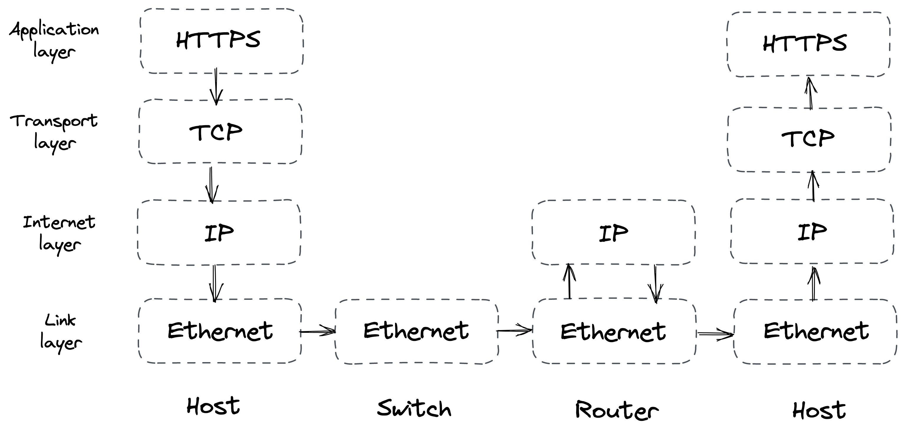

# 介绍

> "网络可靠。"
>
> – 分布式计算的谬误，L. Peter Deutsch

进程间通过网络进行的通信或进程间通信 (IPC) 是分布式系统的核心——它使分布式系统成为分布式系统。为了让进程进行通信，它们需要就一组确定数据如何处理和格式化的规则达成一致。网络协议规定了这样的规则。

这些协议被安排在一个堆栈[^1]中，其中每一层都建立在下一层提供的抽象之上，而较低的层更接近硬件。当一个进程通过网络堆栈向另一个进程发送数据时，数据从顶层移动到底层，反之亦然，如图1.3所示：

图 1.3：互联网协议套件

- 链路层由在本地网络链路（如以太网或 Wi-Fi）上运行的网络协议组成，并为底层网络硬件提供接口。交换机在这一层运行并根据其目标 MAC 地址转发以太网数据包[^2]。
- 互联网层通过网络将数据包从一台机器路由到另一台机器。 Internet 协议 (IP) 是这一层的核心协议，它尽最大努力传递数据包（即数据包可能被丢弃、复制或损坏）。路由器在这一层运行，并将 IP 数据包转发到到达最终目的地的路径上的下一个路由器。
- 传输层在两个进程之间传输数据。为了使托管在同一台机器上的多个进程能够同时通信，端口号用于寻址两端的进程。这一层中最重要的协议是传输控制协议 (TCP)，它在 IP 之上创建了一个可靠的通信通道。
- 最后，应用层定义了高级通信协议，如 HTTP 或 DNS。通常，你的应用程序将针对此抽象级别。

尽管每个协议都建立在另一个协议之上，但有时抽象会泄漏。如果你没有很好地掌握较低层的工作原理，那么你将很难解决不可避免地出现的网络问题。更重要的是，了解进行网络调用时发生的事情的复杂性将使你成为更好的系统构建者。

第 2 章描述了如何在不可靠的 (IP) 之上构建可靠的通信通道 (TCP)，它可以丢弃或复制数据或乱序传递数据。在不可靠的抽象之上构建可靠的抽象是我们将在本书其余部分再次遇到的常见模式。

第 3 章描述了如何在可靠通道 (TCP) 之上构建安全通道 (TLS)。安全性是任何系统的核心问题，在本章中，我们将体验如何保护网络连接免受窥探和恶意代理的侵害。

第 4 章深入探讨互联网电话簿 (DNS) 的工作原理，它允许节点使用名称发现其他节点。从本质上讲，DNS 是一个分布式、分层且最终一致的键值存储。通过研究它，我们将第一次体验最终的一致性[^3]以及它带来的挑战。

第 5 章通过描述基于前面介绍的协议构建的 RESTful HTTP API 的实现，讨论松散耦合的服务如何通过 API 相互通信来结束这一部分。

-------------------

[^1]: "互联网协议套件"，https://en.wikipedia.org/wiki/Internet_protocol_suite
[^2]: "MAC 地址"，https://en.wikipedia.org/wiki/MAC_address
[^3]: 我们将在第 10 章了解更多关于一致性模型的内容。