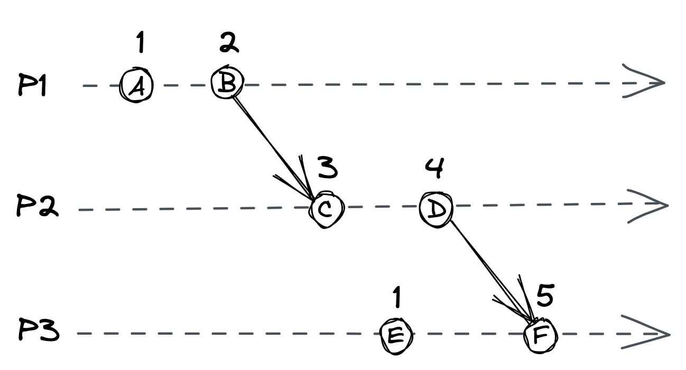
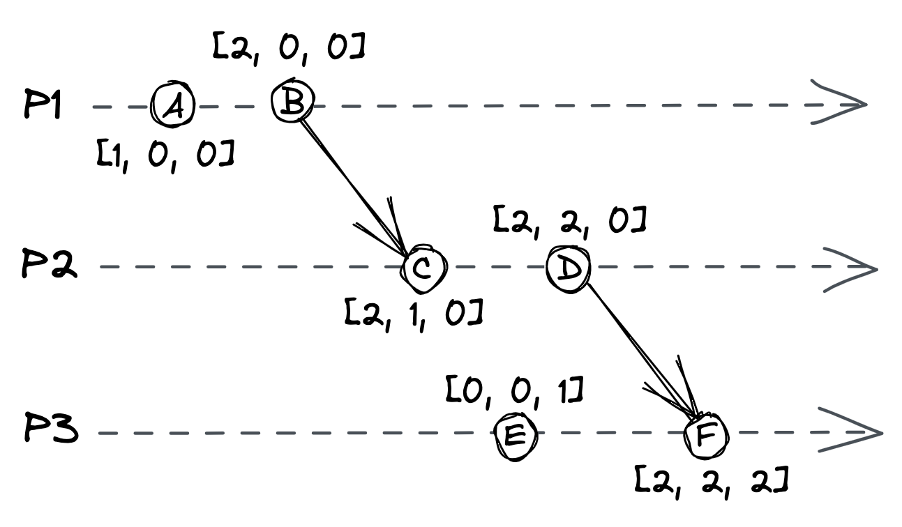

# 时钟

时钟是任何软件应用程序中的一个基本概念；在分布式系统中更是如此。我们已经看到它在网络堆栈（例如，DNS 记录 TTL）和故障检测（超时）中发挥着至关重要的作用。它的另一个重要用途是对事件进行排序。

单线程应用程序的执行流程很容易理解，因为每个操作都按时间顺序执行，一个接一个。但是在分布式系统中，没有所有进程都同意的共享全局时钟可用于对操作进行排序。而且，更糟糕的是，进程可以同时运行。

在不知道一项操作是否先于另一项操作的情况下构建按预期工作的分布式应用程序是一项挑战。在本章中，我们将学习一系列时钟，它们可用于计算分布式系统中跨进程的操作顺序。

## 8.1 物理时钟

进程可以访问物理时钟。最常见的类型是基于振动的石英晶体，价格便宜但不是很准确。根据制造差异和外部温度，一个石英钟的运行速度可能比其他石英钟稍快或稍慢。时钟运行得更快或更慢的速率也称为时钟漂移。相反，特定时间点的两个时钟之间的差异称为时钟偏差。

由于石英钟会漂移，因此它们需要定期与可以访问更高精度时钟的机器同步，比如原子钟。原子钟1 基于原子的量子力学特性测量时间。它们比石英钟贵得多，而且每 300 万年精确到 1 秒。

时钟之间的同步可以通过协议来实现，尽管网络引入了不可预测的延迟，但挑战在于如何做到这一点。最常用的协议是网络时间协议 (NTP 2)。在 NTP 中，客户端通过从 NTP 服务器接收时间戳并使用估计的网络延迟来纠正它来估计时钟偏差。通过估计时钟偏差，客户端可以调整其时钟。但是，这会导致时钟在时间上向前或向后跳跃，从而在比较时间戳时产生问题。例如，一个在另一个操作之后运行的操作可能具有更早的时间戳，因为时钟在两个操作之间及时跳回。

幸运的是，大多数操作系统都提供了一种不受时间跳跃影响的不同类型的时钟：单调时钟。单调时钟测量自任意时间点（例如，启动时间）以来经过的秒数，并且只能向前移动。单调时钟可用于测量同一节点上的两个时间戳之间经过了多长时间。然而，单调时钟对于比较不同节点的时间戳是没有用的。

由于我们没有办法完美地跨进程同步时钟，因此我们不能依赖它们来对节点间的操作进行排序。要解决这个问题，我们需要从另一个角度来看。我们知道两个操作不能在单线程进程中同时运行，因为一个必须在另一个之前发生。这种先发生的关系在两个操作之间建立了因果关系，因为首先发生的操作可能会产生影响其后操作的副作用。我们可以使用这种直觉来构建一种不同类型的时钟，它不依赖于时间的物理概念，而是捕捉操作之间的因果关系：逻辑时钟。

## 8.2 逻辑时钟

逻辑时钟根据逻辑操作而不是挂钟时间来衡量时间的流逝。最简单的逻辑时钟是计数器，在执行操作之前递增。这样做可以确保每个操作都有一个不同的逻辑时间戳。如果两个操作在同一个进程上执行，则必然一个必须先于另一个，并且它们的逻辑时间戳将反映这一点。但是在不同进程上执行的操作呢？

想象一下向朋友发送电子邮件。你在发送该电子邮件之前所做的任何操作，例如喝咖啡，都必须在你的朋友收到电子邮件后采取的操作之前发生。类似地，当一个进程向另一个进程发送消息时，会创建一个所谓的同步点。发送方在发送消息之前执行的操作必须发生在接收方收到消息之后执行的操作之前。

Lamport clock3 是基于这个想法的逻辑时钟。为了实现它，系统中的每个进程都需要有一个遵循特定规则的本地计数器：

- 计数器初始化为 0。
- 进程在执行操作之前将其计数器加 1。
- 当进程发送消息时，它会将其计数器加 1，并在消息中发送它的副本。
- 当进程接收到消息时，它将接收到的计数器与其本地计数器合并，取两者中的最大值。最后，它将计数器加 1。

图 8.1：使用 Lamport 时钟的三个进程。例如，因为 D 发生在 F 之前，所以 D 的逻辑时间戳小于 F。

尽管 Lamport 时钟采用崩溃停止模型，但可以通过例如将时钟的状态保存在磁盘上来支持崩溃恢复模型。

规则保证如果操作 O1 发生在操作 O2 之前，则 O1 的逻辑时间戳小于 O2 的逻辑时间戳。在图 8.1 所示的示例中，操作 D 发生在 F 之前，它们的逻辑时间戳 4 和 5 反映了这一点。

但是，两个不相关的操作可以具有相同的逻辑时间戳。例如，操作 A 和 E 的逻辑时间戳等于 1。要创建严格的总顺序，我们可以任意排序进程以打破关系。例如，如果我们使用图 8.1 中的进程 ID 来打破关系（1、2 和 3），E 的时间戳将大于 A 的时间戳。

不管关系是否中断，逻辑时间戳的顺序并不意味着因果关系。例如，在图 8.1 中，操作 E 没有在 C 之前发生，即使它们的时间戳似乎暗示了这一点。为了保证这种关系，我们必须使用不同类型的逻辑时钟：向量时钟。

## 8.3 向量时钟

向量时钟4 是一个逻辑时钟，它保证如果一个逻辑时间戳小于另一个，那么前者肯定发生在后者之前。向量时钟是用一组计数器实现的，系统中的每个进程一个计数器。而且，与 Lamport 时钟一样，每个进程都有其本地副本。

例如，假设系统由三个进程 P1、P2 和 P3 组成。在这种情况下，每个进程都有一个本地向量时钟，由三个计数器 [CP1, CP2, CP3] 组成的数组5 实现。数组中的第一个计数器与 P1 相关联，第二个与 P2 相关联，第三个与 P3 相关联。

进程根据以下规则更新其本地向量时钟：

- 最初，数组中的计数器设置为 0。
- 当操作发生时，进程将其在数组中的计数器加 1。
- 当进程发送消息时，它将数组中的计数器加 1，并随消息一起发送数组的副本。
- 当进程接收到一条消息时，它通过取两个数组元素中的最大值来将它接收到的数组与本地数组合并。最后，它将数组中的计数器加 1。

图 8.2：每个进程都有一个向量时钟，由三个计数器组成的数组表示。

向量时钟时间戳的美妙之处在于它们可以部分排序6；给定两个带有时间戳 T1 和 T2 的操作 O1 和 O2，如果：

- T1 中的每个计数器都小于或等于 T2 中相应的计数器，
- 并且 T1 中至少有一个计数器严格小于 T2 中相应的计数器，

则 O1 发生在 O2 之前。例如，在图 8.2 中，B 发生在 C 之前。

如果 O1 没有在 O2 之前发生并且 O2 没有在 O1 之前发生，则时间戳无法排序，并且操作被认为是并发的。因此，例如，图 8.2 中的操作 E 和 C 不能排序，因此是并发的。

向量时钟的一个问题是每个进程的存储需求随着进程的数量线性增长，这对于具有许多客户端的应用程序来说是一个问题。但是，还有其他类型的逻辑时钟可以解决此问题，例如点版本向量 7。

在这一点上，关于逻辑时钟的讨论可能有点抽象，但请耐心等待。在本书的后面，我们会遇到一些逻辑时钟的实际应用。在这一点上重要的是，一般来说，我们不能使用物理时钟来准确地推导出不同进程上发生的事件的顺序。话虽如此，有时物理时钟就足够了。例如，如果仅用于调试目的，则使用物理时钟对日志进行时间戳可能没问题。

-----------------------

1. "原子钟"，https://en.wikipedia.org/wiki/Atomic_clock
2. "RFC 5905：网络时间协议版本 4：协议和算法规范"，https://datatracker.ietf.org/doc/html/rfc5905
3. "分布式系统中的时间、时钟和事件顺序"，http://lamport.azurewebsites.net/pubs/time-clocks.pdf
4. "保留部分排序的消息传递系统中的时间戳"，https://fileadmin.cs.lth.se/cs/Personal/Amr_Ergawy/dist-algos-papers/4.pdf
5. 在实际实现中，使用字典而不是数组。
6. 在总顺序中，每一对元素都是可比较的。相反，在偏序中，某些对是不可比较的
7. "为什么逻辑时钟很简单"，https://queue.acm.org/detail.cfm?id=2917756