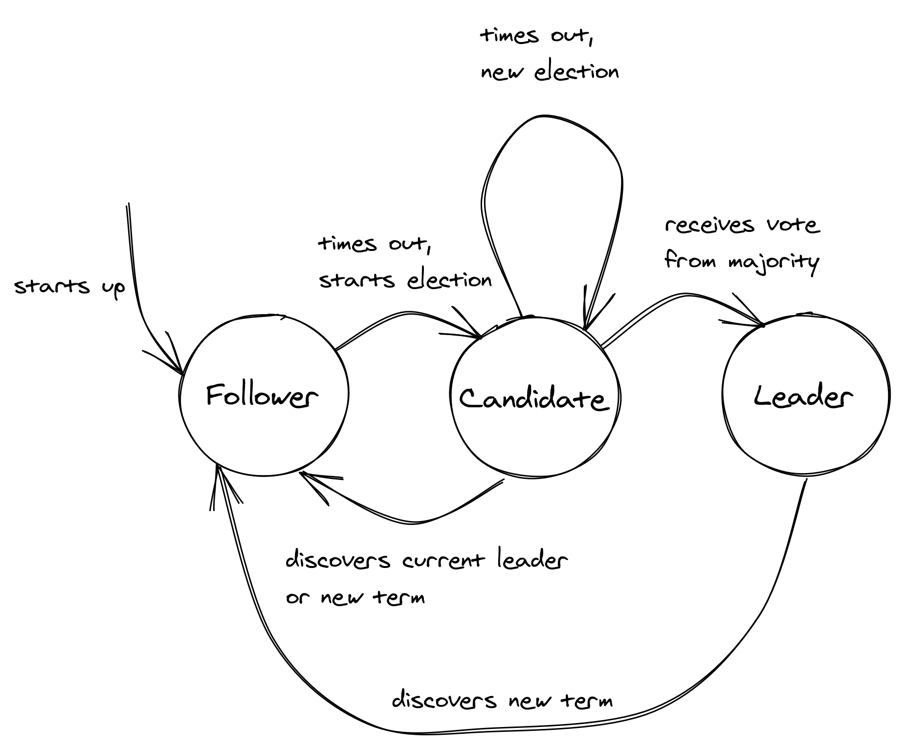

# 领袖选举

有时系统中的单个进程需要具有特殊的权力，例如访问共享资源或将工作分配给其他人。为了授予进程这些权力，系统需要在一组候选进程中选出一个领导者，该领导者一直负责，直到它放弃其角色或变得不可用。当这种情况发生时，剩余的进程可以在它们之间选举一个新的领导者。

领导者选举算法需要保证在任何给定时间最多有一个领导者，并且即使存在失败，选举最终也会完成。这两个属性也分别称为安全性和活性，是分布式算法的通用属性。非正式地，安全保证不会发生任何不好的事情，并保证最终会发生好事。在本章中，我们将探讨一种特定的算法，即 Raft 领导者选举算法，如何保证这些属性。

## 9.1 Raft 领导者选举

Raft[^1] 的领导人选举算法被实现为一个状态机，其中任何进程都处于三种状态之一（见图 9.1）：

- 跟随者状态，该过程将另一个人识别为领导者；
- 候选人状态，该过程开始新的选举，提出自己作为领导者；
- 或领导者状态，其中进程是领导者。

在 Raft 中，时间被划分为任意长度的选举项，这些选举项用连续的整数（即逻辑时间戳）编号。一个任期以新的选举开始，在此期间，一个或多个候选人试图成为领导者。该算法保证任何任期最多有一个领导者。但首先是什么触发了选举？

当系统启动时，所有进程都以追随者的身份开始他们的旅程。 此时，追随者通过增加当前任期并转换到候选状态来开始新的选举。 然后它为自己投票并向系统中的所有进程发送请求以投票给它，并在请求上加上当前的选举期限。

该进程一直处于候选状态，直到发生以下三件事之一：它赢得了选举，另一个进程赢得了选举，或者一段时间没有赢家：

- **进程在选举中获胜** — 当系统进程投票占多数时，选举胜出。每个进程在一个任期内最多可以投票给一个候选人，先到先得。这个多数规则强制规定最多一个候选人可以赢得一个任期。 赢得选举后，它会过度到领导者状态并发送心跳。
- **另一个进程赢得了选举** - 如果候选人从声称自己是领导者的过程中获得心跳，该程序具有大于或等于候选人的任期，它将接受新领导人并返回追随者状态。[^2]如果没有，继续在候选状态。你可能想知道这是怎么发生的； 例如，如果候选进程因任何原因要停止，就像长时间的垃圾收集暂停一样，当它恢复时，另一个进程可能已经赢得了选举。
- **一段时间过去了，没有赢家**——多个追随者同时成为候选人的可能性不大，但也有可能，而且没有一个人能够获得多数票；这被称为分裂投票。发生这种情况时，候选人最终会超时并开始新的选举。选举超时是从固定间隔中随机挑选的，以减少下次选举中再次分裂投票的可能性。



图 9.1：Raft 的领导选举算法表示为状态机。

## 9.2 实践考虑

还有其他的领导人选举算法，但是 Raft 的实现很容易理解并且在实践中也被广泛使用，这就是我在本书中选择它的原因。在实践中，你很少（如果有的话）需要从头开始实施领导人选举。这样做的一个很好的理由是，如果你需要一个外部依赖为零的解决方案[^3]。相反，你可以使用任何容错键值存储，它提供具有过期时间 (TTL) 的线性化[^4]比较和交换[^5]操作。

当且仅当尝试更新值的进程正确识别当前值时，比较和交换操作自动更新键的值。该操作采用三个参数：K、V<sub>o</sub> 和 V<sub>n</sub>，其中 K 是键，V<sub>o </sub>和 V<sub>n</sub> 是分别称为旧值和新值的值。该操作以原子方式将 K 的当前值与 V<sub>o</sub> 进行比较，如果它们匹配，它将 K 的值更新为 V<sub>n</sub>。如果值不匹配，则不修改 K，操作失败。

过期时间定义了密钥的生存时间，之后密钥过期并从存储中删除，除非过期时间延长。这个想法是，每个竞争进程都试图通过使用比较和交换创建一个新密钥来获取租约。第一个成功的进程成为领导者，并保持这种状态，直到它停止更新租约，之后另一个进程可以成为领导者。

过期逻辑也可以在客户端实现，就像 DynamoDB 的这个锁定库[^6]一样，但是实现更复杂，它仍然需要数据存储提供比较和交换操作。

你可能认为这足以保证在任何给定时间都不能有超过一个领导者。但是，不幸的是，事实并非如此。要了解为什么假设多个进程需要更新共享文件存储上的文件，并且我们希望保证一次只有一个进程可以访问它以避免竞争条件。现在，假设我们使用租约来锁定临界区。每个进程都尝试获取租约，并且这样做的进程成功读取文件，在内存中更新文件，并将其写回存储：

```python
if lease.acquire():
    try:
        content = store.read(filename)
        new_content = update(content)
        store.write(filename, new_content)
    except:
        lease.release()
```

问题是当进程开始写入文件时，它可能不再持有租约。例如，操作系统可能已经抢占并停止进程足够长的时间以使租约到期。该进程可以尝试通过在写入存储之前将租约到期时间与其本地时钟进行比较来检测这一点，假设时钟是同步的。

然而，时钟同步并不完全准确。最重要的是，由于网络延迟，当对商店的请求正在进行时，租约可能会到期。为了解决这些问题，该过程可以在写入文件之前检查租约到期时间是否足够远。不幸的是，这种解决方法并非万无一失，租约本身也不能保证互斥。

为了解决这个问题，我们可以为每个文件分配一个版本号，每次文件更新时都会增加一个版本号。然后，持有租约的进程可以从文件存储中读取文件及其版本号，进行一些本地计算，最后在版本号未更改的情况下更新文件（并增加版本号）。该过程可以使用许多文件存储支持的比较和交换操作以原子方式执行此验证。

如果文件存储不支持条件写入，我们必须围绕偶尔会出现竞争条件的事实进行设计。有时，这是可以接受的；例如，如果暂时有两个领导者并且他们都执行相同的幂等更新，则不会造成任何伤害。

尽管拥有领导者可以简化系统设计，因为它消除了并发性，但如果它执行的操作数量增加到无法跟上的程度，它也可能成为可伸缩性瓶颈。此外，领导者是具有大爆炸半径的单点故障；如果选举过程停止工作或领导者没有按预期工作，它可能会导致整个系统崩溃。我们可以通过引入分区并为每个分区分配不同的领导者来缓解其中的一些缺点，但这会带来额外的复杂性。这是许多分布式数据存储使用的解决方案，因为它们无论如何都需要使用分区来存储不适合单个节点的数据。

根据经验，如果我们必须有一个领导者，我们必须尽量减少它所执行的工作，并准备偶尔拥有不止一个。

退一步说，我们之前做出的一个关键假设是持有租约的数据存储是容错的，即它可以容忍节点的丢失。否则，如果数据存储在单个节点上运行并且该节点发生故障，我们将无法获得租约。为了使数据存储能够承受节点故障，它需要在多个节点上复制其状态。在下一章中，我们将仔细研究如何实现这一点。

---------------------

[^1]: "寻找可理解的共识算法": https://raft.github.io/raft.pdf
[^2]: 如果领导者收到更长任期的心跳，也会发生同样的情况。
[^3]: 在下一章讨论复制时，我们会遇到这样的情况。
[^4]: 我们将在后面的 10.3.1 节中定义线性化的确切含义。
[^5]: "比较和交换": https://en.wikipedia.org/wiki/Compare-and-swap
[^6]: "使用 DynamoDB 锁客户端构建分布式锁": https://aws.amazon.com/blogs/database/building-distributed-locks-with-the-dynamodb-lock-client/