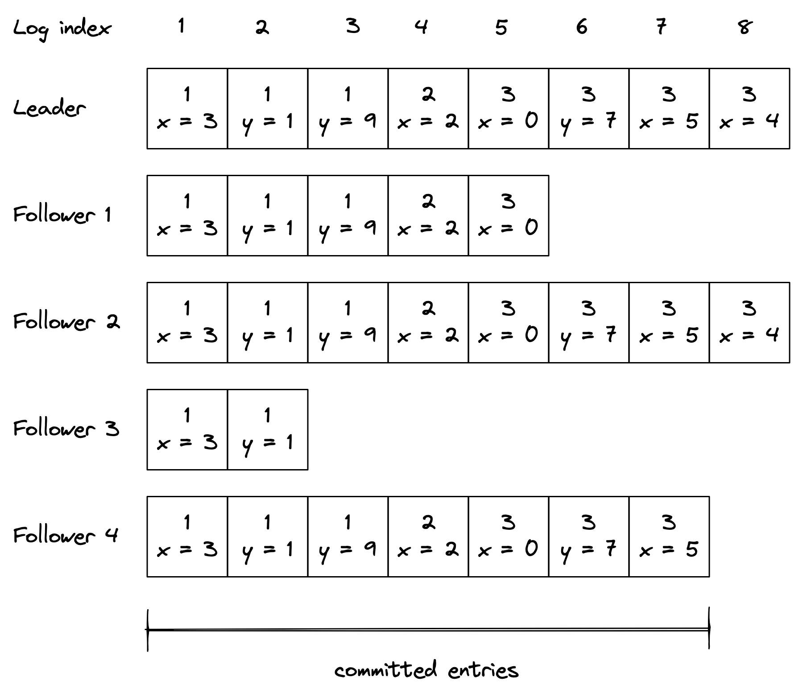

# 复制

数据复制是分布式系统的基本构建块。复制数据的原因之一是提高可用性。如果某些数据专门存储在单个进程中，并且该进程出现故障，则数据将无法再访问。但是，如果数据被复制，客户端可以无缝切换到副本。复制的另一个原因是提高可扩展性和性能。副本越多，可以同时访问数据的客户端就越多。

实施复制具有挑战性，因为它需要保持副本彼此一致，即使在面对故障时也是如此。在本章中，我们将探索 Raft 的复制算法 1，这是一种复制协议，它提供了最强的一致性保证——保证对客户端而言，数据似乎存储在单个进程中，即使它实际上是复制的。可以说，提供这种保证的最流行的协议是 Paxos2，但我们将讨论 Raft，因为它更容易理解。

Raft 基于一种称为状态机复制的机制。主要思想是单个进程，即领导者，将改变其状态的操作广播给其他进程，即追随者（或副本）。如果追随者执行与领导者相同的操作序列，则每个追随者最终将处于与领导者相同的状态。不幸的是，领导者不能简单地向追随者广播操作并收工，因为任何进程都可能随时失败，网络也可能丢失消息。这就是为什么大部分算法都致力于容错。

这种机制被称为陈述机器复制的原因是每个进程都被建模为一个状态机3，它响应一些输入（操作）从一个状态转换到另一个状态。如果状态机是确定性的并且以相同的顺序获得完全相同的输入，则它们的状态是一致的。这样，如果其中一个失败，则可以从任何其他状态机获得冗余副本。状态机复制是一个非常强大的工具，可以使服务容错，只要它可以建模为状态机。

例如，考虑实现容错键值存储的问题。在这种情况下，每个状态机代表一个接受 put(k, v) 和 get(k) 操作的存储节点。实际状态用字典表示。执行 put 操作时，会将键值对添加到字典中。执行get操作时，返回请求的key对应的值。你可以看到如果每个节点执行相同的 put 序列，所有节点最终将具有相同的状态。

在下一节中，我们将更深入地了解 Raft 的复制协议。这是一个具有挑战性的阅读，需要停下来思考，但我可以向你保证，这是非常值得的，特别是如果你以前没有看过复制协议的话。

## 10.1 状态机复制

当系统启动时，使用第 9 章讨论的 Raft 的领导选举算法选举领导，不需要任何外部依赖。领导者是唯一可以改变复制状态的进程。它通过将改变状态的操作序列存储到本地日志中来实现这一点，并将其复制给追随者。复制日志是允许跨进程保持状态同步的原因。

如图 10.1 所示，日志是条目的有序列表，其中每个条目包括：

- 要应用于状态的操作，例如将 3 分配给 x。该操作需要是确定性的，以便所有跟随者最终处于相同的状态，但只要遵守该要求（例如，比较和交换或具有多个操作的事务），它就可以任意复杂；
- 条目在日志中的位置索引；
- 以及领导者的选举任期（每个框中的数字）。

图 10.1：领导者的日志被复制到其追随者。

当领导者想要将操作应用于其本地状态时，它首先会为该操作添加一个新条目到其日志中。此时，该操作尚未应用于本地状态；它只被记录下来。

然后领导者向每个跟随者发送一个 AppendEntries 请求，其中包含要添加的新条目。即使没有新条目，此消息也会定期发送，因为它充当领导者的心跳。

当追随者收到 AppendEntries 请求时，它将收到的条目附加到自己的日志中（尚未实际执行操作）并向领导者发送回响应以确认请求成功。当领导者成功收到大多数追随者的回复时，它认为该条目已提交并在其本地状态上执行操作。领导者跟踪日志中提交的最高索引，该索引在所有未来的 AppendEntries 请求中发送。追随者仅在发现领导者已提交条目时才将日志条目应用于其本地状态。

因为领导者只需要等待大多数（法定人数）的追随者，即使有些追随者宕机，它也能取得进展，即如果有 2f + 1 个追随者，系统最多可以容忍 f 次失败。该算法保证提交的条目是持久的，并且最终将由系统中的所有进程执行，而不仅仅是原始多数进程的一部分。

到目前为止，我们假设没有故障，并且网络是可靠的。让我们放宽这些假设。如果领导者失败，则选举一个追随者作为新的领导者。但是，有一点需要注意：因为复制算法只需要大多数进程才能取得进展，所以当领导者失败时，某些进程可能不是最新的。为避免过时的进程成为领导者，进程不能投票给日志更新较少的进程。换句话说，如果进程不包含所有已提交的条目，那么它将则进行选举。

为了确定两个进程的日志中哪一个更新，比较它们最后条目的选举期限和索引。如果日志以不同的术语结尾，则具有较高术语的日志是最新的。如果日志以相同的期限结束，则以较长者为准。 由于选举需要多数票，并且候选人的日志必须至少与选举中的任何其他过程一样是最新的，选出的进程将包含所有已提交的条目。

如果一个 AppendEntries 请求无法传递给一个或多个追随者，领导者将无限期地重试发送，直到大多数追随者成功地将其附加到他们的日志中。重试是无害的，因为 AppendEntries 请求是幂等的，并且追随者会忽略已经附加到其日志中的日志条目。

如果一个暂时不可用的追随者重新上线，它最终会收到一条 AppendEntries 消息，其中包含来自领导者的日志条目。 AppendEntries 消息包括日志中条目的索引和术语编号，该条目紧接在要附加的条目之前。如果追随者找不到具有该索引和术语编号的日志条目，它会拒绝该消息以防止在其日志中创建间隙。

当 AppendEntries 请求被拒绝时，领导者重试请求，这次包括最后两个日志条目——这就是我们将请求称为 AppendEntries 而不是 AppendEntry 的原因。如果失败，领导者重试发送最后三个日志条目，依此类推。4 目标是让领导者找到两个日志一致的最新日志条目，删除该点之后跟随者日志中的任何条目，并附加到追随者在其后记录所有领导者的条目。

## 10.2 共识

通过解决状态机复制，我们实际上找到了共识的解决方案5——这是分布式系统研究中研究的一个基本问题，其中一组进程必须决定一个值，以便：

- 每个无故障的过程最终都会就一个值达成一致；
- 每个无故障过程的最终决定在任何地方都是相同的；
- 并且已经商定的值是由一个过程提出的。

这听起来可能有点抽象。考虑共识的另一种方式是一次写入寄存器6 (WOR) 的 API：一个线程安全且可线性化的7 寄存器，只能写入一次，但可以多次读取。

共识有很多实际应用。例如，就组中的哪个进程可以获得租约达成一致需要达成共识。而且，如前所述，状态机复制也需要它。如果你稍微眯起眼睛，你应该能够看到 Raft 中的复制日志是一个 WOR 序列，因此 Raft 实际上只是一个共识实例序列。

虽然了解什么是共识以及如何解决它很重要，但你可能永远不需要从头开始实施它8。相反，你可以使用许多可用的现成解决方案之一。

例如，共识最常见的用途之一是用于协调目的，例如选举领导者。正如 9.2 中所讨论的，领导者选举可以通过获取租约来实现。租约确保在任何时候最多有一个进程可以成为领导者，如果该进程死亡，另一个可以代替它。然而，这种机制要求租赁管理器或协调服务具有容错性。 Etcd9 和 ZooKeeper10 是两个广泛使用的协调服务，它们使用共识复制它们的状态以实现容错。协调服务通过其 API 公开分层的键值存储，还允许客户端监视键的更改。因此，例如，获取租约可以通过让客户端尝试创建具有特定 TTL 的密钥来实现。如果密钥已经存在，则操作失败，保证只有一个客户端可以获取租约。

## 10.3 一致性模型

我们讨论了状态机复制，目的是实现能够承受故障并横向扩展以服务更多请求的数据存储。现在我们已经知道如何在原则上构建一个复制的数据存储，让我们仔细看看当客户端向它发送请求时会发生什么。在理想情况下，请求会立即执行，如图 10.2 所示。

图 10.2：立即执行的写请求

但实际上，情况完全不同——请求需要到达领导者，领导者必须处理它并将响应发送回客户端。如图 10.3 所示，这些动作需要时间并且不是瞬时的。

图 10.3：写请求不能立即执行，因为到达领导者并被执行需要时间。

系统可以提供的最佳保证是请求在其调用和完成时间之间的某处执行。你可能认为这看起来没什么大不了的。毕竟，这是你在编写单线程应用程序时所习惯的。例如，如果你将 42 分配给 x 并在之后立即读取它的值，你希望在其中找到 42，假设没有其他线程写入同一个变量。但是当你处理复制系统时，所有的赌注都没有了。让我们看看为什么会这样。

在 10.1 节中，我们研究了 Raft 如何将领导者的状态复制到其追随者。由于只有领导者可以对状态进行更改，因此任何修改它的操作都必须经过领导者。但是阅读呢？它们不一定要通过领导者，因为它们不会影响系统的状态。读取可以由领导者、追随者或领导者和追随者的组合提供。如果所有读取都必须经过领导者，则读取吞吐量将被限制为单个进程的吞吐量。但是，如果任何追随者可以代替读取，那么两个客户端或观察者可以对系统状态有不同的看法，因为追随者可能落后于领导者。

直观地说，观察者对系统的看法与系统性能和可用性的一致性之间存在权衡。要理解这种关系，我们需要准确定义一致性的含义。我们将在一致性模型的帮助下做到这一点11，它正式定义了观察者可以拥有的系统状态的可能视图。

### 10.3.1 强一致性

如果客户端专门向领导者发送写入和读取，那么每个请求似乎都在一个非常特定的时间点原子地发生，就好像只有一个数据副本一样。无论有多少副本或落后多远，只要客户端始终直接查询领导者，从他们的角度来看，数据只有一个副本。

因为请求不是即时服务的，并且有一个可以服务它的进程，所以请求在其调用和完成时间之间的某个地方执行。当它完成时，它的副作用对所有观察者都是可见的，如图 10.4 所示。

图 10.4：强一致性操作的副作用在完成后对所有观察者都是可见的。

由于请求在其调用和完成时间之间对所有其他参与者可见，因此必须强制执行实时保证；这种保证由称为线性化12或强一致性的一致性模型形式化。线性化是系统可以为单对象请求提供的最强一致性保证。13

不幸的是，领导者不能直接从其本地状态提供读取服务，因为当它收到来自客户端的请求时，它可能不再是领导者；因此，如果要服务于请求，系统将不会保持强一致性。假定的领导者首先需要联系大多数副本以确认它是否仍然是领导者。只有这样它才允许执行请求并将响应发送回客户端。否则，它会转换到跟随者状态并导致请求失败。此确认步骤大大增加了提供读取所需的时间。

### 10.3.2 顺序一致性

到目前为止，我们已经讨论了通过领导者序列化所有读取。但是这样做会产生一个单一的阻塞点，从而限制了系统的吞吐量。最重要的是，领导者需要联系大多数追随者来处理读取，这增加了处理请求所需的时间。为了提高读取性能，我们还可以允许追随者处理请求。

即使追随者可能落后于领导者，它也将始终以与领导者相同的顺序接收新的更新。例如，假设一个客户端只查询关注者 1，而另一个客户端只查询关注者 2。在这种情况下，两个客户端将看到状态在不同时间演变，因为关注者并不完全同步（见图 10.5）。

图 10.5：虽然追随者对系统状态有不同的看法，但他们以相同的顺序处理更新。

确保所有观察者的操作以相同的顺序发生的一致性模型，但不提供任何关于操作的副作用何时对他们可见的实时保证，称为顺序一致性14。缺乏实时保证是顺序一致性与线性化的区别。

与队列同步的生产者/消费者系统就是这种模型的一个例子。生产者将项目写入队列，消费者读取该队列。生产者和消费者以相同的顺序查看项目，但消费者落后于生产者。

### 10.3.3 最终一致性

尽管我们设法增加了读取吞吐量，但我们必须将客户端固定到关注者——如果关注者不可用，客户端将失去对存储的访问权限。我们可以通过允许客户端查询任何追随者来提高可用性。但这在一致性方面付出了高昂的代价。例如，假设有两个追随者，1 和 2，其中追随者 2 落后于追随者 1。如果客户端查询追随者 1，然后是追随者 2，它将看到更早的状态，这可能会非常混乱。客户端唯一的保证是，如果对系统的写入停止，最终所有的追随者都将收敛到最终状态。这种一致性模型称为最终一致性。

在最终一致的数据存储之上构建应用程序具有挑战性，因为这种行为与我们在编写单线程应用程序时所习惯的不同。因此，难以调试和重现的细微错误可能会蔓延。然而，在最终的一致性防御中，并非所有应用程序都需要线性化。例如，如果我们想跟踪访问网站的用户数量，最终一致的存储非常好，因为读取返回的数字是否稍微过时并不重要。

### 10.3.4 CAP定理

当发生网络分区时，系统的某些部分会彼此断开连接。例如，某些客户端可能不再能够联系到领导者。发生这种情况时，系统有两种选择；它可以：

通过允许客户查询可达的追随者来保持可用，牺牲了强一致性；
或者通过失败无法到达领导者的读取来保证强一致性。
这个概念用 CAP 定理 15 来表达，可以概括为："强一致性、可用性和分区容错性：三选二。"实际上，只能在强一致性和可用性之间进行选择，因为网络故障是给定的，无法避免。

令人困惑的是，CAP 定理对可用性的定义要求每个请求最终都会收到响应。但在实际系统中，实现完美的可用性是不可能的。此外，非常缓慢的响应与从未发生过的响应一样糟糕。因此，换句话说，许多高可用性系统不能被视为 CAP 定理所定义的可用系统。同样，该定理对一致性和分区容限的定义非常精确，限制了其实际应用。16 考虑可用性和一致性之间关系的更有用的方法是作为频谱。因此，例如，由 CAP 定理定义的强一致性和分区容错系统仅占据该频谱中的一个点。17

此外，即使可能发生网络分区，它们在数据中心内通常也很少见。但是，即使没有网络分区，也需要在一致性和延迟（或性能）之间进行权衡。一致性保证越强，单个操作的延迟就必须越高。这种关系由 PACELC 定理18表示，它是 CAP 定理的扩展。它指出，在网络分区（P）的情况下，必须在可用性（A）和一致性（C）之间进行选择，否则（E），即使系统在没有分区的情况下正常运行，也必须选择在延迟 (L) 和一致性 (C) 之间。在实践中，延迟和一致性之间的选择不是二元的，而是一个频谱。

这就是为什么一些现成的分布式数据存储带有违反直觉的一致性保证以提供高可用性和性能的原因。其他的有旋钮，可以让你选择是想要更好的性能还是更强的一致性保证，比如 Azure 的 Cosmos DB19 和 Cassandra20。

解释 PACELC 定理的另一种方法是在所需的协调量和性能之间进行权衡。围绕这一基本限制进行设计的一种方法是将协调从关键路径移开。例如，之前我们讨论过，要使读取具有强一致性，领导者必须联系大多数追随者。每次阅读都要支付协调税！在下一节中，我们将探索一种不同的复制协议，该协议将这种成本从关键路径中移开。

## 10.4 链式复制

链式复制21 是一种广泛使用的复制协议，它使用与 Raft 等基于领导者的复制协议非常不同的拓扑。在链式复制中，进程被安排在一个链中。最左边的过程称为链的头部，而最右边的过程称为链的尾部。

客户端专门向头部发送写入，头部更新其本地状态并将更新转发到链中的下一个进程。同样，该进程更新其状态并将更改转发给其后继者，直到它最终到达尾部。

当尾部收到更新时，它会在本地应用它并向其前身发送确认以表明更改已提交。确认流回头部，然后头部可以回复客户端写入成功22。

客户端读取仅由尾部提供，如图 10.6 所示。在没有失败的情况下，协议是强一致的，因为所有的写入和读取都由尾部一次处理一个。但是如果链中的一个进程失败了怎么办？

图 10.6：写入通过链中的所有进程传播，而读取仅由尾部提供。

容错被委托给专用组件、配置管理器或控制平面。在高层次上，控制平面监控链的健康状况，当它检测到有故障的进程时，它会将其从链中移除。控制平面确保每个进程都同意链的拓扑结构的单一视图。为此，控制平面需要容错，这需要状态机复制（例如，Raft）。因此，虽然链最多可以容忍 N - 1 个进程失败，其中 N 是链的长度，但控制平面只能容忍C2失败，其中 C 是组成控制平面的副本数。

链式复制有三种失败模式：头部失败，尾部失败，或者中间进程失败。如果头失败，控制平面通过将其后继者重新配置为新头并通知客户端更改来删除它。如果头部提交了对其本地状态的写入但在将其转发到下游之前崩溃了，则不会造成任何伤害。由于写入没有到达尾部，发出它的客户端还没有收到它的确认。从客户端的角度来看，这只是一个超时，需要重试的请求。同样，没有其他客户端会看到写入的副作用，因为它从未到达尾部。

如果尾部出现故障，控制平面将其移除并使其前身成为链的新尾部。因为尾部接收到的所有更新都必须由前一个接收到，所以一切都按预期工作。

如果中间进程 X 失败，控制平面必须将 X 的前任与 X 的后继联系起来。这种情况处理起来有点棘手，因为 X 可能已经在本地应用了一些更新，但在将它们转发给其继任者之前失败了。因此，X 的后继者需要将它所看到的最后提交更新的序列号传达给控制平面，然后将其传递给 X 的前任以将丢失的更新发送到下游。

链式复制最多可以容忍 N-1 次失败。因此，随着链中的更多进程失败，它可以容忍更少的失败。这就是为什么用新的流程替换失败的流程很重要的原因。这可以通过在将新进程与其前身同步后使新进程成为链的尾部来实现。

链式复制的美妙之处在于只有少数几个简单的故障模式需要考虑。这是因为对于提交的写入，它需要到达尾部，因此，它必须由链中的每个进程处理。这与像 Raft 这样的基于仲裁的复制协议非常不同，后者可能只有一部分副本看到了已提交的写入。

链式复制比基于领导者的复制更易于理解且性能更高，因为领导者服务客户端请求的工作在头部和尾部之间分配。头部通过更新其本地状态并将更新转发给其后继者来序列写入。然而，读取是由尾部提供的，并与从其前身收到的更新交错。与 Raft 不同，来自客户端的读取请求可以立即从尾部的本地状态提供服务，而无需先联系其他副本，这允许更高的吞吐量和更短的响应时间。

但是，在写入延迟方面需要付出代价。由于更新需要经过链中的所有进程才能被视为已提交，因此单个慢速副本可以减慢所有写入速度。相比之下，在 Raft 中，领导者只需要等待大多数进程的回复，因此对瞬态降级更有弹性。此外，如果进程不可用，则链复制无法提交写入，直到控制平面检测到问题并将失败的进程从链中取出。相反，在 Raft 中，单个进程失败并不会阻止写入的提交，因为只需要一定数量的进程即可取得进展。

也就是说，链式复制允许将写入请求流水线化，这可以显着提高吞吐量。此外，通过在副本之间分配读取，可以进一步提高读取吞吐量，同时仍然保证线性化。这个想法是让副本存储一个对象的多个版本，每个版本都包括一个版本号和一个脏标志。副本将更新标记为脏，因为它从头部传播到尾部。一旦尾部接收到它，它就被认为是已提交的，并且尾部沿着链发送回一个确认。当副本收到确认时，它将相应的版本标记为干净。现在，当一个副本收到一个对象的读取请求时，如果最新版本是干净的，它将立即提供它。如果没有，它首先联系尾部以请求最新的提交版本（见图 10.7）。

图 10.7：任何副本都可以为脏读提供服务，并向尾部附加请求以保证强一致性。

正如第 9 章所讨论的，领导者引入了可扩展性瓶颈。但是在链复制中，数据平面（即系统中在关键路径上处理单个客户端请求的部分）不需要领导者来完成它的工作，因为它不关心故障——它唯一关注的是吞吐量和效率.相反，控制平面需要一个领导者来实现状态机复制，但这仅用于处理偶尔的故障，并且不会影响关键路径上的客户端请求。另一种思考方式是链式复制减少了每个客户端请求所需的协调量。反过来，这增加了数据平面处理负载的能力。因此，将数据平面与控制平面（即配置管理部分）分离是分布式系统中的常见模式。我们将在第 22 章更详细地讨论这一点。

此时您可能想知道是否可以在完全不需要共识23的情况下复制数据以进一步提高性能。 在下一章中，我们将尝试做到这一点。

--------------------------

1. "寻找可理解的共识算法"，https://raft.github.io/raft.pdf
2. "Paxos 变得简单"，https://lamport.azurewebsites.net/pubs/paxos-simple.pdf
3. "有限状态机"，https://en.wikipedia.org/wiki/Finite-state_machine
4. 在实践中，有一些方法可以减少此步骤所需的消息数量。
5. "共识"，https://en.wikipedia.org/wiki/Consensus_(computer_science)
6. "Paxos 做了抽象，"https://maheshba.bitbucket.io/blog/2021/11/15/Paxos.html
7. 我们将在下一节定义线性化的含义。
8. 也不想，因为做对是非常具有挑战性的；请参阅"Paxos 实现 - 工程视角"，https://static.googleusercontent.com/media/research.google.com/en//archive/paxos_made_live.pdf
9. "etcd：分布式系统最关键数据的分布式、可靠键值存储，"https://etcd.io/
10. "Apache ZooKeeper：一种开源服务器，可实现高度可靠的分布式协调，"https://zookeeper.apache.org/
11. "一致性模型"，https://jepsen.io/consistency
12. "线性化"，https://jepsen.io/consistency/models/linearizable
13. 例如，这是你期望从管理租约的协调服务中获得的保证。
14. "顺序一致性"，https://jepsen.io/consistency/models/sequential
15. "关于 CAP 定理的观点"，https://groups.csail.mit.edu/tds/papers/Gilbert/Brewer2.pdf
16. "对 CAP 定理的批判"，https://www.cl.cam.ac.uk/research/dtg/www/files/publications/public/mk428/cap-critique.pdf
17. "CAP 定理：你不需要 CP，你不需要 AP，也不能有 CA，"https://www.youtube.com/watch?v=hUd_9FENShA
18. "现代分布式数据库系统设计中的一致性权衡"，https://en.wikipedia.org/wiki/PACELC_theorem
19. "Azure Cosmos DB 中的一致性级别"，https://docs.microsoft.com/en-us/azure/cosmos-db/consistency-levels
20. "Apache Cassandra：如何配置一致性级别？" https://docs.datastax.com/en/cassandra-oss/3.0/cassandra/dml/dmlConfigConsistency.html
21. "支持高吞吐量和可用性的链复制"，https://www.cs.cornell.edu/home/rvr/papers/OSDI04.pdf
22. 这与原始链复制论文略有不同，因为它基于原始协议的扩展 CRAQ；请参阅"CRAQ 上的对象存储"，https://www.usenix.org/legacy/event/usenix09/tech/full_papers/terrace/terrace.pdf。
23. 状态机复制所需