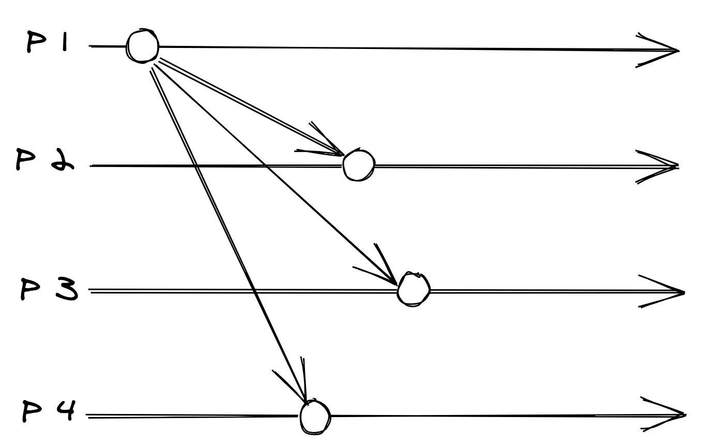
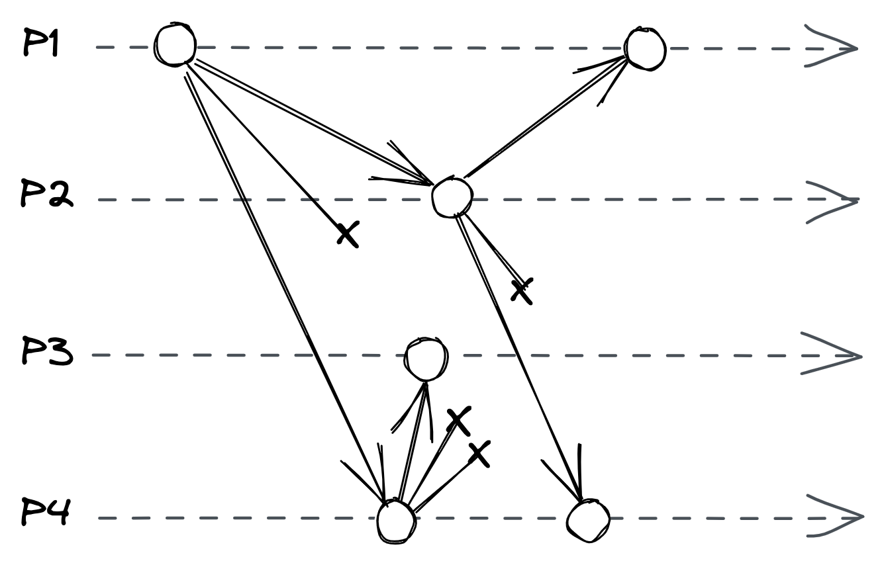
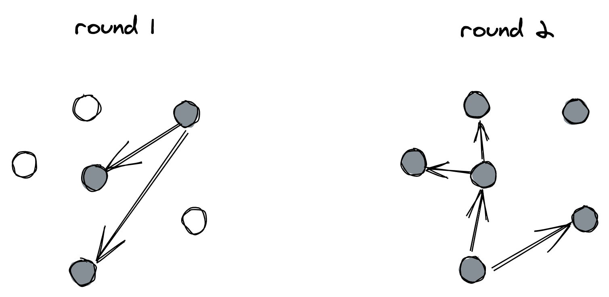
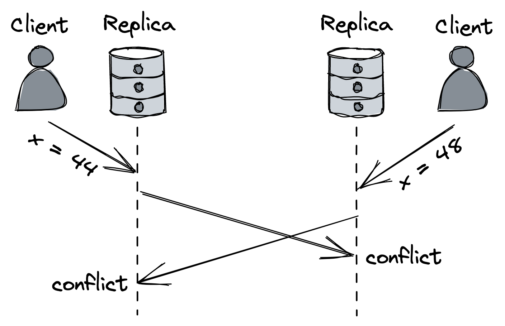
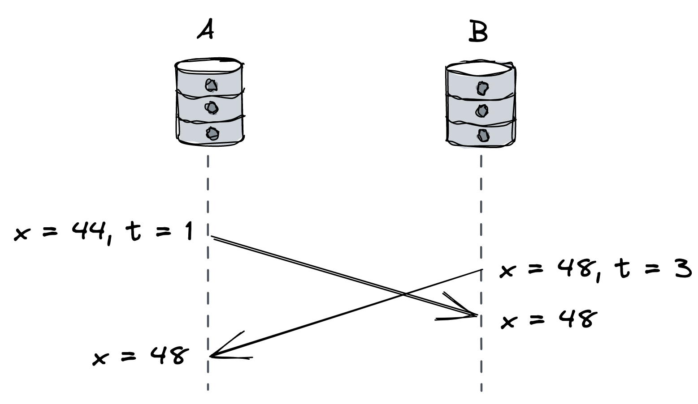
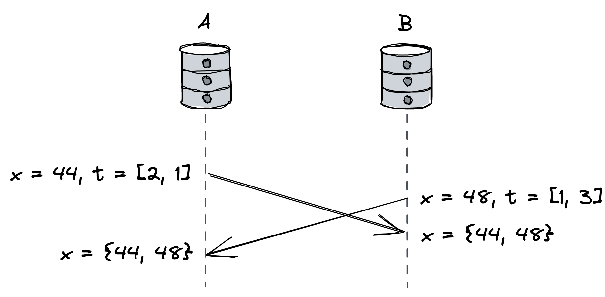
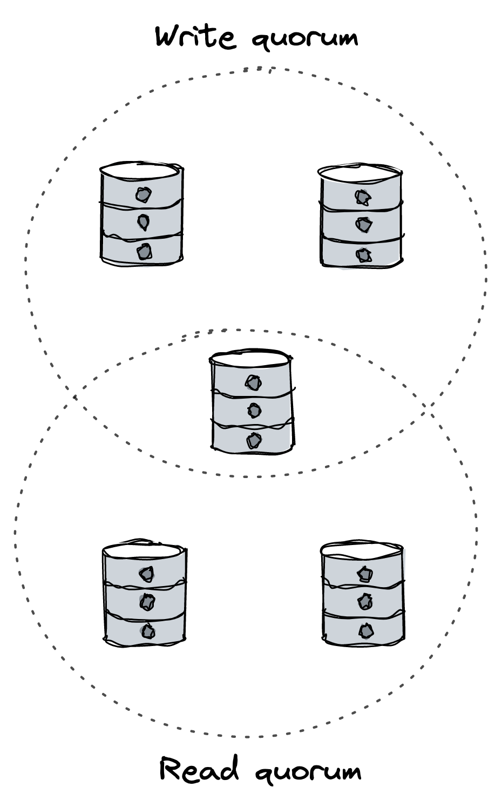
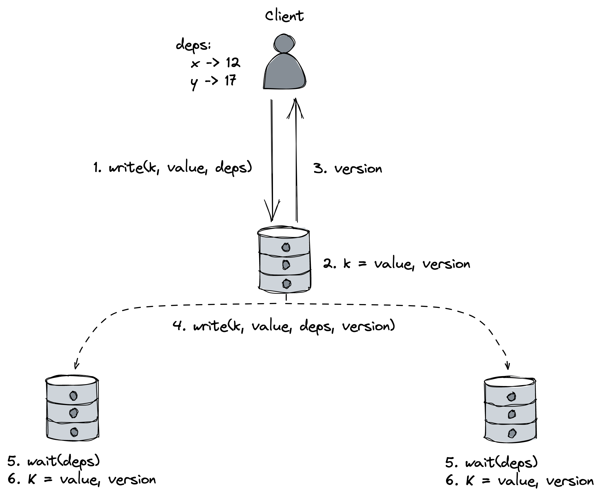

# 协调回避

另一种看待状态机复制的方式是作为一个需要两个主要成分的系统：

- 一个广播协议，即使在出现故障的情况下，也能保证每个副本以相同的顺序接收相同的更新（又名容错全序广播），
- 以及一个处理每个副本更新的确定性函数。

不出所料，实现一个容错的全序广播协议是使状态机复制难以解决的原因，因为它需要共识<sub>1</sub>。更重要的是，对总订单的需求造成了可扩展性瓶颈，因为更新需要由单个进程（例如，Raft 中的领导者）按顺序处理。此外，由于 CAP 定理 <sub>2</sub> 也适用于网络分区，因此在网络分区期间无法使用全序广播 <sub>3</sub>。

在本章中，我们将探索一种不需要全序但仍具有有用保证的复制形式。但首先，我们需要谈谈广播协议。

## 11.1 广播协议

广域网（如互联网）上的网络通信仅提供点对点（单播）通信协议，如 TCP。但是要将消息传递给一组进程，则需要广播协议（多播）。这意味着我们必须以某种方式在单播协议之上构建多播协议。这里的挑战是多播需要支持随时可能崩溃的多个发送方和接收方。

广播协议的特点是它提供的保证。尽力而为的广播保证如果发送方没有崩溃，消息会被传递到组中的所有非故障进程。实现它的一个简单方法是通过可靠的链接将消息一个一个地发送给一个组中的所有进程（见图 11.1）。但是，例如，如果发送方中途失败，则某些进程将永远不会收到消息。




图 11.1：尽力广播

与尽力而为的广播不同，可靠的广播保证消息最终被传递到组中的所有非故障进程，即使发送者在消息完全传递之前崩溃。实现可靠广播的一种方法是让每个进程在第一次传递消息时将消息重新传输给组的其余部分（见图 11.2）。这种方法也称为急切可靠广播。虽然它保证了所有非故障进程最终都会收到消息，但它的成本很高，因为它需要为一组 N 进程发送 N ^2^ 次消息。



图 11.2：渴望可靠的广播

消息的数量可以通过仅将消息重新传输到进程的随机子集（例如，图 11.3 中的 2 个）来减少。 这种实现被称为八卦广播协议<sub>4</sub>，因为它类似于谣言的传播方式。 因为它是一个概率协议，所以它不能保证消息会被传递到所有进程。 也就是说，可以通过调整协议的参数来使该概率可以忽略不计。 在向确定性协议无法扩展的大量进程广播时，Gossip 协议特别有用。



图 11.3：Gossip 广播

尽管可靠的广播协议保证消息被传递到组中的所有非故障进程，但它们不对其顺序做出任何保证。例如，两个进程可以接收相同的消息，但顺序不同。全序广播是一种可靠的广播抽象，它建立在可靠广播提供的保证之上，另外还确保消息以相同的顺序传递给所有进程。如前所述，容错实现需要共识。

## 11.2 无冲突的复制数据类型

现在，有一个想法：如果我们要使用不保证总顺序的广播协议来实现复制，我们不需要通过单个领导者序列化写入，而是可以允许任何副本接受写入。但是由于副本可能以不同的顺序接收消息，因此它们不可避免地会出现分歧。因此，为了使复制有用，分歧只能是暂时的，并且副本最终必须收敛到相同的状态。这是最终一致性的本质。

更正式地说，最终的一致性要求：

- 最终交付——保证在一个副本上应用的每个更新最终都应用在所有副本上，
- 和收敛——保证应用了相同更新的副本最终达到相同的状态。

使用不以相同顺序在所有副本之间传递消息的广播协议将不可避免地导致分歧（见图 11.4）。协调冲突写入的一种方法是使用共识来做出所有副本都需要同意的决定。



图 11.4：同一个对象同时被不同副本的不同客户端更新，导致冲突。

这种解决方案比使用全订单广播的解决方案具有更好的可用性和性能，因为共识只需要协调冲突并且可以在关键路径之外发生。但是，让和解逻辑正确并非易事。那么副本有没有办法在不使用共识的情况下解决冲突？

好吧，如果我们可以为任何潜在的冲突定义一个确定性的结果（例如，具有最大时间戳的写入总是获胜），那么设计上就不会有任何冲突。因此，协调副本不需要共识。这种复制策略提供了比普通的最终一致性更强的保证，即：

- 最终交付——与最终一致性相同的保证，
- 和强收敛——保证执行相同更新的副本具有相同的状态（即，每个更新都立即持久化）。

这种最终一致性的变化也称为强最终一致性<sub>5</sub>。有了它，我们可以构建可用的、（最终）一致的并且还可以容忍分区的系统。

需要哪些条件来保证副本强收敛？例如，假设我们跨 N 个副本复制一个对象，其中该对象是某种支持查询和更新操作（例如，整数、字符串、集合等）的数据类型的实例。

客户端可以向任何副本发送更新或查询操作，并且：

- 当副本收到查询时，它会立即使用对象的本地副本进行回复；
- 当一个副本收到更新时，它首先将其应用于对象的本地副本，然后将更新的对象广播到所有副本；
- 当副本接收到广播消息时，它会将消息中的对象与自己的对象合并。

可以证明，如果满足以下条件，每个副本将收敛到相同的状态：

- 对象的可能状态形成一个半格，即包含可以部分排序的元素的集合；
- 并且合并操作返回两个对象状态之间的最小上界（因此是幂等的、交换的和关联的）。

具有这些属性的数据类型也称为收敛复制数据类型<sub>6</sub>，它是无冲突复制数据类型 (CRDT) 系列的一部分。这听起来比实际上要复杂得多。

例如，假设我们正在处理整数对象（可以部分排序），并且合并操作取两个对象中的最大值（最小上限）。在这种情况下，很容易看出副本如何收敛到全局最大值，即使请求是无序交付和/或跨副本多次传递。

尽管到目前为止我们已经假设使用可靠的广播协议，但副本甚至可以使用不可靠的协议来实现广播，只要它们定期交换和合并它们的状态以确保它们最终收敛（也称为反熵机制，我们将请参阅第 11.3 节中的一些示例）。当然，如果天真地进行定期状态交换可能会很昂贵。

有许多数据类型旨在在复制时收敛，例如寄存器、计数器、集合、字典和图表。例如，寄存器是存储一些不透明字节序列的存储单元，支持分配操作以覆盖其状态。为了使寄存器收敛，我们需要定义其值的偏序和合并操作。有两种常见的寄存器实现可以满足这些要求：last-writer-wins (LWW) 和 multi-value (MV)。

LWW 寄存器将时间戳与每个更新相关联，以使更新完全可排序。时间戳可以由 Lamport 时间戳组成，以保留更新之间的发生之前的关系，并由副本标识符组成，以确保没有联系。当副本收到来自客户端的更新请求时，它会生成一个新的时间戳，并使用该时间戳和新值更新寄存器的状态；最后，它将状态和时间戳广播到所有副本。当一个副本从一个对等点接收到一个注册状态时，它会将其与本地副本合并，方法是获取时间戳较大的副本并丢弃另一个（见图 11.5）。



图 11.5: Last-writer wins register

LWW 寄存器的主要问题是并发发生的冲突更新是通过采用具有更大时间戳的更新来处理的，这可能并不总是有意义的。处理冲突的另一种方法是跟踪所有并发更新并将它们返回给客户端应用程序，客户端应用程序可以处理它认为合适的冲突。这是多值寄存器采用的方法。为了检测并发更新，副本用向量时钟时间戳标记每个更新，合并操作返回所有并发更新的联合（见图 11.6）。



图 11.6：多值寄存器

CRDT 的美妙之处在于它们可以组合。因此，例如，你可以通过使用 LWW 或 MV 寄存器的字典来构建收敛键值存储。这是 Dynamo 风格的数据存储所遵循的方法。

## 11.3 Dynamo 风格的数据存储

Dynamo<sub>8</sub> 可以说是最终一致且高度可用的键值存储的最著名设计。许多其他数据存储都受到了它的启发，例如 Cassandra<sub>9</sub> 和 Riak KV<sub>10</sub>。

在 Dynamo 风格的数据存储中，每个副本都可以接受写入和读取请求。当客户端想要将条目写入数据存储时，它会将请求并行发送到所有 N 个副本，但只等待来自 W 个副本的确认（写入仲裁）。类似地，当客户端想要从数据存储中读取条目时，它会将请求发送到所有副本，但只等待 R 个回复（读取仲裁）并将最新条目返回给客户端。为了解决冲突，条目的行为类似于 LWW 或 MV 寄存器，具体取决于实现风格。

当 ```W + R > N``` 时，写 quorum 和读 quorum 必须相互交叉，因此至少有一次读取将返回最新版本（见图 11.7）。不过，这本身并不能保证线性化。例如，如果写入在少于 W 个副本上成功而在其他副本上失败，则副本处于不一致状态，并且一些客户端可能会读取最新版本，而其他客户端则不会。为了避免这种不一致，需要将写入绑定到原子事务中。我们将在第 12 章详细讨论交易。



图 11.7：相交写入和读取仲裁

通常 W 和 R 被配置为多数仲裁，即包含超过一半副本数量的仲裁。也就是说，其他组合也是可能的，数据存储的读写吞吐量取决于 R 和 W 的大小。例如，读取繁重的工作负载受益于较小的 R；但是，这会使写入速度变慢且可用性降低（假设 ```W + R > N```）。或者，可以将 W 和 R 都配置为非常小（例如，```W = R = 1```），以牺牲一致性（```W + R < N```）以获得最大性能。

这种方法的一个问题是发送到副本的写入请求可能永远不会到达目的地。在这种情况下，无论等待多长时间，副本都不会收敛。为了确保副本收敛，使用了两种反熵机制：读取修复和副本同步。因此，另一种考虑仲裁复制的方法是将尽力广播与反熵机制相结合，以确保所有更改都传播到所有副本。

读取修复是客户端实施的一种机制，用于帮助在执行读取时使副本恢复同步。如前所述，当客户端执行读取时，它会等待 R 个回复。现在，假设其中一些回复包含较旧的条目。在这种情况下，客户端可以向不同步的副本发出带有最新条目的写入请求。尽管这种方法对于经常读取的条目效果很好，但不足以保证所有副本最终都会收敛。

副本同步是一种持续的后台机制，它在每个副本上运行并定期与其他副本进行通信以识别和修复不一致。例如，假设副本 X 发现它的密钥 K 版本比副本 Y 旧。在这种情况下，它将从 Y 检索最新版本的 K。为了检测不一致并最小化交换的数据量，副本可以交换带有 gossip 协议的 Merkle 树 hashes<sub>11</sub>。

## 11.4 CALM定理

此时，你可能想知道如何判断应用程序是否需要协调，例如共识，以及何时不需要。 CALM 定理<sub>12</sub> 指出，当且仅当程序是单调的时，程序具有一致的、无协调的分布式实现。

直观地说，如果新输入进一步细化输出并且不能收回任何先前的输出，则程序是单调的。一个计算集合并集的程序就是一个很好的例子——一旦一个元素（输入）被添加到集合（输出）中，它就不能被删除。类似地，可以证明 CRDT 是单调的。

相反，在非单调程序中，新输入可以收回先前的输出。例如，变量赋值是一个非单调操作，因为它会覆盖变量的先前值。

单调程序可以同时保持一致、可用和分区容错。然而，CALM 中的一致性并不是指线性化，即 CAP 中的 C。线性化只关注读写的一致性。相反，CALM 侧重于程序输出的一致性<sub>13</sub>。在 CALM 中，一致的程序是一种无论输入以何种顺序处理以及任何冲突都产生相同输出的程序；它没有说明读写的一致性。

例如，假设你要实现一个计数器。如果你可以使用的只是写入和读取操作，那么操作的顺序很重要：

```
write(1), write(2), write(3) => 3
```

但是

```
write(3), write(1), write(2) => 2
```

相反，如果程序有一个支持增量操作的计数器的抽象，你可以按照你喜欢的方式重新排序操作而不影响结果：

```
increment(1), increment(1), increment(1) => 3
```

换句话说，基于读写的一致性可能会限制解决方案空间<sub>14</sub>，因为可以构建在应用程序级别一致的系统，但在存储级别的读写方面则不然。

CALM 还可以识别由于不单调而无法保持一致的程序。例如，一个普通的寄存器/变量赋值操作不是单调的，因为它会使之前存储的任何值无效。但是，通过将赋值操作与逻辑时钟相结合，可以构建单调实现，正如我们之前在讨论 LWW 和 MV 寄存器时看到的那样。

## 11.5 因果一致性

所以我们现在了解了如何使用最终一致性来实现一致、可用和分区容忍的单调应用程序。不幸的是，有许多应用程序的保证是不够的。例如，最终一致性并不能保证副本以正确的顺序观察到先发生的操作。假设你将图片上传到社交网络，然后将其添加到图库。在最终保持一致的情况下，图库可能会在图像可用之前引用它，从而导致出现丢失的图像占位符。

强一致性的主要好处之一是它保留了操作之间的先发生顺序，这保证了原因发生在结果之前。因此，在前面的示例中，保证了对图库中新添加图片的引用仅在图片可用后才可见。

令人惊讶的是，为了保持操作之间的先发生顺序（因果顺序），我们不需要达到强一致性，因为我们可以使用称为因果一致性的较弱一致性模型<sub>15</sub>。这个模型弱于强一致性，但强于最终一致性，它特别有吸引力有两个原因：

- 对于许多应用程序，因果一致性"足够一致"并且比最终一致性更容易使用。
- 因果一致性是可证明的<sub>16</sub> 最强的一致性模型，它支持构建同样可用和分区容错的系统。

因果一致性对操作施加了部分顺序。最简单的定义要求进程在因果相关操作的顺序上达成一致，但在不相关操作的顺序上可以不一致。你可以进行任意两个操作，其中一个发生在另一个之前，或者它们是并发的，因此无法排序。这是与强一致性的主要区别，强一致性强加了一个所有进程都同意的全局顺序。

例如，假设一个进程更新了键值存储中的一个条目（操作 A），该条目稍后被另一个进程（操作 B）读取，该进程随后更新另一个条目（操作 C）。在这种情况下，系统中的所有进程都必须同意 A 发生在 C 之前。相反，如果两个操作 X 和 Y 同时发生并且都没有发生在另一个之前，则某些进程可能在 Y 之前观察到 X 而其他 Y在 X 之前。

让我们看看如何使用因果一致性来构建在网络分区下可用的复制数据存储。我们的讨论将基于"订单保持服务器集群"（COPS<sub>17</sub>），这是一种键值存储，可在地理分布的集群之间提供因果一致性。在 COPS 中，集群被设置为强一致的分区数据存储，但为简单起见，我们将其视为没有分区的单个逻辑节点。<sub>18</sub> 稍后，在第 16 章中，我们将详细讨论分区。

首先，让我们定义一种称为 causal+ 的因果一致性变体，其中不相关操作的顺序没有分歧（冲突）。分歧是有问题的，因为它们会导致副本永远分歧。为了避免它们，LWW 寄存器可以用作值，以确保所有副本在存在并发写入的情况下收敛到相同的状态。 LWW 寄存器由一个对象和一个表示其版本的逻辑时间戳组成。

在 COPS 中，任何副本都可以接受读写请求，客户端将请求发送到其最近的副本（本地副本）。当客户端向其本地副本发送对密钥的读取请求时，后者会使用本地可用的最新值进行回复。当客户端收到响应时，它会将收到的值的版本（逻辑时间戳）添加到用于跟踪依赖关系的本地键版本字典中。

当客户端向其本地副本发送写入时，它会将依赖字典的副本添加到请求中。副本为写入分配一个版本，在本地应用更改，并向客户端发送一个确认，其中包含分配给它的版本。即使其他客户端同时更新了密钥，它也可以在本地应用更改，因为值是用 LWW 寄存器表示的。最后，更新异步广播到其他副本。

当副本接收到要写入的复制消息时，它不会立即在本地应用它。相反，它首先检查写入的依赖项是否已在本地提交。如果没有，它会等到出现所需的版本。最后，一旦提交了所有依赖项，复制消息就会在本地应用。这种行为保证了因果一致性（见图 11.8）。



图 11.8：一个因果一致的键值存储实现

如果副本失败，则数据存储将继续可用，因为任何副本都可以接受写入。在本地提交更新后但在广播更新之前，副本可能会失败，从而导致数据丢失。在 COPS 的情况下，这种折衷被认为是可以接受的，以避免在确认客户端写入之前等待一个或多个远程请求到远程副本的代价。

## 11.6 实际考虑

总而言之，在前面的章节中，我们探索了实现复制的不同方法，并了解到一致性和可用性/性能之间存在权衡。换句话说，要构建可扩展且可用的系统，需要尽量减少协调。

这种权衡存在于任何大型系统中，有些系统甚至具有允许你控制它的旋钮。例如，Azure Cosmos DB 是一个完全托管的可扩展 NoSQL 数据库，它使开发人员能够在 5 种不同的一致性模型中进行选择，从最终一致性到强一致性<sub>19</sub>，其中较弱的一致性模型比强一致性模型具有更高的吞吐量。

--------------------

1. 全订单广播等价于共识，参见"Unreliable Failure Detectors for Reliable Distributed Systems"，https://www.cs.utexas.edu/~lorenzo/corsi/cs380d/papers/p225-chandra.pdf
2. "关于 CAP 定理的观点"，https://groups.csail.mit.edu/tds/papers/Gilbert/Brewer2.pdf
3. 与实现线性化读/写寄存器相比，共识更难解决，这是 CAP 定理用来定义一致性的。
4. "八卦协议"，https://en.wikipedia.org/wiki/Gossip_protocol
5. "强大的最终一致性和无冲突的复制数据类型"，https://www.microsoft.com/en-us/research/video/strong-eventual-consistency-and-conflict-free-replicated-data-types/
6. "无冲突的复制数据类型"，https://hal.inria.fr/inria-00609399v1/document
7. 在实践中，版本向量用于比较不同副本的状态，这些副本仅跟踪更改副本状态的事件，请参阅"分布式系统中相互不一致的检测"，https://pages.cs.wisc.edu/ ~remzi/Classes/739/Fall2017/Papers/parker83detection.pdf。
8. "Dynamo：亚马逊高度可用的键值对存储"，https://www.allthingsdistributed.com/files/amazon-dynamo-sosp2007.pdf
9. "Cassandra：开源 NoSQL 数据库"，https://cassandra.apache.org/
10. "Riak KV：分布式 NoSQL 键值数据库"，https://riak.com/products/riak-kv/
11. "默克尔树"，https://en.wikipedia.org/wiki/Merkle_tree
12. "保持冷静：当分布式一致性很容易时"，https://arxiv.org/pdf/1901.01930.pdf
13. 根据上下文，一致性可以有不同的含义；确保你在遇到它时准确地知道它指的是什么。
14. "以流沙为基础"，https://dsf.berkeley.edu/cs286/papers/quicksand-cidr2009.pdf
15. "因果一致性"，https://jepsen.io/consistency/models/causal
16. "一致性、可用性和收敛性"，https://apps.cs.utexas.edu/tech_reports/reports/tr/TR-2036.pdf
17. "不要满足于最终：使用 COPS 的广域存储的可扩展因果一致性，"https://www.cs.princeton.edu/~mfreed/docs/cops-sosp11.pdf
18. COPS 可以跟踪分区（以及节点）之间的因果关系，这与使用版本向量的更简单方法不同，后者将因果关系跟踪限制为单个节点可以存储的键集（请参阅"弱一致复制数据的会话保证"，https：/ /www.cs.utexas.edu/users/dahlin/Classes/GradOS/papers/SessionGuaranteesPDIS.pdf）。
19. "Azure Cosmos DB：推动全球分布式数据库的前沿"，https://azure.microsoft.com/en-gb/blog/azure-cosmos-db-pushing-the-frontier-of-globally-distributed-databases/