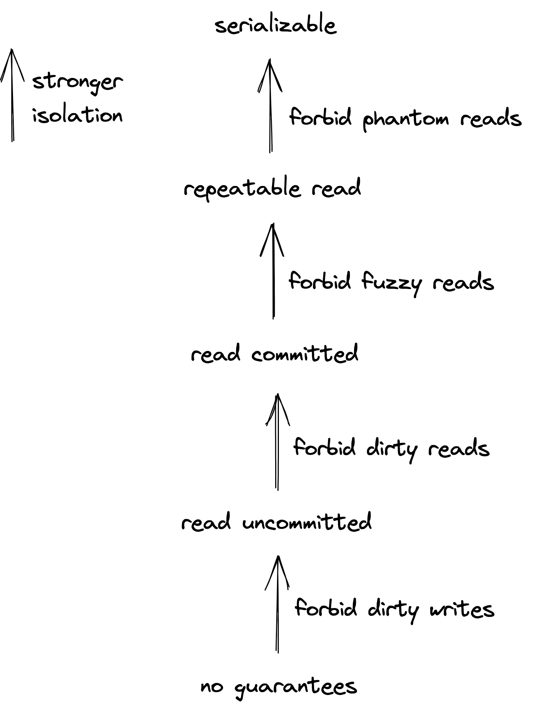
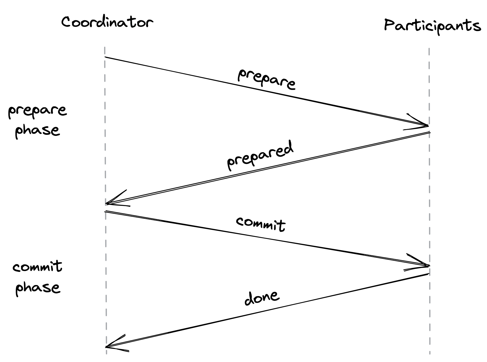
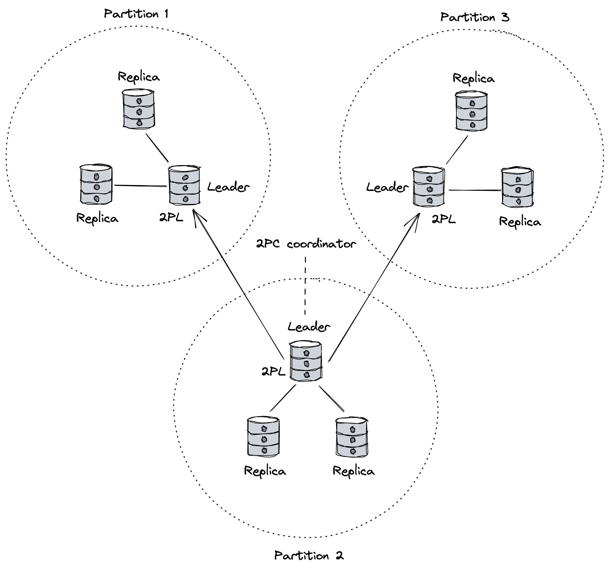

# 事务

事务<sub>1</sub> 提供了一种错觉，即组内的所有操作都成功完成，或者没有一个操作成功完成，就好像该组是单个原子操作一样。如果你过去使用过 MySQL 或 PostgreSQL 等关系型数据库，那么你应该熟悉这个概念。

如果你的应用程序专门更新单个关系数据库中的数据，那么将一些更改捆绑到事务中很简单。另一方面，如果你的系统需要以原子方式更新驻留在多个数据存储中的数据，则需要将这些操作包装到分布式事务中，实现起来更具挑战性。这是微服务架构中相当常见的场景，其中服务需要与其他服务交互以处理请求，并且每个服务都有自己独立的数据存储。在本章中，我们将探索解决这个问题的各种方法。

## 12.1 ACID

考虑从一个银行账户到另一个银行账户的汇款。如果提现成功，但由于某种原因转账失败，则需要将资金存回源账户。换句话说，传输需要原子地执行；提款和存款要么都成功，要么都失败。为了实现这一点，取款和存款需要包装在一个不可分割的变化单元中：事务。

在传统的关系数据库中，事务是一组操作，数据库为其保证一组属性，称为 ACID：

- 原子性保证部分失败是不可能的；事务中的所有操作要么成功完成，要么都不成功。因此，如果事务开始执行但由于任何原因失败，则必须撤消它所做的任何更改。无论事务本身是否失败（例如，除以零）或数据库在中途崩溃，这都需要发生。
- 一致性保证应用程序级不变量必须始终为真。换句话说，一个事务只能将一个数据库从一个正确的状态转换到另一个正确的状态。如何实现这一点是定义事务的应用程序开发人员的责任。例如，在转账中，不变性是转账后账户间的资金总额是相同的，即资金不能被销毁或创造。令人困惑的是，ACID 中的"C"与我们目前讨论的一致性模型无关，据 Joe Hellerstein 说，它是为了使首字母缩略词<sub>2</sub>起作用而被扔进去的。因此，我们将在本章的其余部分安全地忽略此属性。
- 隔离保证一个事务看起来是独立运行的，就好像没有其他事务正在执行一样，即事务的并发执行不会导致任何竞争条件。
- 持久性保证一旦数据库提交事务，更改将持久存储在持久存储中，以便数据库在随后崩溃时不会丢失更改。以我描述的方式，一旦数据被持久化到存储设备，听起来工作就完成了。但是，我们现在知道得更清楚了，在存在存储故障的情况下需要复制<sub>3</sub> 来确保持久性。

事务将开发人员从一系列可能的故障场景中解脱出来，这样他们就可以专注于实际的应用程序逻辑而不是处理故障。但是要了解分布式事务是如何工作的，我们首先需要讨论集中式、非分布式数据库是如何实现事务的。

## 12.2 隔离

保证没有事务干扰另一个事务的最简单方法是一个接一个地连续运行它们（例如，使用全局锁）。但是，当然，这将是非常低效的，这就是为什么实际上事务是并发运行的。但是，访问相同数据的一组并发运行的事务可能会遇到各种竞争条件，例如脏写、脏读、模糊读和幻读：

- 当一个事务覆盖另一个尚未提交的事务写入的值时，就会发生脏写。
- 当事务观察到尚未完成的事务的写入时，就会发生脏读。
- 当一个事务两次读取一个对象的值但在每次读取中看到不同的值时，就会发生模糊读取，因为另一个事务在两次读取之间更新了值。
- 当一个事务读取一组符合特定条件的对象，而另一个事务同时添加、更新或删除符合相同条件的对象时，就会发生幻读。例如，如果一个事务将所有员工的工资相加，而另一个事务同时删除一些员工记录，则最终总和在提交时将不正确。

为了防止这些竞争条件，事务需要与其他事务隔离。隔离级别可以防止一种或多种类型的竞争条件，并提供我们可以用来推理并发性的抽象。隔离级别越强，它对竞争条件的保护就越多，但性能越差。

隔离级别是根据它禁止的竞争条件类型定义的，如图 12.1 所示。



图 12.1：隔离级别定义了它们禁止的竞争条件。

可串行化是唯一隔离所有可能的竞争条件的隔离级别。它保证执行一组事务具有与事务以某种顺序连续（一个接一个）运行相同的副作用。例如，假设我们有两个并发事务，X 和 Y，并且事务 X 在事务 Y 之前提交。可序列化的系统保证即使它们的操作是交错的，它们似乎在另一个之后运行，即 X 在 Y 之前或 Y 在之前X（即使 Y 之后提交！）。要对事务的顺序添加实时性要求，我们需要更强的隔离级别：严格的可串行化。此级别将可串行化与线性化的实时保证相结合，因此当事务完成时，其副作用立即对所有未来事务可见。

（严格）可串行化很慢，因为它需要协调，这会在系统中产生争用。例如，一个事务可能被迫等待其他事务。在某些情况下，它甚至可能被强制中止，因为它不能再作为可序列化执行的一部分执行。因为并非所有应用程序都需要可串行化提供的保证，所以数据存储允许开发人员使用较弱的隔离级别。根据经验，我们需要有意识地决定使用哪个隔离级别并理解其含义，否则数据存储会默默地为我们做出决定；例如，PostgreSQL 的默认隔离<sub>4</sub> 是已提交读。因此，如果有疑问，请选择严格的可串行化。

隔离级别和竞争条件比我们在这里讨论的要多。 Jepsen<sub>5</sub> 为现有的隔离级别、它们之间的关系以及它们提供的保证提供了一个很好的正式参考。尽管供应商通常会记录其产品的隔离级别，但这些规范并不总是符合正式定义<sub>6</sub>。

现在我们知道什么是可串行化，挑战就变成了最大化并发性，同时仍然保持串行执行的外观。并发策略由并发控制协议定义，保证可串行化的协议有两类：悲观和乐观。

### 12.2.1 并发控制

悲观协议使用锁来阻止其他事务访问对象。最常用的协议是两阶段锁定<sub>7</sub> (2PL)。 2PL 有两种类型的锁，一种用于读，一种用于写。读锁可以由以只读模式访问对象的多个事务共享，但它会阻止尝试获取写锁的事务。写锁只能由单个事务持有，并阻止任何试图获取对象上的读或写锁的人。锁由锁管理器持有，该管理器跟踪到目前为止授予的锁、获取它们的事务以及等待释放它们的事务。

2PL有两个阶段，一个扩展阶段和一个收缩阶段。在扩展阶段，事务只允许获取锁，不能释放锁。在收缩阶段，事务只允许释放锁而不能获取锁。如果遵守这些规则，就可以正式证明该协议保证了严格的可串行化。实际上，只有在事务完成时才会释放锁（又名严格的 2PL）。这确保了由未提交事务 X 写入的数据在提交之前被锁定，从而防止另一个事务 Y 读取它并因此在 X 中止时中止（也称为级联中止），从而导致工作浪费。

不幸的是，使用 2PL，两个或多个事务可能会死锁并卡住。例如，如果事务 X 正在等待事务 Y 持有的锁，而事务 Y 正在等待授予事务 X 的锁，那么这两个事务将不会有任何进展。处理死锁的一般方法是在它们发生后检测它们并选择一个"受害者"事务来中止并重新启动以打破死锁。

与悲观协议相比，乐观协议基于冲突很少且事务是短暂的假设而乐观地执行事务而不会阻塞。乐观并发控制<sub>8</sub>（OCC）可以说是该领域最著名的协议。在 OCC 中，事务写入本地工作区而不修改实际数据存储。然后，当事务要提交时，数据存储会比较事务的工作空间，看它是否与另一个正在运行的事务的工作空间冲突。这是通过为每个事务分配一个确定其可序列化顺序的时间戳来完成的。如果验证成功，则将本地工作空间的内容复制到数据存储中。如果验证失败，事务将中止并重新启动。

值得指出的是，OCC 使用锁来保证内部共享数据结构的互斥。这些物理锁的持有时间很短，与我们之前在 2PL 上下文中讨论的逻辑锁无关。例如，在验证阶段，数据存储必须获取锁才能访问正在运行的事务的工作区以避免竞争条件。在数据库世界中，这些锁也被称为闩锁，以区别于逻辑锁。

乐观协议避免了悲观协议的开销，例如获取锁和管理死锁。因此，这些协议非常适合很少执行写入的读取繁重的工作负载或执行仅偶尔相互冲突的写入的工作负载。另一方面，悲观协议对于冲突繁重的工作负载更有效，因为它们避免了浪费工作。

退后一步，到目前为止讨论的乐观和悲观协议都不是只读事务的最佳选择。在 2PC 中，只读事务可能要等待很长时间才能获取共享锁。另一方面，在 OCC 中，只读事务可能会中止，因为它读取的值已被覆盖。通常，只读事务的数量远高于写事务的数量，因此如果只读事务永远不会因为与写事务的冲突而阻塞或中止，那将是理想的。

多版本并发控制 <sub>9</sub> (MVCC) 通过维护旧版本的数据在此前提下提供。从概念上讲，当事务写入对象时，数据存储会创建它的新版本。当事务读取一个对象时，它会读取事务开始时存在的最新版本。此机制允许只读事务读取数据存储的不可变且一致的快照，而不会由于与写入事务的冲突而阻塞或中止。然而，对于写事务，MVCC 回退到我们之前讨论过的并发控制协议之一（即 2PL 或 OCC）。由于通常大多数事务都是只读的，因此这种方法提供了重大的性能改进，这就是为什么 MVCC 是当今使用最广泛的并发控制方案。

例如，当 MVCC 与 2PL 结合使用时，写入事务使用 2PL 访问它想要读取或写入的任何对象，因此如果另一个事务试图更新其中任何一个，它将阻塞。当事务准备好提交时，事务管理器给它一个唯一的提交时间戳 TC<sub>i</sub>，它分配给事务创建的所有新版本。因为一次只能提交一个事务，这保证了事务一旦提交，一个开始时间戳 TS<sub>j</sub> 大于或等于前一个事务的提交时间戳（TS<sub>j</sub>≥TC<sub>i</sub>）的只读事务将看到所有先前事务应用的更改。这是该协议允许只读事务仅读取时间戳小于或等于 TS<sub>j</sub> 的对象的最新提交版本的结果。由于这种机制，只读事务可以读取数据存储的不可变且一致的快照，而不会由于与写入事务的冲突而阻塞或中止。

我故意掩盖了这些并发控制协议是如何实现的细节，因为你不太可能必须从头开始实现它们。但是，你的应用程序依赖的商业数据存储使用上述协议来隔离事务，因此你必须基本掌握它们的权衡。如果你对细节感兴趣，我强烈推荐 Andy Pavlo 的数据库系统课程 <sub>10</sub>。

也就是说，在分布式应用程序中广泛使用的单个对象级别存在有限形式的 OCC，你应该知道如何实现。该协议为每个对象分配一个版本号，该版本号在每次更新对象时递增。然后，事务可以从数据存储中读取一个值，进行一些本地计算，最后根据未更改的对象版本更新该值。此验证步骤可以使用许多数据存储支持的比较和交换操作自动执行。 <sub>11</sub> 例如，如果事务读取对象的版本 42，则仅当版本未更新时，它才能稍后更新对象。 t 改变了。因此，如果版本相同，则更新对象并将版本号递增到 43（原子地）。否则，事务将中止并重新启动。

## 12.3 原子性

执行事务时，有两种可能的结果：要么在完成所有操作后提交，要么在执行某些操作后由于失败而中止。当事务中止时，数据存储需要保证事务执行的所有更改都被撤消（回滚）。

为了保证原子性（以及持久性），数据存储在应用它们之前记录对预写日志（WAL）的所有更改。每个日志条目记录进行更改的事务的标识符、正在修改的对象的标识符以及对象的旧值和新值。大多数情况下，数据库根本不会从该日志中读取。但是，如果事务中止或数据存储崩溃，日志包含足够的信息来重做更改以确保原子性和持久性，并在事务执行期间发生故障时撤消更改。<sub>12</sub>

不幸的是，这种基于 WAL 的恢复机制只能保证单个数据存储中的原子性。回到我们从一个银行账户向另一个银行账户汇款的原始示例，假设这两个账户属于使用不同数据存储的两家不同银行。我们不能只运行两个单独的事务来分别提取和存入资金——如果第二个事务失败，系统就会处于不一致的状态。我们想要的是保证两个事务要么成功并且它们的更改被提交，要么它们失败而没有任何副作用。

### 12.3.1 两阶段提交

两阶段提交<sub>13</sub> (2PC) 是一种用于跨多个进程实现原子事务提交的协议。 该协议分为两个阶段，准备和提交。 它假定一个流程充当协调者并协调其他流程（称为参与者）的动作。 例如，启动事务的客户端应用程序可以充当协议的协调器。

当协调者想要提交事务时，它会发送一个准备请求，询问参与者是否准备好提交事务（见图 12.2）。 如果所有参与者都回复他们准备好提交，则协调器向所有参与者发送提交请求，命令他们这样做。 相反，如果任何进程回复它无法提交或没有及时响应，则协调器会向所有参与者发送中止请求。



图 12.2：两阶段提交协议由准备阶段和提交阶段组成。

协议中有两点不归路。如果参与者回复了准备好提交的消息，那么无论如何它都必须稍后再提交。参与者从那一刻起无法取得进展，直到它收到来自协调者的消息以提交或中止事务。这意味着如果协调器崩溃，参与者就会被卡住。

不返回的另一点是协调器在收到所有参与者对其准备消息的响应后决定提交或中止事务。一旦协调器做出决定，它就不能在以后改变主意，并且无论如何都必须看到事务被提交或中止。如果参与者暂时宕机，协调者将继续重试，直到请求最终成功。

两阶段提交的声誉好坏参半14。它很慢，因为它需要多次往返才能完成事务，并且如果协调者或参与者失败，则事务的所有进程都会被阻塞，直到失败的进程重新联机。最重要的是，参与者需要实施协议；你不能只使用两个不同的数据存储并期望它们相互配合。

如果我们愿意增加协议的复杂性，我们可以通过复制事务中涉及的每个进程的状态来使其对故障更具弹性。例如，使用 Raft 等共识协议复制协调器可以使 2PC 对协调器故障具有弹性。同样，参与者也可以被复制。

事实证明，以原子方式提交事务是一种共识形式，称为统一共识，其中所有进程都必须就一个值达成一致，即使是错误的也是如此。相比之下，第 10.2 节中介绍的一般共识形式仅保证所有非故障进程都同意提议的值。因此，统一共识实际上比共识更难15。尽管如此，如前所述，普遍共识可用于复制每个进程的状态，并使整个协议对故障更加健壮。

## 12.4 新SQL

作为历史的旁注，在 2000 年代后期出现的现代大型数据存储的第一个版本曾经被称为 NoSQL 存储，因为它们的核心功能完全专注于可扩展性并且缺乏传统关系数据库的保证，例如作为 ACID 事务。但近年来，随着分布式数据存储继续添加只有传统数据库提供的功能，这种情况开始发生变化。

可以说，NewSQL 数据存储最成功的实现之一是 Google 的 Spanner<sub>16</sub>。在较高级别上，Spanner 将数据（键值对）分解为分区以进行扩展。使用状态机复制协议 (Paxos) 在不同数据中心的一组节点之间复制每个分区。

在每个复制组中，有一个特定的节点充当领导者，它通过首先在该组的大部分中复制它然后应用它来处理该分区的客户端写入事务。领导者还充当锁管理器并实施 2PL 以隔离修改分区的事务。

为了支持跨多个分区的事务，Spanner 实现了 2PC。事务由客户端发起并由所涉及分区的组长之一协调。所有其他组长都充当事务的参与者（见图 12.3）。

协调器将事务的状态记录到本地预写日志中，该日志在其复制组中复制。这样，如果协调器崩溃，复制组中的另一个节点将被选为领导者并继续协调事务。同样，每个参与者都会在其日志中记录事务的状态，该日志也会在其组中复制。因此，如果参与者失败，组中的另一个节点将接管作为领导者并恢复事务。

为了保证事务之间的隔离，Spanner 使用 MVCC 结合 2PL。多亏了这一点，只读事务是无锁的，并且可以看到数据存储的一致快照。相比之下，写事务使用两阶段锁定来创建它们更改的对象的新版本，以保证严格的可串行化。



图 12.3：Spanner 将 2PC 与 2PL 和状态机复制相结合。在这个图中，有 3 个分区，每个分区有 3 个副本。

如果你还记得 12.2 节中关于 MVCC 的讨论，你应该知道每个事务都被分配了一个唯一的时间戳。虽然在单台机器上很容易做到这一点，但在分布式环境中更具挑战性，因为时钟并不完全同步。尽管我们可以使用为事务分配唯一时间戳的集中式时间戳服务，但这将成为可扩展性瓶颈。为了解决这个问题，Spanner 使用物理时钟，而不是返回精确的时间戳，而是返回不确定的间隔
```[tearliest,tlatest]``` 考虑测量的误差边界，其中```tearliest≤treal≤tlatest```。因此，虽然一个节点不知道当前的物理时间进程，但它很可能知道它在区间内。

从概念上讲，当一个事务想要提交时，它被分配了事务协调器时钟返回的间隔的最新时间戳。但是在事务可以提交和释放锁之前，它会等待一个等于不确定期（tlatest-tearliest）的持续时间。等待时间保证在前一个事务提交之后开始的任何事务都可以看到它应用的更改。当然，挑战在于保持不确定性区间尽可能小，以使事务快速进行。 Spanner 通过在每个数据中心部署 GPS 和原子钟并经常与它们同步节点的石英钟来做到这一点。<sub>17</sub>。其他受 Spanner 启发的系统，如 CockroachDB<sub>18</sub>，采用了不同的方法，而是依赖于由物理时间戳和逻辑时间戳组成的混合逻辑时钟。 <sub>19</sub>

------------------

1. "事务处理"，https://en.wikipedia.org/wiki/Transaction_processing
2. "什么时候是"ACID"ACID？很少。" http://www.bailis.org/blog/when-is-acid-acid-rarely/
3. 见第 10 章
4. "PostgreSQL 事务隔离"，https://www.postgresql.org/docs/12/transaction-iso.html
5. "一致性模型"，https://jepsen.io/consistency
6. "Jepsen 分析"，https://jepsen.io/analysiss
7. "两阶段锁定"，https://en.wikipedia.org/wiki/Two-phase_locking
8. "关于并发控制的乐观方法"，https://www.eecs.harvard.edu/~htk/publication/1981-tods-kung-robinson.pdf
9. "多版本并发控制"，https://en.wikipedia.org/wiki/Multiversion_concurrency_control
10. "CMU 15-445/645：数据库系统"，https://15445.courses.cs.cmu.edu/fall2019/
11. 在第 9.2 节讨论租赁时，我们已经看到了一个例子。
12. 这种恢复机制如何工作的细节超出了本书的范围，但你可以从任何数据库教科书中了解更多信息。
13. "两阶段提交协议"，https://en.wikipedia.org/wiki/Two-phase_commit_protocol
14. "是时候从两阶段提交继续前进了"，http://dbmsmusings.blogspot.com/2019/01/its-time-to-move-on-from-two-phase.html
15. "统一共识比共识更难，"https://infoscience.epfl.ch/record/88273/files/CBS04.pdf?version=1
16. "Spanner：Google 的全球分布式数据库"，https://static.googleusercontent.com/media/research.google.com/en//archive/spanner-osdi2012.pdf
17. 时钟不确定性一般小于10ms。
18. "CockroachDB"，https://www.cockroachlabs.com/
19. "全球分布式数据库中的逻辑物理时钟和一致快照"，https://cse.buffalo.edu/tech-reports/2014-04.pdf