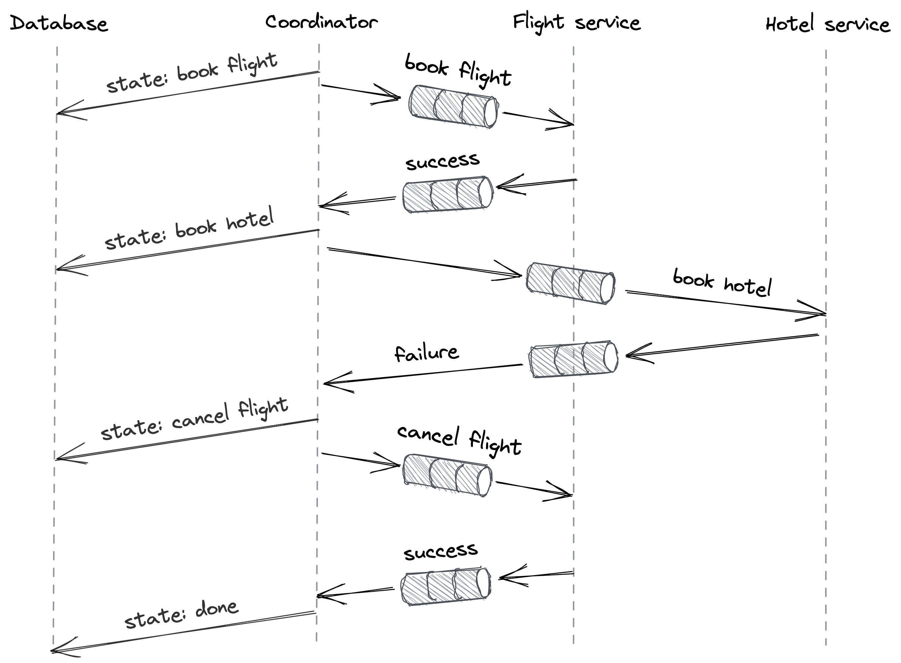

# 异步事务

2PC 是一种同步阻塞协议——如果协调者或任何参与者速度慢或不可用，事务就无法进行。由于其阻塞特性，2PC 通常与阻塞并发控制协议（如 2PL）结合使用，以提供隔离。这意味着参与者在等待协调者的同时持有锁，阻止其他访问相同对象的事务取得进展。

2PC 的基本假设是协调者和参与者都可用并且事务的持续时间是短暂的。虽然我们可以通过使用状态机复制来对参与者的可用性做一些事情，但我们不能对由于其性质而需要很长时间才能执行的事务做很多事情，比如几小时或几天。在这种情况下，阻止只是不是一种选择。此外，如果参与者属于不同的组织，这些组织可能不愿意互相授予阻止他们的系统运行他们无法控制的交易的权力。

为了解决这个问题，我们可以在现实世界中寻找解决方案。例如，考虑通过本票在两家银行之间进行资金转账。首先，发行支票的银行从来源账户中扣除资金。然后，支票被实际运送到另一家银行，并最终存入目的地账户。为使资金转帐生效，支票不能丢失或多次存入。由于在交易进行时来源银行和目的地银行都不必相互等待，因此通过支票进行的资金转移是异步（非阻塞）原子交易。但是，为此付出的代价是，在支票转移时，源账户和目标账户处于不一致的状态。因此，虽然异步事务是原子的，但它们并不是相互隔离的。

现在，因为检查只是一条消息，我们可以用通过网络发送的持久消息的概念来概括这个想法，即保证只处理一次的消息。在本章中，我们将讨论基于此概念的异步事务的一些实现。

## 13.1 发件箱模式

现代应用程序中的一个常见模式[^1]是将相同的数据复制到针对不同用例定制的不同数据存储中。例如，假设我们拥有一个由关系数据库支持的产品目录服务，并且我们决定在其 API 中提供高级全文搜索功能。尽管一些关系数据库提供了基本的全文搜索功能，但更高级的用例需要专用服务，例如 Elasticsearch[^2]。

为了与搜索服务集成，目录服务需要在添加新产品或修改或删除现有产品时更新关系数据库和搜索服务。该服务可以先更新关系数据库，然后再更新搜索服务，但如果服务在更新搜索服务之前崩溃，系统将处于不一致状态。所以我们需要以某种方式将这两个更新包装到一个事务中。

我们可以考虑使用 2PC，但是虽然关系数据库支持 X/Open XA[^3] 2PC 标准，但搜索服务不支持，这意味着我们必须以某种方式实现搜索服务的协议。如果搜索服务暂时不可用，我们也不希望目录服务阻塞。尽管我们希望两个数据存储同步，但我们可以接受一些暂时的不一致。所以最终的一致性对于我们的用例是可以接受的。

我们可以通过让目录服务在添加、修改或删除产品时向搜索服务发送持久消息来解决这个问题。一种实现方式是本地事务在更改产品目录时将消息附加到专用的发件箱表[^4]。因为关系数据库支持 ACID 事务，所以当且仅当本地事务提交并且没有中止时，消息才会附加到发件箱表中。

然后可以通过专用中继进程监控发件箱表。当中继进程发现一条新消息时，它会将消息发送到目的地，即搜索服务。中继进程仅在收到消息已成功传递的确认时才从表中删除消息。毫不奇怪，同一条消息可能会被多次传递。例如，如果中继进程在发送消息后但在将其从表中删除之前崩溃，它将在重新启动时重新发送消息。为了保证目的地只处理一次消息，给它分配了一个幂等键，以便可以对消息进行重复数据删除（我们在第 5.7 章中讨论了这一点）。

在实践中，中继过程不会直接将消息发送到目的地。 相反，它将消息转发到消息通道[^5]，如 Kafka[^6]或 Azure Event Hubs[^7]，负责按照附加顺序将它们传递到一个或多个目的地。 稍后在第 23 章中，我们将更详细地讨论消息通道。

如果你稍微眯眼，你会发现我们刚刚在这里实现的在概念上类似于状态机复制，其中状态由目录中的产品表示，并且复制通过操作日志（发件箱表）发生 .

## 13.2 Sagas

现在假设我们拥有一个旅行预订服务。要预订旅行，旅行服务必须通过专用服务自动预订航班，并通过另一服务自动预订酒店。但是，这些服务中的任何一个都可能使它们各自的请求失败。如果一个预订成功，而另一个失败，则需要取消前者以保证原子性。因此，预订旅行需要多个步骤才能完成，其中一些仅在失败的情况下才需要。因此，我们不能使用前面介绍的简单解决方案。

Saga[^8]模式为这个问题提供了解决方案。 saga 是由一组本地事务 T1,T2,...,Tn 组成的分布式事务，其中 Ti 有一个相应的补偿本地事务 Ci 用于撤消其更改。 saga 保证所有本地事务都成功，或者在失败的情况下，补偿本地事务完全撤消事务的部分执行。这保证了协议的原子性；要么所有本地事务都成功，要么都不成功。

考虑 sagas 的另一种方式是，每个本地事务 Ti 都假设所有其他本地事务都会成功。这是一个猜测，而且很可能是一个很好的猜测，但在一天结束时仍然是一个猜测。所以当猜测错误时，就已经犯了错误，需要以补偿交易 Ci 的形式发出"补偿[^9]"。这类似于现实世界中发生的情况，例如，航班超额预订。

saga 可以使用协调器（即事务协调器）来实现，该协调器管理跨所涉及的进程（即事务的参与者）的本地事务的执行。在我们的示例中，旅行预订服务是交易的协调者，而航班和酒店预订服务是交易的参与者。传奇由三个本地交易组成：T1 预订航班，T2 预订酒店，C1 取消通过 T1 预订的航班。

在高层次上，可以使用图 13.1 中描述的工作流[^10]来实现 saga：

1. 协调器通过向航班服务发送预订请求 (T1) 来启动交易。如果预订失败，则不会造成任何损害，并且协调器将事务标记为中止。
2. 如果航班预订成功，协调器将向酒店服务发送预订请求 (T2)。如果请求成功，则事务被标记为成功，我们都完成了。
3. 如果酒店预订失败，交易需要中止。协调员向航班服务发送取消请求 (C1) 以取消之前预订的航班。如果没有取消，交易将处于不一致的状态，这将破坏其原子性保证。

协调器可以通过消息通道与参与者异步通信以容忍临时故障。由于事务需要多个步骤才能成功，并且协调器随时可能失败，因此它需要在事务进行时保持事务的状态。通过将事务建模为状态机，协调器可以在它从一个状态转换到下一个状态时持久地将其状态检查点到数据存储。这确保了如果协调器崩溃并重新启动，或者另一个进程被选为协调器，它可以通过读取最后一个检查点从中断的地方恢复事务。

图 13.1：实现异步事务的工作流

不过，有一个警告；如果协调器在发送请求后但在备份其状态之前崩溃，它将在重新联机时再次发送相同的请求。同样，如果发送请求超时，协调器将不得不重试，导致消息在接收端出现两次。因此，参与者必须对他们收到的消息进行重复数据删除，以使其具有幂等性。

在实践中，你无需从头开始构建编排引擎来实施此类工作流，因为 AWS Step Functions[^11]或 Azure Durable Functions[^12]等云计算服务可以轻松创建托管工作流。

## 13.3 隔离

我们开始了异步事务之旅，以此来解决 2PC 的阻塞特性。但要做到这一点，我们不得不牺牲传统 ACID 事务提供的隔离保证。事实证明，我们也可以解决缺乏隔离的问题。例如，一种方法是使用语义锁13。这个想法是，saga 修改的任何数据都标有一个脏标志，该标志仅在事务结束时被清除。另一个尝试访问脏记录的事务可能会失败并回滚其更改，或者等到脏标志被清除。

---------------------

[1] "在线事件处理：在分布式事务失败的情况下实现一致性"，https://queue.acm.org/detail.cfm?id=3321612

[1] "Elasticsearch：一个分布式的 RESTful 搜索和分析引擎，"https://www.elastic.co/elasticsearch/

[1] "分布式事务处理：XA 规范"，https://pubs.opengroup.org/onlinepubs/009680699/toc.pdf

[1] "模式：事务发件箱"，https://microservices.io/patterns/data/transactional-outbox.html

[1] 例如，Debezium 是执行此操作的开源中继服务，请参阅 https://debezium.io/

[1] "Apache Kafka：开源分布式事件流平台"，https://kafka.apache.org

[1] "Azure 事件中心：完全托管的实时数据摄取服务"，https://azure.microsoft.com/en-gb/services/event-hubs/

[1] "传奇"，https://www.cs.cornell.edu/andru/cs711/2002fa/reading/sagas.pdf

[1] "以流沙为基础"，https://dsf.berkeley.edu/cs286/papers/quicksand-cidr2009.pdf

[1] "阐明 Saga 模式"，http://web.archive.org/web/20161205130022/http://kellabyte.com:80/2012/05/30/clarifying-the-saga-pattern

[1] "AWS Step Functions"，https://aws.amazon.com/step-functions/

[1] "Azure Durable Functions 文档"，https://docs.microsoft.com/en-us/azure/azure-functions/durable/

[1] "使用远程过程调用和更新传播的多数据库中的语义 ACID 属性"，https://dl.acm.org/doi/10.5555/284472.284478