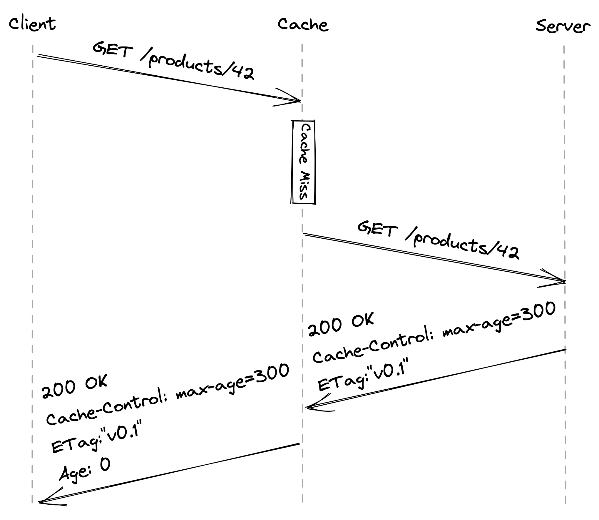
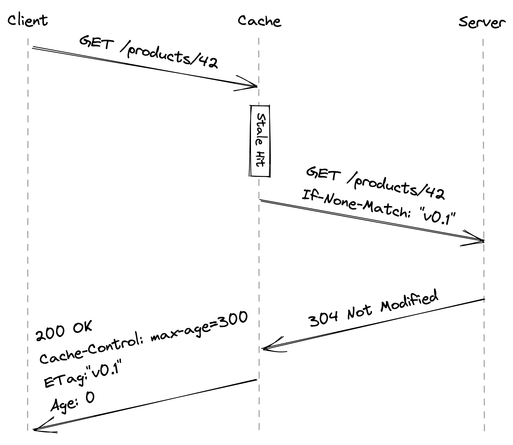

# HTTP缓存

Cruder 的应用服务器此时同时处理静态和动态资源。静态资源包含通常不会从一个请求更改为另一个请求的数据，例如 JavaScript 或 CSS 文件。相反，动态资源由服务器动态生成，例如包含用户配置文件的 JSON 文档。

由于静态资源不会经常更改，因此可以对其进行缓存。这个想法是让客户端（即浏览器）缓存资源一段时间，以便下次访问不需要网络调用，从而减少服务器的负载和响应时间。[^1]

让我们通过一个具体的例子来看看客户端 HTTP 缓存在实践中是如何工作的。 HTTP 缓存仅限于不改变服务器状态的安全请求方法，例如 GET 或 HEAD。假设客户端向它之前未访问过的资源发出 GET 请求。本地缓存拦截请求，如果在本地找不到资源，它会代表客户端从源服务器获取资源。

服务器使用特定的 HTTP 响应标头[^2] 让客户端知道资源是可缓存的。因此，当服务器响应资源时，它会添加一个 Cache-Control 标头，该标头定义缓存资源 (TTL) 的时间长度，以及一个带有版本标识符的 ETag 标头。最后，当缓存接收到响应时，它将资源存储在本地并将其返回给客户端（见图 14.1）。

图 14.1：客户端第一次访问资源（Age 标头包含对象在缓存中的时间，以秒为单位）

现在，假设经过一段时间，客户端再次尝试访问资源。缓存首先检查资源是否还没有过期，即是否新鲜。如果是这样，缓存会立即返回它。但是，即使从客户端的角度来看资源还没有过期，服务器也可能在此期间更新了它。这意味着读取不是强一致的，但我们可以安全地假设这是我们的应用程序可以接受的折衷方案。

如果资源已过期，则将其视为过期。在这种情况下，缓存会向服务器发送一个 GET 请求，其中包含一个条件头（如 If-None-Match），其中包含过期资源的版本标识符，以检查是否有更新的版本可用。如果有，服务器返回更新的资源；如果没有，服务器会回复 304 Not Modified 状态码（见图 14.2）。

图 14.2：客户端访问陈旧资源

理想情况下，静态资源应该是不可变的，以便客户端可以"永久"缓存它，根据 HTTP 规范，这对应于一年的最大长度。如果需要，我们仍然可以通过创建具有不同 URL 的新资源来修改静态资源，强制客户端从服务器获取。

将静态资源视为不可变的另一个优点是我们可以原子地更新多个相关资源。例如，如果我们发布应用程序网站的新版本，更新后的 HTML 索引文件将引用 JavaScript 和 CSS 包的新 URL。因此，客户端将看到旧版本的网站或新版本的网站，具体取决于它读取的索引文件，但绝不会混合使用两者，例如旧的 JavaScript 捆绑包和新的 CSS 捆绑包。

另一种考虑 HTTP 缓存的方式是，我们将读取路径 (GET) 与写入路径 (POST、PUT、DELETE) 区别对待，因为我们预计读取次数比写入次数高几个数量级。这是一种常见的模式，称为命令查询职责分离[^3] (CQRS) 模式。[^4]

总而言之，允许客户端缓存静态资源减少了我们服务器的负载，我们所要做的就是使用一些 HTTP 标头！我们可以通过引入带有反向代理的服务器端 HTTP 缓存来进一步缓存。

## 14.1 反向代理

反向代理是一种服务器端代理，它拦截与客户端的所有通信。由于代理与实际服务器无法区分，客户端不知道他们正在通过中介进行通信（参见图 14.3）。

图 14.3：反向代理充当客户端和服务器之间的中介。

反向代理的一个常见用例是缓存服务器返回的静态资源。由于缓存在客户端之间共享，因此它将比任何客户端缓存更能减少服务器的负载。

因为反向代理是一个中间人，所以它不仅仅可以用于缓存。例如，它可以：

- 代表服务器验证请求；
- 在返回给客户端之前压缩响应以加快传输速度；
- 来自特定 IP 或用户的速率限制请求，以保护服务器不过载；
- 跨多个服务器的负载平衡请求以处理更多负载。

我们将在接下来的章节中探讨其中的一些用例。 NGINX[^5] 和 HAProxy[^6] 是广泛使用的反向代理，我们可以利用它们来构建服务端缓存。但是，反向代理的许多用例已被托管服务商品化。因此，与其构建服务器端缓存，不如利用内容交付网络 (CDN)。

这是实际复制模式的一个示例。

[^1]: "HTTP 缓存": https://developer.mozilla.org/en-US/docs/Web/HTTP/Caching
[^2]:  "CQRS": https://martinfowler.com/bliki/CQRS.html
[^3]: 这是功能分解的另一个例子
[^4]: "NGINX": https://www.nginx.com/
[^5]: "HAProxy": https://www.haproxy.com/