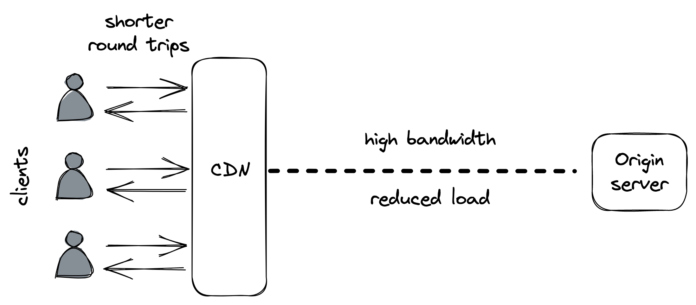

# CDN

CDN 是地理上分布的缓存服务器（反向代理）的覆盖网络，其架构围绕运行互联网的网络协议的设计限制。

使用 CDN 时，客户端会点击解析为属于 CDN 的缓存服务器的 URL。当 CDN 服务器收到请求时，它会检查请求的资源是否在本地缓存。如果没有，CDN 服务器使用原始 URL 透明地从源服务器（即我们的应用程序服务器）获取它，在本地缓存响应，并将其返回给客户端。 AWS CloudFront[^1] 和 Akamai[^2] 是知名 CDN 服务的示例。

## 15.1 覆盖网络

你会认为 CDN 的主要好处是缓存，但它实际上是底层网络基础。公共互联网由数千个网络组成，其核心路由协议 BGP 在设计时并未考虑性能。它主要使用跳数来计算一条路径相对于另一条路径的成本，而不考虑它们的延迟或拥塞。

顾名思义，CDN 就是一个网络。更具体地说，建立在互联网之上的覆盖网络[^3]，它利用各种技术来减少网络请求的响应时间并增加数据传输的带宽。

当我们在第 2 章第一次讨论 TCP 时，我们谈到了最小化客户端和服务器之间的延迟的重要性。无论服务器有多快，如果客户端位于世界的另一端，响应时间将超过 100 毫秒，因为网络延迟是物理上受限于光速的。更不用说通过公共互联网长距离发送数据时增加的错误率。

这就是为什么 CDN 集群被放置在多个地理位置以更靠近客户端的原因。但是客户如何知道哪个集群离他们最近呢？一种方法是通过全局 DNS 负载平衡[^4]：对 DNS 的扩展，它考虑从其 IP 推断出的客户端位置，并返回地理上最近的集群列表，同时考虑网络拥塞和集群的健康状况。

CDN 服务器也放置在互联网交换点，ISP 在这里相互连接。这样，实际上从源服务器到客户端的整个通信都流经作为 CDN 一部分的网络链路，并且由于距离短，两端的短暂跃点具有低延迟。

覆盖网络的路由算法经过优化，可以根据不断更新的网络健康数据来选择延迟和拥塞减少的路径。此外，尽可能利用 TCP 优化，例如在服务器之间使用持久连接池来避免建立新连接的开销，并使用最佳 TCP 窗口大小来最大化有效带宽（参见图 15.1）。

图 15.1：CDN 减少了客户端网络调用的往返时间和源服务器的负载。

覆盖网络还可用于加速无法缓存的动态资源的交付。在这种能力下，CDN 成为应用程序的前端，保护其免受分布式拒绝服务 (DDoS) 攻击[^5]。

## 15.2 缓存

一个 CDN 可以有多个内容缓存层。如前所述，顶层由部署在不同地理位置的边缘集群组成。但是不经常访问的内容可能在边缘不可用，在这种情况下，边缘服务器必须从源服务器获取它。借助覆盖网络，可以比公共互联网所允许的更有效、更可靠地获取内容。

在边缘集群的数量和缓存命中率[^6]之间存在权衡，即在缓存中找到对象的可能性。 边缘集群的数量越多，它们可以服务的地理分散的客户端越多，但缓存命中率越低，因此源服务器上的负载就越高。 为了缓解这个问题，CDN 可以在较少的地理位置部署一个或多个中间缓存集群，这些集群缓存大部分原始内容。

在 CDN 集群中，内容在多个服务器之间进行分区，以便每个服务器仅服务于其中的一个特定子集；这是必要的，因为没有单个服务器能够保存所有数据。因为数据分区是一种核心的可伸缩性模式，所以我们将在下一章仔细研究它。

-----------------------------

[^1]: "亚马逊 CloudFront": https://aws.amazon.com/cloudfront/
[^2]: "Akamai": https://www.akamai.com/
[^3]: "Akamai 网络：高性能 Internet 应用程序平台": https://groups.cs.umass.edu/ramesh/wp-content/uploads/sites/3/2019/12/The-akamai-network-a-platform-for-high-performance-internet-applications.pdf
[^4]: "前端的负载平衡": https://landing.google.com/sre/sre-book/chapters/load-balancing-frontend/
[^5]: "拒绝服务攻击": https://en.wikipedia.org/wiki/Denial-of-service_attack
[^6]: 当请求的数据可以在缓存中找到时，就会发生缓存命中，而当无法找到时，就会发生缓存未命中。