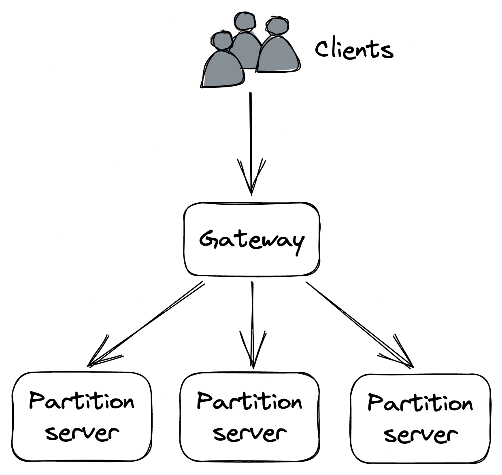
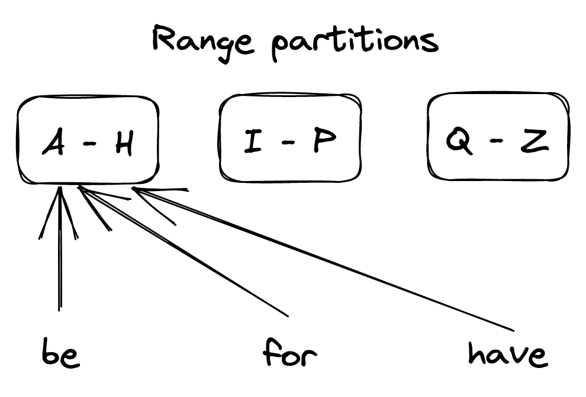
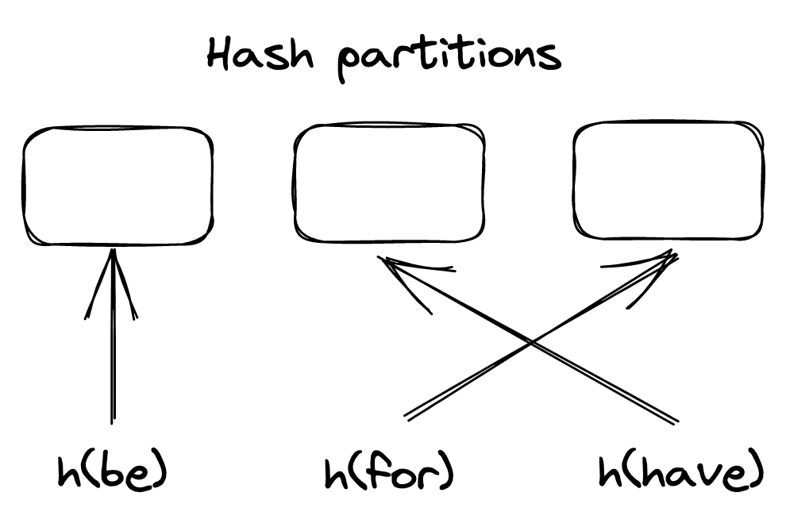
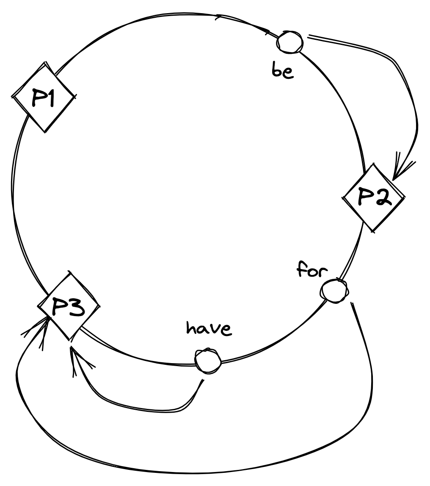
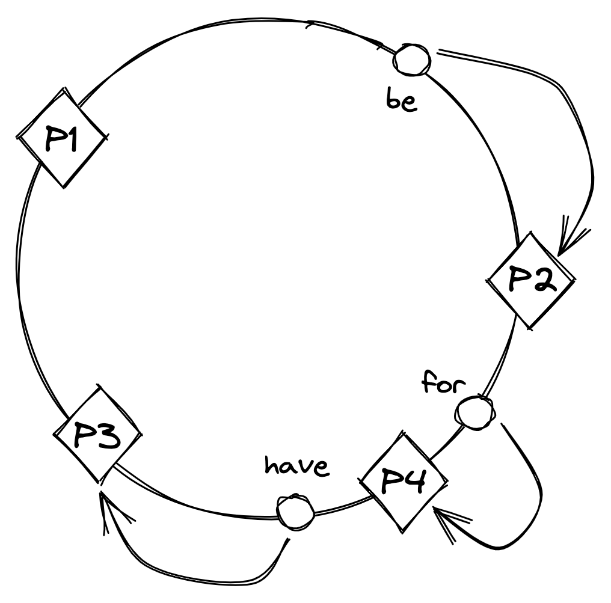

# 分区

当应用程序的数据不断增长时，它的体积最终会变得大到无法容纳在单台机器上。 为了解决这个问题，它需要被分成足够小的分区或碎片，以适应单个节点。 作为一个额外的好处，系统处理请求的能力也增加了，因为访问数据的负载分散在更多的节点上。

当客户端向分区系统发送请求时，需要将请求路由到负责它的节点。 网关服务（即反向代理）通常负责这一点，知道数据如何映射到分区和节点（见图 16.1）。 此映射通常由容错协调服务维护，例如 etcd 或 Zookeeper。



图 16.1：带有网关的分区应用程序，该网关将请求路由到分区

分区不是免费的午餐，因为它引入了相当多的复杂性：

- 需要网关服务将请求路由到正确的节点。
- 要跨分区汇总数据，需要从多个分区中提取数据并进行聚合（例如，考虑跨分区实现“分组"操作的复杂性）。
- 事务需要以原子方式更新跨越多个分区的数据，从而限制了可扩展性。
- 如果一个分区的访问频率比其他分区高得多，那么系统的扩展能力就会受到限制。
- 在运行时添加或删除分区变得具有挑战性，因为它需要跨节点移动数据。

我们在讨论 CDN 之后立即讨论分区并非巧合。缓存非常适合分区，因为它避免了大部分复杂性。例如，它通常不需要跨分区自动更新数据或执行跨多个分区的聚合。

现在我们已经了解了分区是什么以及它为什么有用，让我们讨论如何以键值对的形式将数据映射到分区。在高层次上，有两种主要方法可以做到这一点，称为范围分区和哈希分区。两者的一个重要前提是可能的密钥数量非常大；例如，只有两个可能值的布尔键不适合分区，因为它最多允许两个分区。

## 16.1 范围划分

范围分区按键范围将数据拆分为按字典顺序排序的分区，如图 16.2 所示。为了快速进行范围扫描，每个分区通常按排序顺序存储在磁盘上。



图 16.2：范围划分的数据集

范围分区的第一个挑战是选择分区边界。例如，如果键的分布或多或少是均匀的，则均匀地分割键范围是有意义的。如果不是，就像在英语词典中一样，分区将是不平衡的，并且有些分区的条目会比其他分区多得多。

另一个问题是某些访问模式可能会导致热点，从而影响性能。例如，如果数据按日期进行范围分区，则当天的所有请求都将由单个节点处理。有一些方法可以解决这个问题，比如向分区键添加随机前缀，但在增加复杂性方面需要付出代价。

当数据量或请求数过大时，需要增加节点数来维持负载的增加。同样，如果数据缩小和/或请求数量下降，则应减少节点数量以降低成本。添加和删除节点以平衡系统负载的过程称为重新平衡。重新平衡必须以最小化系统中断的方式实施，系统需要继续为请求提供服务。因此，应尽量减少重新平衡分区时传输的数据量。

一种解决方案是在系统首次初始化时创建比必要更多的分区，并将多个分区分配给每个节点。这种方法也称为静态分区，因为分区的数量不会随着时间而改变。当一个新节点加入时，一些分区从现有节点移动到新节点，这样存储总是处于平衡状态。这种方法的缺点是分区的数量是固定的，不能轻易改变。获得正确的分区数量很难——太多的分区会增加开销并降低性能，而太少的分区会限制可伸缩性。此外，某些分区最终可能比其他分区更容易被访问，从而创建热点。

另一种方法是按需创建分区，也称为动态分区。系统从单个分区开始，当它增长到一定大小或变得太热时，该分区被分成两个子分区，每个子分区包含大约一半的数据，其中一个子分区被转移到一个新节点。同样，当两个相邻的分区变得足够小或足够“冷"时，它们可以合并为一个。

## 16.2 哈希分区

让我们看一下将数据映射到分区的另一种方法。这个想法是使用一个哈希函数，该函数将一个键（字符串）确定性地映射到某个范围内（例如，0 和
2[^64] - 1）。这保证了键的哈希值在整个范围内均匀分布。

接下来，我们将哈希子集分配给每个分区，如图 16.3 所示。例如，一种方法是对哈希取模，即 ```hash(key) mod N```，其中 N 是分区数。



图 16.3：散列分区数据集

尽管这种方法确保分区包含或多或少相同数量的条目，但如果访问模式不统一，它并不能消除热点。例如，如果单个键的访问频率明显高于其他键，则托管它所属分区的节点可能会过载。在这种情况下，需要通过增加分区总数来进一步拆分分区。或者，需要通过例如预先添加随机前缀将密钥拆分为子密钥。

当添加新分区时，通过模运算符将哈希分配给分区可能会出现问题，因为大多数键必须移动（或打乱）到不同的分区，因为它们的分配发生了变化。洗牌数据非常昂贵，因为它消耗网络带宽和其他资源。理想情况下，如果添加了一个分区，则应该只对 ```K / N``` 个键进行混洗，其中 K 是键的数量，N 是分区的数量。具有该属性的一种广泛使用的散列策略是一致散列。

使用一致散列[^1]，散列函数将分区标识符和键随机映射到一个圆圈上，每个键按顺时针顺序分配给圆圈上最近的分区（见图16.4）。



图 16.4：在哈希一致的情况下，分区标识符和键随机分布在一个圆圈周围，每个键按顺时针顺序分配给出现在圆圈上的下一个分区。

现在，当添加一个新分区时，只需要重新分配圆圈上现在映射到它的键，如图 16.5 所示。



图 16.5：添加分区 P4 后，键“for"重新分配给 P4，但其他键的分配没有改变。

与范围分区相比，哈希分区的主要缺点是丢失了分区上的排序顺序，这是有效地按顺序扫描所有数据所必需的。 但是，仍然可以根据辅助键对单个分区中的数据进行排序。

--------------------

[^1]: "一致散列和随机树：用于缓解万维网上热点的分布式缓存协议": https://www.cs.princeton.edu/courses/archive/fall09/cos518/papers/chash.pdf