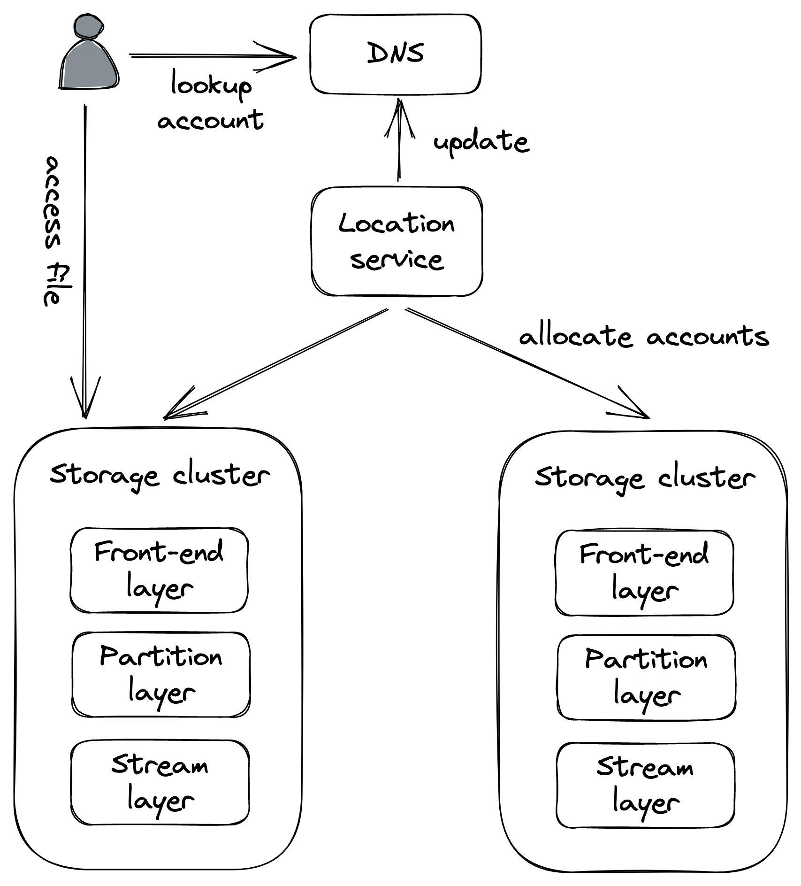
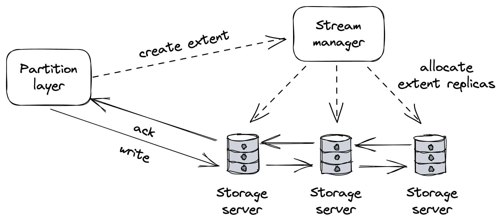
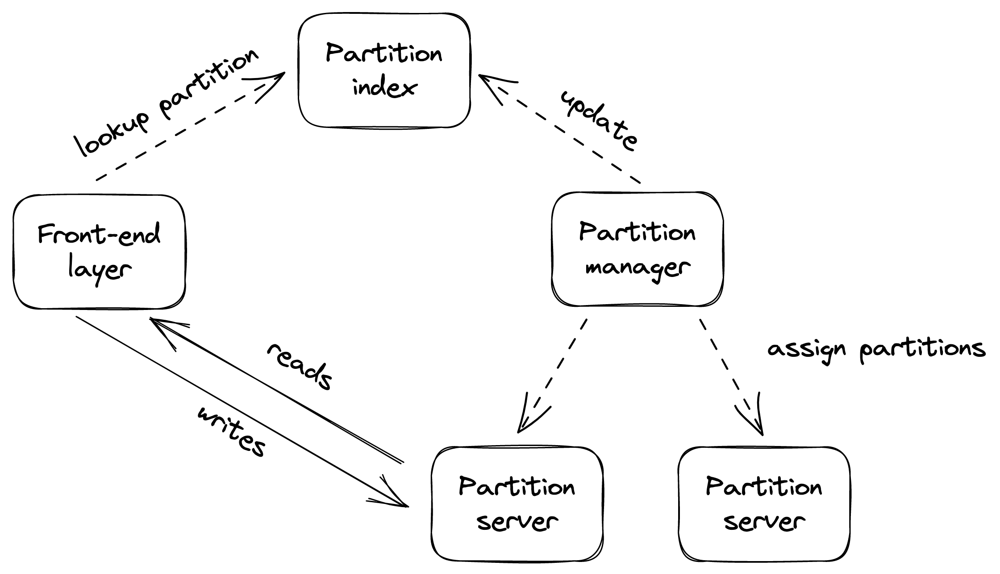

# 文件存储

使用 CDN 显着减少了访问 Cruder 应用服务器的请求数量。但是只有这么多的图像、视频等，服务器可以在空间不足之前存储在其本地磁盘上。要解决此限制，我们可以使用托管文件存储（如 AWS S3[^1] 或 Azure Blob Storage[^2]）来存储大型静态文件。托管文件存储是可扩展的、高度可用的，并提供强大的持久性保证。上传到托管商店的文件可以配置为允许知道其 URL 的任何人访问，这意味着我们可以将 CDN 直接指向它。这使我们能够将静态资源的存储和服务完全卸载到托管服务。

## 17.1 Blob存储架构

由于分布式文件存储是现代应用程序的重要组成部分，因此了解它们在底层的工作方式很有用。在本章中，我们将深入探讨 Azure Storage[^3] (AS) 的架构，这是一个可扩展的云存储系统，可提供强一致性。 AS 支持文件、队列和表抽象，但为简单起见，我们的讨论将只集中在文件抽象上，也称为 blob 存储。

AS由分布在全球多个地区的存储集群组成。存储集群由多个节点机架组成，其中每个机架都构建为具有冗余网络和电源的独立单元。

在高层次上，AS 公开了一个基于域名的全局命名空间，该域名由两部分组成：帐户名和文件名。这两个名称共同构成一个指向特定文件的唯一 URL，例如 https://ACCOUNT_NAME.blob.core.windows.net/FILE_NAME。客户配置账户名，AS DNS服务器用它来识别存储数据的存储集群。集群使用文件名来定位负责数据的节点。

中央位置服务充当全局控制平面，负责创建新帐户并将它们分配到集群，并将它们从一个集群移动到另一个集群以更好地分配负载。例如，当客户想要在特定区域创建新帐户时，位置服务：

- 根据负载信息选择合适的集群来分配账户；
- 更新集群的配置以开始接受新账户的请求；
- 并创建一条新的 DNS 记录，将账户名映射到集群的公共 IP 地址。

从架构的角度来看，存储集群由三层组成：流层、分区层和前端层（见图 17.1）。

图 17.1：Azure 存储架构的高级视图

流层实现了一个分布式的仅附加文件系统，其中数据存储在所谓的流中。在内部，流表示为一系列范围，其中范围是复制单元。使用链复制[^4]同步复制对范围的写入。

流管理器是负责为集群中的存储服务器链分配范围的控制面板。当管理器被要求分配一个新的扩展区时，它会回复保存新创建扩展区副本的存储服务器列表（参见图 17.2）。客户端缓存此信息并使用它来将未来的写入发送到主服务器。流管理器还负责通过创建新副本并重新配置它们所属的复制链来处理不可用或有故障的范围副本。

图 17.2：流层使用链复制跨存储服务器复制范围。

分区层是将高级文件操作转换为低级流操作的地方。在这一层中，分区管理器（又一个控制面板）管理存储在集群中的所有文件的大型索引。索引中的每个条目都包含元数据，例如帐户和文件名，以及指向流服务中实际数据的指针（范围列表加上偏移量和长度）。分区管理器对索引进行范围分区并将每个分区映射到一个分区服务器。分区管理器还负责跨服务器负载平衡分区，在分区变得太热时拆分分区，并合并冷分区（见图 17.3）。

分区层还在后台跨集群异步复制帐户。此功能用于将帐户从一个集群迁移到另一个集群，以实现负载平衡和容灾恢复。

图 17.3：分区管理器范围 - 跨分区服务器的分区文件，并在必要时重新分区。

最后，前端服务（反向代理）是一种无状态服务，它使用分区管理器管理的映射对请求进行身份验证并将它们路由到适当的分区服务器。

虽然我们只是粗略地描述了 AS 的架构，但它很好地展示了应用于具体系统的可伸缩性模式。作为一个有趣的历史记录，AS 从头开始构建是为了保持强一致性，而 AWS S3 在 2021[^5] 年开始提供相同的保证。

----------------------

[^1]: "亚马逊简单存储服务": https://aws.amazon.com/s3/
[^2]: "Azure Blob 存储": https://azure.microsoft.com/en-us/services/storage/blob/#overview
[^3]: "Windows Azure 存储：具有强一致性的高可用性云存储服务": https://sigops.org/s/conferences/sosp/2011/current/2011-Cascais/printable/11-calder.pdf
[^4]: 我们在 10.4 节讨论了链式复制
[^5]: "深入了解 S3 一致性": https://www.allthingsdistributed.com/2021/04/s3-strong-consistency.html