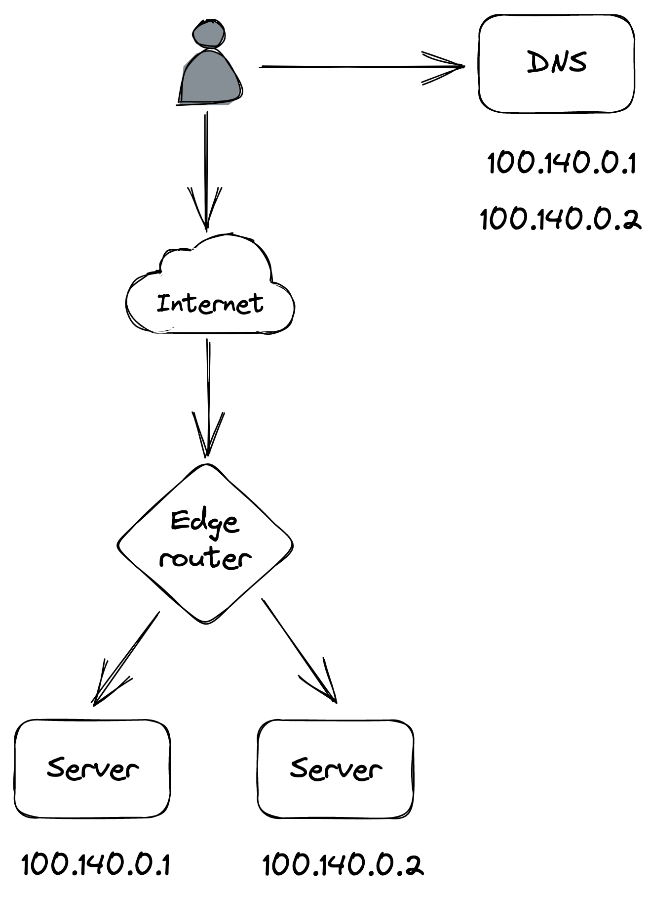
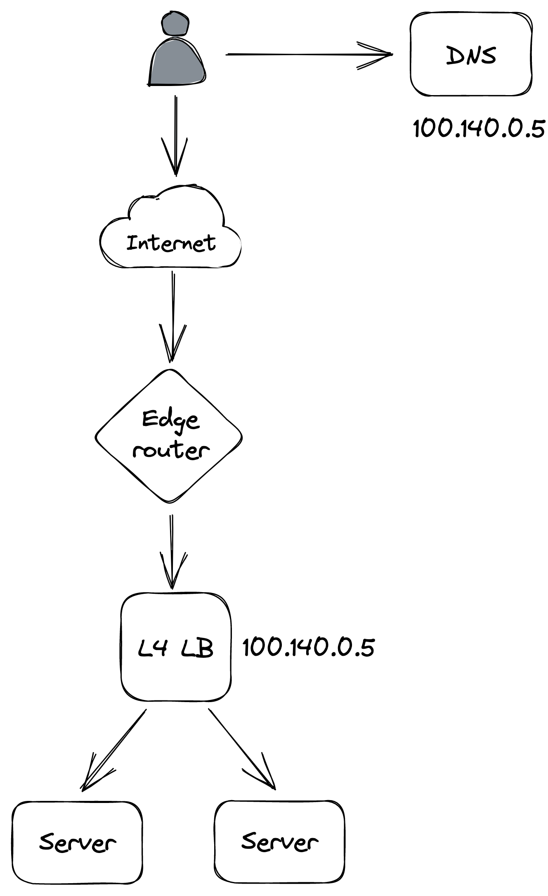

# 负载均衡

通过将请求卸载到文件存储和 CDN，Cruder 能够处理比以前更多的请求。但是免费午餐只能持续这么久。因为只有一个应用服务器，如果指向它的请求数量不断增加，它不可避免地会崩溃。为避免这种情况，我们可以创建多个应用程序服务器，每个应用程序服务器运行在不同的机器上，并让负载均衡器向它们分配请求。想法是，如果一台服务器具有一定的容量，那么理论上，两台服务器的容量应该是该容量的两倍。这是我们称为横向扩展或水平扩展的更通用可扩展性模式的示例。

我们可以水平扩展 Cruder 的原因是我们已经将状态推送到专用服务（数据库和托管文件存储）。假设它的依赖项也可以相应地扩展，那么扩展无状态应用程序不需要太多努力。正如我们将在下一章讨论的那样，扩展有状态服务（如数据存储）更具挑战性，因为它需要复制状态，因此需要某种形式的协调，这增加了复杂性，也可能成为瓶颈。作为一般的经验法则，我们应该尝试通过将状态推送到由具有多年构建此类服务经验的团队设计的第三方服务来保持我们的应用程序无状态。

跨服务器池分发请求有很多好处。因为客户端与服务器解耦并且不需要知道它们各自的地址，负载均衡器后面的服务器数量可以透明地增加或减少。而且由于多个冗余服务器可以互换地用于处理请求，负载均衡器可以检测到有故障的服务器并将它们从池中取出，从而提高整个应用程序的可用性。

你可能还记得第 1 章中的内容，系统的可用性是它能够服务请求和完成有用工作的时间百分比。另一种思考方式是请求成功的概率。

负载均衡器提高理论可用性的原因是，为了使应用程序被视为不可用，所有服务器都需要关闭。对于 N 个服务器，它们都不可用的概率是服务器故障率的乘积1。通过从[^1]中减去该产品，我们可以确定应用程序的理论可用性。

例如，如果我们在负载均衡器后面有两台服务器，每台服务器的可用性为 99%，那么应用程序的理论可用性为 99.99%：
$$
1 − (0.01 * 0.01) = 0.9999
$$
直观地说，独立服务器的 9 相加。[^2] 因此，在前面的示例中，我们有两个独立的服务器，每个服务器有两个 9，总共有四个 9 的可用性。当然，这个数字只是理论上的，因为在实践中，负载均衡器不会立即从池中删除有故障的服务器。该公式还天真地假设故障率是独立的，但情况可能并非如此。恰当的例子：当故障服务器从负载均衡器的池中移除时，剩余的服务器可能无法承受负载的增加和降级。

在以下部分中，我们将仔细研究负载均衡器提供的一些核心功能。

### 负载均衡

用于路由请求的算法可以从循环到一致散列到考虑服务器负载的算法。

作为一个有趣的旁注，负载均衡比在分布式环境中看起来更具挑战性。例如，负载均衡器可以定期对每个服务器公开的专用负载端点进行采样，该端点返回服务器繁忙程度的度量（例如，CPU 使用率）。而且由于不断查询服务器的成本可能很高，因此负载均衡器可以将响应缓存一段时间。

使用缓存或以其他方式延迟的指标将请求分发到服务器可能会导致令人惊讶的行为。例如，如果刚刚加入池的服务器报告负载为 0，负载均衡器将对其进行锤击，直到下一次对其负载进行采样。发生这种情况时，服务器会报告它过载，负载均衡器将停止向它发送更多请求。这会导致服务器在非常忙和根本不忙之间交替。

事实证明，在不考虑负载的情况下将请求随机分布到服务器可以实现更好的负载分布。这是否意味着无法使用延迟负载指标进行负载均衡？有一种方法，但它需要将负载指标与随机性的力量相结合。这个想法是从池中随机选择两台服务器并将请求路由到两者中负载最小的一台。这种方法在实践中非常有效[^3]。

### 服务发现

服务发现是负载均衡器用来发现可以将请求路由到的服务器池的机制。实现它的一种天真的方法是使用列出所有服务器的 IP 地址的静态配置文件，这很难管理和保持最新状态。

更灵活的解决方案是使用容错协调服务，例如 etcd 或 Zookeeper，管理服务器列表。当新服务器上线时，它会使用 TTL 将自己注册到协调服务。当服务器注销自己，或 TTL 因为它没有更新注册而过期时，服务器将从池中删除。

从负载均衡器的池中动态添加和删除服务器是云提供商用于实现自动缩放的关键功能[^4]，即根据负载启动和关闭服务器的能力。

### 健康检查

负载均衡器使用运行状态检查来检测服务器何时无法再处理请求并需要暂时从池中删除。基本上有两类健康检查：**被动**和**主动**。

负载均衡器在将传入请求路由到下游服务器时执行被动运行状态检查。如果服务器不可访问、请求超时或服务器返回不可重试状态代码（例如 503），负载均衡器可以决定将该服务器从池中取出。

相反，主动健康检查需要下游服务器的支持，下游服务器需要公开一个专用的健康端点，负载均衡器可以定期查询该端点以推断服务器的健康状况。如果服务器可以处理请求，则端点返回 200（OK）；如果服务器过载并且没有更多容量来处理请求，则返回 5xx 状态代码。如果对端点的请求超时，它也算作错误。

端点的处理程序可以简单到总是返回 200 OK，因为大多数请求会在服务器降级时超时。或者，处理程序可以尝试通过将本地指标（如 CPU 使用率、可用内存或正在服务的并发请求数）与可配置的阈值进行比较来推断服务器是否已降级。

但是这里是dragons[^5]：如果阈值配置错误或健康检查有错误，负载均衡器后面的所有服务器都可能无法通过健康检查。在这种情况下，负载均衡器可能会天真地清空池，从而关闭应用程序。然而，在实践中，如果负载均衡器"足够聪明": 它应该检测到大部分服务器不健康，并认为健康检查不可靠。因此，与其从池中删除服务器，不如完全忽略健康检查，以便可以将新请求发送到任何服务器。

由于运行状态检查，负载均衡器背后的应用程序可以更新到新版本，而无需任何停机时间。在更新期间，大量服务器报告自己不可用，因此负载均衡器停止向它们发送请求。这允许在使用新版本重新启动服务器之前完成（耗尽）正在进行的请求。更一般地说，我们可以使用这种机制来重新启动服务器而不会造成伤害。

例如，假设一个无状态应用程序有一个罕见的内存泄漏，导致服务器的可用内存随着时间的推移缓慢减少。当服务器可用的物理内存非常少时，它会积极地将内存页面交换到磁盘。这种不断的交换是昂贵的，并且会显着降低服务器的性能。最终，泄漏将影响大多数服务器并导致应用程序降级。

在这种情况下，我们可以强制严重降级的服务器重新启动。这样，当服务器进入罕见且意外的降级模式时，我们不必开发复杂的恢复逻辑。此外，重新启动服务器可以让系统自我修复，让操作员有时间确定根本原因。

为了实现这种行为，服务器可以有一个单独的后台线程——一个看门狗——它会定期唤醒并监控服务器的健康状况。例如，看门狗可以监控剩余的可用物理内存。当监控的指标在一段时间内违反特定阈值时，看门狗会认为服务器已降级并故意崩溃或重新启动它。

当然，watchdog 的实现需要经过良好的测试和监控，因为错误可能会导致服务器不断重启。也就是说，我发现这种简单的模式如何使应用程序对灰色故障更加健壮，这很不可思议。

## 18.1 DNS负载均衡

现在我们已经熟悉了负载均衡器的工作原理，让我们仔细看看它是如何实现的。鉴于有大量可用的现成解决方案，你不必构建自己的负载均衡器，但了解负载均衡器的工作原理非常重要。因为每个请求都需要通过它，所以它有助于提高应用程序的性能和可用性。

实现负载均衡器的一种简单方法是使用 DNS。 例如，假设我们有几台服务器，我们希望通过这些服务器对请求进行负载平衡。 如果这些服务器有公共 IP 地址，我们可以将它们添加到应用程序的 DNS 记录中，并让客户端在解析 DNS 地址时选择一个[^6]，如图 18.1 所示

图 18.1：DNS 负载均衡

尽管这种方法有效，但它对故障没有弹性。如果两台服务器中的一台出现故障，DNS 服务器将愉快地继续为其 IP 地址提供服务，而不会意识到它不再可用。即使我们要在发生故障时自动重新配置 DNS 记录并取出有问题的 IP，更改也需要时间传播到客户端，因为 DNS 条目被缓存，如第 4 章所述。

在实践中使用 DNS 进行负载均衡的一个用例是将流量分配到位于不同区域的不同数据中心（全局 DNS 负载均衡）。在讨论 CDN 时，我们已经遇到过这种用途。

## 18.2 传输层负载均衡

更灵活的负载均衡解决方案可以使用在网络堆栈的 TCP 级别运行的负载均衡器（也称为 L4 负载均衡器[^7]）来实现，客户端和服务器之间的所有流量都通过该负载均衡器流动。

网络负载均衡器有一个或多个物理网络接口卡映射到一个或多个虚拟 IP (VIP) 地址。反过来，一个 VIP 与一个服务器池相关联。负载均衡器充当客户端和服务器之间的中介——客户端只能看到负载均衡器公开的 VIP，而无法看到与其关联的各个服务器。

当客户端与负载均衡器的 VIP 建立新的 TCP 连接时，负载均衡器会从池中选择一个服务器，然后为客户端和服务器之间的连接来回打乱数据包。而且由于所有流量都通过负载均衡器，它可以检测到不可用的服务器（例如，通过被动健康检查）并自动将它们从池中取出，从而提高系统的可靠性。

连接由元组（源 IP/端口、目标 IP/端口）标识。通常，某种形式的散列用于将连接元组分配给服务器，以最大程度地减少从池中添加或删除服务器引起的中断，例如一致散列[^8]。

为了向下游转发数据包，负载均衡器将[^9]每个数据包的源地址转换为负载均衡器的地址，并将其目标地址转换为服务器的地址。类似地，当负载均衡器从服务器接收到一个数据包时，它会将其源地址转换为负载均衡器的地址，并将其目标地址转换为客户端的地址（参见图 18.2）。

图 18.2：传输层负载均衡

由于从服务器传出的数据通常比传入的数据量大，因此服务器有一种方法可以绕过负载均衡器，并使用一种称为直接服务器返回 10 的机制直接响应客户端，这可以显着降低负载均衡器上的负载。

可以使用商用机器构建网络负载均衡器，并使用 Anycast[^11]和 ECMP[^12]的组合进行横向扩展。负载均衡器实例以相同的 Anycast VIP 和相同的 BGP 权重向数据中心的边缘路由器宣布自己。使用 Anycast IP 是一个巧妙的技巧，它允许多台机器共享相同的 IP 地址，并让路由器将流量发送到具有最低 BGP 权重的机器。如果所有实例的 BGP 权重相同，则路由器使用等价多路径路由（一致哈希）来确保特定连接的数据包通常路由到同一个负载均衡器实例。

由于 Cruder 托管在云中，我们可以利用众多托管解决方案之一进行网络负载平衡，例如 AWS Network Load Balancer[^13]或 Azure Load Balancer[^14]。

尽管 TCP 级别的负载平衡连接非常快，但缺点是负载平衡器只是在不知道它们的实际含义的情况下随机播放字节。因此，L4 负载均衡器通常不支持需要更高级别网络协议的功能，例如终止 TLS 连接。需要在更高级别的网络堆栈上运行的负载平衡器来支持这些高级用例。

## 18.3 应用层负载均衡

应用层负载均衡器（又名 L7 负载均衡器[^15]）是一个 HTTP 反向代理，它通过服务器池分发请求。负载均衡器从客户端接收 HTTP 请求，对其进行检查，然后将其发送到后端服务器。

这里有两个不同的 TCP 连接，一个在客户端和 L7 负载均衡器之间，另一个在 L7 负载均衡器和服务器之间。因为 L7 负载均衡器在 HTTP 级别运行，它可以多路分解共享同一 TCP 连接的各个 HTTP 请求。这对于 HTTP 2 更为重要，其中多个并发流在同一个 TCP 连接上多路复用，并且一些连接的处理成本可能比其他连接高得多。

负载均衡器可以对应用程序流量执行智能操作，例如基于 HTTP 标头的速率限制请求、终止 TLS 连接或强制将属于同一逻辑会话的 HTTP 请求路由到同一后端服务器。例如，负载均衡器可以使用 cookie 来识别请求属于哪个逻辑会话，并使用一致的哈希将其映射到服务器。这允许服务器在内存中缓存会话数据，并避免为每个请求从数据存储中获取它。需要注意的是，粘性会话可以创建热点，因为某些会话的处理成本可能比其他会话高得多。

L7 负载均衡器可用作 L4 负载均衡器的后端，用于对从 Internet 接收的请求进行负载均衡。尽管 L7 负载均衡器比 L4 负载均衡器具有更多功能，但它们的吞吐量也较低，这使得 L4 负载均衡器更适合防御某些 DDoS 攻击，例如 SYN 洪水[^16]。

使用专用负载均衡器的一个缺点是指向应用程序的所有流量都需要通过它。因此，如果负载均衡器出现故障，其背后的应用程序也会出现故障。但是，如果客户端在组织内部，则可以使用边车模式将负载平衡委托给它们。这个想法是通过位于同一台机器上的进程（边车代理）代理所有客户端的网络流量。 Sidecar 进程充当 L7 负载均衡器，将请求负载均衡到正确的服务器。而且，由于它是一个反向代理，它还可以实现各种其他功能，例如限速、认证和监控。

随着组织中微服务的兴起，这种方法[^17]（又名"服务网格”）越来越受欢迎，组织中有数百个服务相互通信。在撰写本文时，流行的 Sidecar 代理负载均衡器是 NGINX、HAProxy 和 Envoy。这种方法的主要优点是它将负载平衡委托给客户端，从而消除了对需要扩展和维护的专用负载平衡器的需求。缺点是它使系统变得更加复杂，因为现在我们需要一个控制面板来管理所有的 sidecar[^18]。

--------------------------

[^1]: "AWS 架构完善的框架，可用性": https://docs.aws.amazon.com/wellarchitected/latest/reliability-pillar/availability.html
[^2]: 另一种思考方式是，通过线性增加服务器的数量，我们可以成倍地增加可用性。
[^3]: "两个随机选择的力量": https://broker.co.za/blog/2012/01/17/two-random.html
[^4]: "自动缩放": https://docs.microsoft.com/en-us/azure/architecture/best-practices/auto-scaling
[^5]: "实施健康检查": https://aws.amazon.com/builders-library/implementing-health-checks/
[^6]: "循环 DNS": https://en.wikipedia.org/wiki/Round-robin_DNS
[^7]: 第 4 层是 OSI 模型中的传输层
[^8]: "SREcon19 Americas - 保持平衡：互联网规模负载平衡揭秘": https://www.youtube.com/watch?v=woaGu3kJ-xk
[^9]: "网络地址翻译": https://en.wikipedia.org/wiki/Network_address_translation
[^10]: "现代网络负载平衡和代理简介": https://blog.envoyproxy.io/introduction-to-modern-network-load-balancing-and-proxying-a57f6ff80236
[^11]: "任播": https://en.wikipedia.org/wiki/Anycast
[^12]: "等价多路径路由": https://en.wikipedia.org/wiki/Equal-cost_multi-path_routing
[^13]: "网络负载均衡器": https://aws.amazon.com/elasticloadbalancing/network-load-balancer/
[^14]: "Azure 负载均衡器": https://azure.microsoft.com/en-us/services/load-balancer/
[^15]: 第 7 层是 OSI 模型中的应用层
[^16]: SYN 洪水是一种拒绝服务攻击形式，攻击者在此攻击中快速启动与服务器的 TCP 连接，而无需完成连接。
[^17]: "服务网格数据面板与控制面板，”https://blog.envoyproxy.io/service-mesh-data-plane-vs-control-plane-2774e720f7fc
[^18]: "服务网格大战，再见 Istio": https://blog.polymatic.systems/service-mesh-wars-goodbye-istio-b047d9e533c7