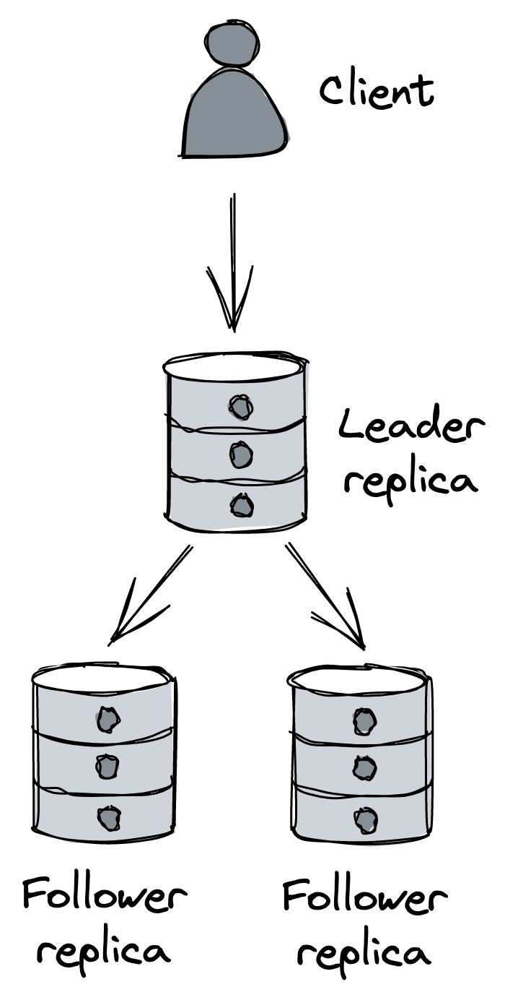

# 数据存储

因为 Cruder 是无状态的，我们能够通过在负载均衡器后面运行多个应用程序服务器来扩展它。但随着应用程序处理更多负载，对关系数据库的请求数量也会增加。而且由于数据库托管在单台机器上，它达到其容量并开始降级只是时间问题。

## 19.1 复制

我们可以通过创建副本来增加数据库的读取容量。最常见的方法是使用领导者-跟随者拓扑（参见图 19.1）。在此模型中，客户端将写入（更新、插入和删除）专门发送给领导者，领导者将更改保存到其预写日志中。然后，追随者或副本连接到领导者并从中流式传输日志条目，并在本地提交它们。由于日志条目有一个序列号，追随者可以随时断开连接并重新连接，并通过与领导者通信他们处理的最后一个序列号从他们离开的地方开始。

图 19.1：单领导者复制

通过创建只读追随者并将它们放在负载均衡器后面，我们可以增加数据库的读取容量。复制还增加了数据库的可用性。例如，当负载均衡器检测到故障副本不再健康或不可用时，它可以自动将故障副本从池中取出。当领导者失败时，可以重新配置一个副本来代替它。此外，单独的追随者可用于隔离特定的工作负载，例如定期运行的昂贵分析查询，这样它们就不会影响领导者和其他副本。

领导者和追随者之间的复制可以完全同步、完全异步或两者结合发生。

如果复制是完全异步的，当领导者收到写入时，它会将其广播给追随者，并立即将响应发送回客户端，而无需等待追随者确认。尽管这种方法最大限度地减少了客户端的响应时间，但它不是容错的。例如，领导者可能会在确认写入后立即将其广播给追随者之前崩溃，从而导致数据丢失。

相反，如果复制是完全同步的，则领导者会等待追随者确认写入，然后再向客户端返回响应。这会带来性能成本，因为单个慢速副本会增加每个请求的响应时间。如果有任何副本无法访问，则数据存储将变得不可用。这种方法不可扩展；追随者越多，就越有可能至少有一个追随者运行缓慢或不可用。

在实践中，关系数据库通常支持同步和异步复制的组合。例如，在 PostgreSQL 中，可以将各个跟随者配置为同步接收更新[^1]，而不是异步接收更新，这是默认设置。因此，例如，我们可以有一个同步跟随者，其目的是充当领导者的最新备份。这样，如果领导者失败，我们可以故障转移到同步跟随者，而不会导致任何数据丢失。

从概念上讲，故障转移机制需要：检测领导者何时失败，将同步跟随者提升为新领导者并重新配置其他副本以跟随它，并确保将客户端请求发送到新领导者。 AWS RDS 或 Azure SQL 数据库等托管解决方案支持开箱即用的只读副本[^2] 和自动故障转移[^3]，以及自动修补和备份等其他功能。

复制的一个警告是它只有助于扩展读取，而不是写入。另一个问题是整个数据库需要安装在一台机器上。虽然我们可以通过将一些表从主数据库移动到运行在不同节点上的其他表来解决这个问题，但我们只会推迟不可避免的事情。正如你现在应该知道的，我们可以通过分区来克服这些限制。

## 19.2 分区

分区允许我们为读取和写入扩展数据库。尽管传统（集中式）关系型数据库一般不支持开箱即用，但原则上我们可以在应用层实现。然而，在应用层实现分区具有挑战性，并且给系统增加了很多复杂性。对于初学者，我们需要决定如何在数据库实例之间对数据进行分区，并在分区变得太热或太大时重新平衡它。一旦数据被分区，跨越多个分区的查询需要被拆分为子查询，并且它们的响应必须被组合（考虑聚合或连接）。此外，为了支持跨分区的原子事务，我们需要实现分布式事务协议，例如 2PC。再加上将分区与复制相结合的所有要求，你可以看到应用层的分区是如何变得令人生畏的。

退一步说，传统关系数据库的根本问题在于，它们是在假设它们适合一台强大的机器上的情况下设计的。因此，它们支持许多难以扩展的功能，例如 ACID 事务和连接。关系数据库是在磁盘空间昂贵的时代设计的，并且规范化数据以减少磁盘占用是当务之急，即使在查询时使用连接对数据进行非规范化会带来巨大成本。[^4]

时代变了，现在存储很便宜，而 CPU 时间却没有。这就是为什么在 2000 年代初期，大型科技公司开始构建定制的解决方案，用于存储从头开始设计的数据，并考虑到高可用性和可扩展性。

## 19.3 NoSQL

这些早期的解决方案不支持 SQL，并且更普遍地只实现了传统关系数据存储提供的一小部分功能。 Bigtable[^5] 和 Dynamo[^6] 等白皮书彻底改变了行业，并开始推动可扩展存储层，从而产生了大量受它们启发的开源解决方案，如 HBase 和 Cassandra。

由于这些数据存储的第一代不支持 SQL，因此它们被称为 NoSQL。如今，该名称具有误导性，因为 NoSQL 存储已发展为支持诸如 SQL 方言之类的功能，而这些功能过去仅在关系数据存储中可用。

虽然关系数据库支持更强的一致性模型（例如严格的可序列化性），但 NoSQL 存储采用宽松的一致性模型（例如最终一致性和因果一致性）来支持高可用性。

此外，NoSQL 存储通常不提供连接，而是依赖于数据（通常表示为键值对或文档（例如 JSON））来进行非规范化。纯键值存储将不透明的字节序列（键）映射到不透明的字节序列（值）。文档存储将键映射到（可能是分层的）文档，而没有严格执行的模式。与键值存储的主要区别在于文档被解释和索引，因此可以根据其内部结构进行查询。

最后，由于 NoSQL 存储本身支持分区以实现可扩展性目的，因此它们对事务的支持有限。例如，Azure Cosmos DB 当前仅支持范围为单个分区的事务。另一方面，由于数据以非规范化的形式存储，因此首先对事务或联接的需求较少。

虽然 NoSQL 存储使用的数据模型一般不是关系型的，但我们仍然可以使用它们对关系型数据进行建模。但是，如果我们使用 NoSQL 存储并尝试将其用作关系数据库，我们最终会遇到两全其美的情况。如果使用得当，NoSQL 可以处理传统关系数据库可以处理的许多用例[^7]，同时从一开始就具有基本的可扩展性。[^8]

有效使用 NoSQL 数据存储的主要要求是预先了解访问模式并相应地对数据进行建模；让我们看看为什么这如此重要。以 Amazon DynamoDB[^9] 为例；它的主要抽象是一个包含项目的表。每个项目可以有不同的属性，但它必须有一个唯一标识一个项目的主键。

主键可以由单个属性（分区键）或两个属性（分区键和排序键）组成。正如你可能怀疑的那样，分区键指示数据如何分区和跨节点分布，而排序键定义数据在分区内的排序方式，这允许有效的范围查询。

DynamoDB 为每个分区创建三个副本，并使用状态机复制使它们保持同步[^10]。写入被路由到领导者，当三分之二的副本收到写入时，将向客户端发送确认。读取可以是最终一致的（选择任何副本）或强一致的（查询领导者）。令人困惑的是，DynamoDB 的架构与我们在第 11.3 章讨论的 Dynamo 论文中提出的架构非常不同。

在高层次上，DynamoDB 的 API 支持：

- 对单个项目的 CRUD 操作，
- 查询具有相同分区键的多个项目（可选地在排序键上指定条件），
- 并扫描整个表。

设计上没有连接操作，因为它们不能很好地扩展。但这并不意味着我们应该在应用程序中实现连接。相反，正如我们将很快看到的那样，我们应该对数据进行建模，以便一开始就不需要连接。

分区和排序键属性用于对表的访问模式进行建模。例如，假设最常见的访问模式是检索按日期排序的特定客户的订单列表。在这种情况下，将客户 ID 作为分区键并将订单创建日期作为排序键的表是有意义的：

|  分区键   |   排序键   |      属性      |     属性     |
| :-------: | :--------: | :------------: | :----------: |
|  jonsnow  | 2021-07-13 | 订单编号: 1452 | 状态：已发货 |
| aryastark | 2021-07-20 | 订单编号: 5252 | 状态：已放置 |
| branstark | 2021-07-22 | 订单编号: 5260 | 状态：已放置 |

现在假设我们还想要订单列表中的客户全名。 虽然在关系数据库中，表仅包含某种类型的实体（例如，客户），但在 NoSQL 中，表可以包含多种类型的实体。 因此，我们可以将客户和订单存储在同一个表中：
|  分区键   |   排序键   |         属性         |     属性     |
| :-------: | :--------: | :------------------: | :----------: |
|  jonsnow  | 2021-07-13 |    订单编号: 1452    | 状态：已发货 |
|  jonsnow  |  jonsnow   |  FullName: Jon Snow  |  Address: …  |
| aryastark | 2021-07-20 |    订单编号: 5252    | 状态：已放置 |
| aryastark | aryastark  | FullName: Arya Stark |  Address: …  |

因为客户及其订单具有相同的分区键，所以我们现在可以发出一个查询来检索所需客户的所有实体。

看看我们刚刚做了什么？我们根据访问模式构建了表，因此查询不需要任何连接。现在考虑一下如何在关系数据库中以标准化形式对相同的数据进行建模。你可能会有一张桌子用于订单，另一张桌子用于客户。而且，要执行相同的查询，在查询时需要连接，这将更慢且更难扩展。

前面的例子非常简单，DynamoDB 支持二级索引来建模更复杂的访问模式——本地二级索引允许在同一个表中使用备用排序键，而全局二级索引允许不同的分区和排序键，但需要注意的是索引更新是异步的并且最终是一致的。

一个常见的误解是 NoSQL 数据存储比关系数据库更灵活，因为它们可以无缝扩展而无需预先对数据进行建模。事实并非如此——NoSQL 需要更多地关注数据的建模方式。由于 NoSQL 存储与访问模式紧密耦合，因此它们的灵活性远不如关系数据库。

如果你应该从本章中吸取一个概念，那就是：使用 NoSQL 数据存储需要预先识别访问模式以相应地对数据进行建模。如果你想了解如何做到这一点，我建议你阅读"The DynamoDB Book"[^11]，即使你计划使用不同的 NoSQL 存储。

随着可扩展数据存储的不断发展，最新趋势是将 NoSQL 的可扩展性与关系数据库的 ACID 保证相结合。这些新的数据存储也称为 NewSQL[^12]。虽然 NoSQL 数据存储在面对网络分区时优先考虑可用性而不是一致性，但 NewSQL 存储更喜欢一致性。 NewSQL 存储背后的论点是，通过正确的设计，强制强一致性导致的可用性降低对于许多应用程序来说几乎不会引起注意[^13]。再加上无论如何不可能实现完美的 100% 可用性（可用性定义为 9 秒），这促使人们构建可以扩展的存储系统，但在存在网络分区的情况下更倾向于一致性而不是可用性。 CockroachDB[^14] 和 Spanner[^15] 是 NewSQL 数据存储的著名示例。

---------------------

[^1]: "PostgreSQL 服务器配置、复制": https://www.postgresql.org/docs/14/runtime-config-replication.html
[^2]: "Amazon RDS 只读副本": https://aws.amazon.com/rds/features/read-replicas/
[^3]: "多可用区部署以实现高可用性": https://docs.aws.amazon.com/AmazonRDS/latest/UserGuide/Concepts.MultiAZ.html
[^4]: 也就是说，降低存储成本并不是标准化的唯一好处：它还有助于保持数据完整性。如果一条数据在多个地方重复，那么要更新它，我们必须确保它在所有地方都得到更新。相比之下，如果数据被归一化，我们只需要在一个地方更新它。
[^5]: "Bigtable：结构化数据的分布式存储系统": https://static.googleusercontent.com/media/research.google.com/en//archive/bigtable-osdi06.pdf
[^6]: 我们在 11.3 节讨论了 Dynamo
[^7]: "AWS re:Invent 2018：Amazon DynamoDB 深入探讨：DynamoDB 的高级设计模式 (DAT401)": https://www.youtube.com/watch?v=HaEPXoXVf2k
[^8]: 另一方面，虽然我们当然可以找到扩展关系数据库的方法，但在第 1 天有效的方法可能在第 10 天或第 100 天无效。
[^9]: "亚马逊 DynamoDB": https://aws.amazon.com/dynamodb/
[^10]: "AWS re:Invent 2018：引擎盖下的 Amazon DynamoDB：我们如何构建超大规模数据库 (DAT321)": https://www.youtube.com/watch?v=yvBR71D0nAQ
[^11]: "DynamoDB 书籍": https://www.dynamodbbook.com/
[^12]: "Andy Pavlo — NewSQL 数据库的官方十年回顾展": https://www.youtube.com/watch?v=LwkS82zs65g
[^13]: "NewSQL 数据库系统无法保证一致性，我责怪 Spanner，"https://dbmsmusings.blogspot.com/2018/09/newsql-database-systems-are-failing-to.html
[^14]: "CockroachDB": https://github.com/cockroachdb/cockroach
[^15]: 我们在 12.4 节讨论了 Spanner