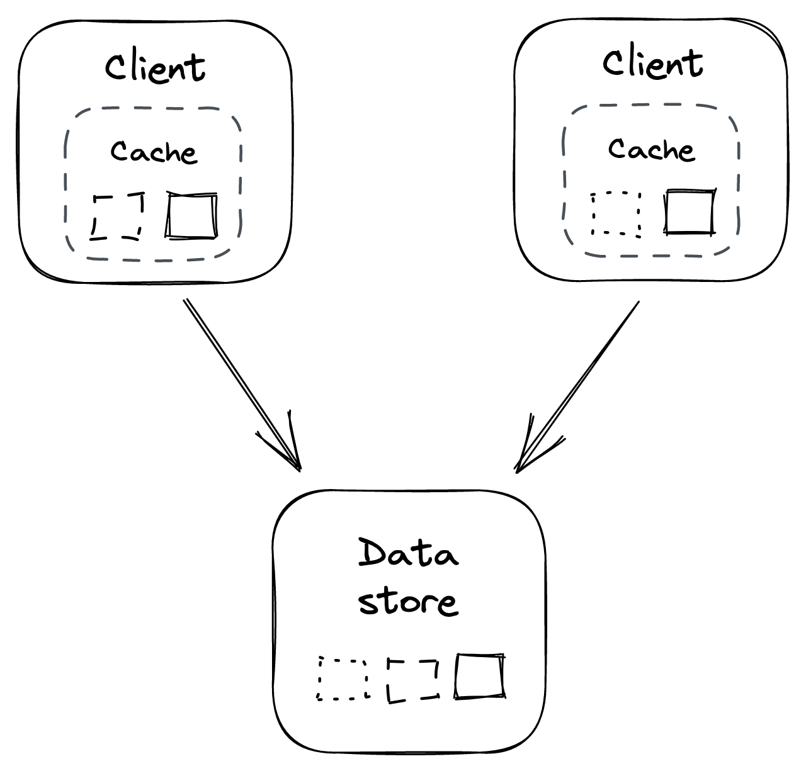
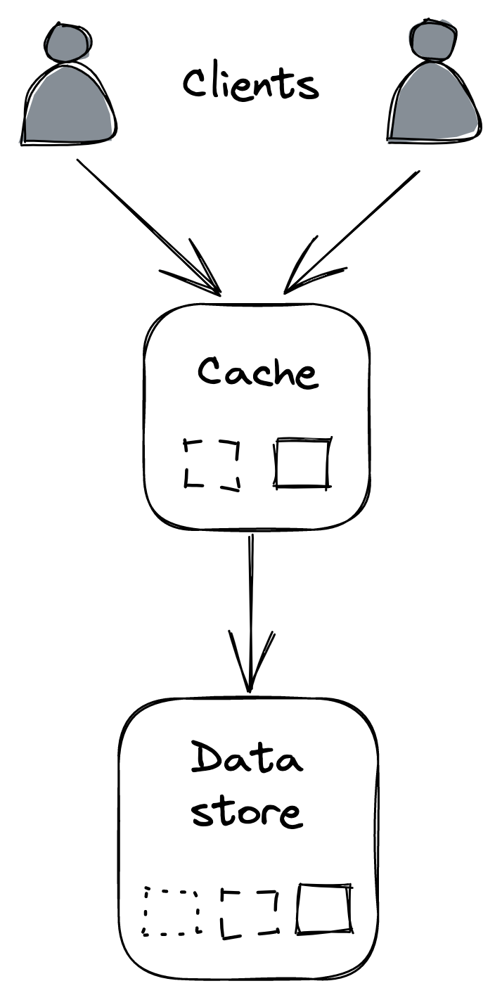

# 缓存

假设 Cruder 发送到其数据存储的请求中有很大一部分由一个小的经常访问条目池组成。在这种情况下，我们可以通过引入缓存来提高应用程序的性能并减少数据存储的负载。缓存是一个高速存储层，它临时缓冲来自源的响应，例如数据存储，以便将来的请求可以直接从中得到服务。它只提供尽力而为的保证，因为它的状态是一次性的并且可以从源头重建。在讨论 DNS 协议或 CDN 时，我们已经看到了缓存的一些应用。

为了使缓存具有成本效益，可以直接从它提供服务的请求比例（命中率）应该很高。命中率取决于几个因素，例如可缓存对象的范围（越少越好）、重复访问相同对象的可能性（越高越好）以及缓存的大小（越大越好）更好的）。

作为一般经验法则，调用堆栈缓存使用得越高，下游可以节省的资源就越多。这就是为什么我们讨论的第一个缓存用例是客户端 HTTP 缓存。但是，值得指出的是，缓存是一种优化，如果源（例如我们的案例中的数据存储）在没有缓存的情况下无法承受负载，那么你就没有可扩展的架构。如果访问模式突然改变，导致缓存未命中，或者缓存变得不可用，你不希望你的应用程序崩溃（但它可以变慢）。

## 20.1 政策

当发生缓存未命中时，必须从源请求丢失的对象，这可能以两种方式发生：

- 在从缓存中获得"object-not-found"错误后，应用程序从源请求对象并更新缓存。在这种情况下，缓存被称为侧缓存，它通常被应用程序视为键值存储。
- 或者，缓存是内联的，它直接与源通信，代表应用程序请求丢失的对象。在这种情况下，应用程序只访问缓存。在讨论 HTTP 缓存时，我们已经看到了内联缓存的示例。

因为缓存的容量有限，当达到其容量时，需要逐出一个或多个条目以便为新条目腾出空间。要删除哪个条目取决于缓存使用的驱逐策略和对象的访问模式。例如，一种常用的策略是逐出最近最少使用 (LRU) 条目。

缓存还可以有一个过期策略，该策略指示何时应该驱逐对象，例如 TTL。当一个对象在缓存中的时间超过其 TTL 时，它就会过期并且可以安全地被驱逐。过期时间越长，命中率越高，但提供陈旧和不一致数据的可能性也越高。

过期不需要立即发生，可以推迟到下一次请求条目时。事实上，这可能更可取——如果源（例如，数据存储）暂时不可用，将具有过期 TTL 的对象返回给应用程序比返回错误更有弹性。

基于 TTL 的过期策略是缓存失效的一种解决方法，在实践中很难实现[^1]。例如，如果你要缓存数据库查询的结果，则每次该查询涉及的任何数据发生更改（可能跨越数千条或更多记录）时，都需要以某种方式使缓存的结果无效。

## 20.2 本地缓存

实现缓存的最简单方法是将其与客户端放在一起。例如，客户端可以使用简单的内存哈希表或嵌入式键值存储，如 RocksDB[^2]，来缓存响应（见图 20.1）。

图 20.1：进程内缓存

因为每个客户端缓存都独立于其他缓存，所以相同的对象会在缓存之间重复，从而浪费资源。例如，如果每个客户端都有一个 1GB 的本地缓存，那么无论有多少个客户端，缓存的总大小都是 1GB。此外，不可避免地会出现一致性问题；例如，两个客户端可能会看到同一对象的不同版本。

此外，随着客户端数量的增加，对源的请求数量也会增加。当客户端重新启动或新客户端上线并且需要从头开始填充它们的缓存时，此问题会更加严重。这可能会导致"雷鸣般的羊群"效应，即下游来源受到请求高峰的打击。当以前未访问过的特定对象突然变得流行时，也会发生同样的情况。

客户可以通过合并对同一对象的请求来减少雷鸣般的羊群的影响。这个想法是，在任何给定时间，每个客户端最多应该有一个未完成的请求来获取特定对象。

## 20.3 外部缓存

外部缓存是专门用于缓存对象的服务，通常在内存中。因为它是在客户端之间共享的，所以它以更高的复杂性和成本为代价解决了本地缓存的一些缺点（见图 20.2）。例如，Redis[^3] 或 Memcached[^4] 是流行的缓存服务，也可作为 AWS 和 Azure 上的托管服务使用。

图 20.2：进程外缓存

与本地缓存不同，外部缓存可以使用复制和分区来增加其吞吐量和大小。例如，Redis[^5] 可以自动将数据跨多个节点进行分区，并使用leader-follower 协议复制每个分区。

由于缓存在其客户端之间共享，因此在任何给定时间每个对象都只有一个版本（假设缓存没有被复制），这减少了一致性问题。此外，从源请求对象的次数不会随着客户端数量的增加而增加。

尽管外部缓存将客户端与源解耦，但负载仅转移到外部缓存。因此，如果负载增加，缓存最终将需要横向扩展。发生这种情况时，应移动（或丢弃）尽可能少的数据，以避免缓存降级或命中率显着下降。一致的散列或类似的分区技术可以帮助减少缓存重新平衡时需要洗牌的数据量。

外部缓存也会带来维护成本，因为它是另一种需要运行的服务。此外，访问它的延迟比访问本地缓存要高，因为需要网络调用。

如果外部缓存关闭，客户端应该如何反应？你会认为绕过缓存并暂时直接命中源可能是可以的。但始发地可能没有准备好承受突然激增的流量。因此，外部缓存变得不可用可能会导致级联故障，从而导致源也变得不可用。

为了避免这种情况，客户端可以使用进程内缓存来防御外部缓存变得不可用。也就是说，源端还需要准备好处理这些突然的"攻击": 例如，放弃请求；我们将在本书的弹性部分讨论实现这一目标的一些方法。重要的是要记住缓存是一种优化，系统需要在没有它的情况下生存，但代价是速度变慢。

-----------------

[^1]: "缓存一致性": https://en.wikipedia.org/wiki/Cache_coherence
[^2]: "RocksDB": http://rocksdb.org/
[^3]: "Redis": https://redis.io/
[^4]: "Memcached": https://memcached.org/
[^5]: "Redis 集群教程": https://redis.io/topics/cluster-tutorial