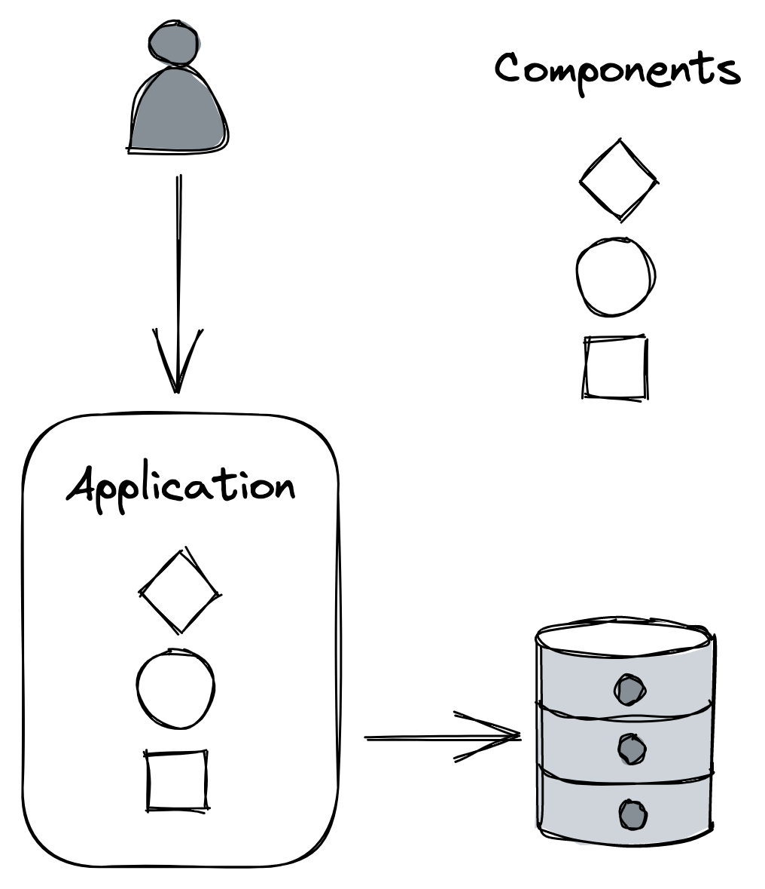

# 微服务

如果 Cruder 在市场上取得成功，我们可以放心地假设我们将继续向它添加更多组件以满足不断增长的业务需求列表，如图 21.1 所示。

图 21.1：由多个组件组成的单体应用程序

这些组件可能会随着时间的推移变得越来越耦合，导致开发人员更频繁地踩到对方的脚趾。最终，代码库变得足够复杂，以至于没有人完全理解它的每个部分，并且实现新功能或修复错误变得比以前更耗时。

此外，对组件的更改可能需要重新构建和部署整个应用程序。如果新版本的部署引入了错误，例如内存或套接字泄漏，那么无关的组件也可能会受到影响。此外，恢复部署会影响每个开发人员的速度，而不仅仅是引入错误的开发人员。

减轻单体应用程序成长之痛的一种方法是在功能上将其分解为一组可独立部署的服务，这些服务通过 API 进行通信，如图 21.2 所示。 API 通过创建难以违反的边界来将服务彼此分离，这与在同一进程中运行的组件之间的边界不同。

图 21.2：应用程序拆分为可独立部署的服务，这些服务通过 API 进行通信

每个服务都可以由一个小团队拥有和运营。 较小的团队比较大的团队更有效地协作，因为沟通开销随着团队的规模呈[^1] 指数增长。 而且由于每个团队都控制自己的代码库并规定自己的发布时间表，因此总体上需要较少的跨团队沟通。 此外，服务的表面积小于整个应用程序，使其更容易被开发人员消化，尤其是新员工。

每个团队原则上也可以自由采用适合其特定需求的技术堆栈和硬件。毕竟，API 的使用者并不关心功能是如何实现的。这使得在不影响系统其他部分的情况下试验和评估新技术变得容易。因此，每个服务都可以拥有自己独立的数据模型和最适合其用例的数据存储。

这种架构风格也被称为微服务架构。不过，"微观”一词具有误导性——服务不必有任何微观。[^2] 如果服务没有做太多，它只会增加运营开销和复杂性。根据经验，API 应具有较小的表面积并封装大量功能。 [^3]

## 21.1 警告

回顾一下，将应用程序拆分为服务会增加整个系统的复杂性，只有在可以在许多开发团队之间摊销的情况下才值得付出代价。让我们仔细看看为什么会这样。

### 技术栈

虽然没有什么禁止每个微服务使用不同的技术堆栈，但这样做会使开发人员更难从一个团队转移到另一个团队。想想大量的库——每种语言一个库——需要支持以提供所有服务所需的通用功能，比如日志记录。

因此，执行一定程度的标准化是合理的。做到这一点的一种方法，同时仍然允许一定程度的自由，是通过为坚持推荐的语言和技术组合的团队提供出色的开发体验来松散地鼓励特定技术。

### 沟通

远程调用很昂贵并且引入了非确定性。本书中描述的大部分内容都是关于处理通过网络进行通信的分布式进程的复杂性。也就是说，单体应用也不是孤立存在的，因为它服务于外部请求并且可能还依赖于第三方 API，因此这些问题也需要在那里解决，尽管规模较小。

### 耦合

微服务应该是松耦合的，这样一个服务的改变就不需要改变其他服务。如果不是这种情况，你最终可能会得到一个可怕的分布式单体，它具有单体的所有缺点，但由于其分布式特性，它的复杂性要高一个数量级。

紧密耦合的原因有很多，例如脆弱的 API 需要在客户端更改时更新，共享库必须在多个服务之间同步更新，或者使用静态 IP 地址来引用外部服务。

### 资源供应

为了支持大量独立服务，配置新机器、数据存储和其他商品资源应该很简单——你不希望每个团队都想出自己的方式来做这件事。而且，一旦供应了这些资源，就必须对其进行配置。为了有效地实现这一目标，需要大量的自动化。

### 测试

虽然测试单个微服务不一定比测试单体更具挑战性，但测试微服务的集成要困难得多。这是因为只有当服务在生产中大规模交互时才会出现非常微妙和意想不到的行为。

### 运营

就像资源配置一样，应该有一种通用的方式来持续交付和安全地部署新的构建到生产环境，这样每个团队就不必重新发明轮子。

此外，调试失败、性能下降和错误对于微服务来说更具挑战性，因为你不能只是将整个应用程序加载到本地机器上并使用调试器单步执行。这就是为什么拥有一个良好的可观察性平台变得至关重要的原因。

### 最终一致性

作为将应用程序拆分为单独服务的副作用，数据模型不再驻留在单个数据存储中。然而，正如我们在前几章中所了解的，原子更新分布在不同数据存储中的数据并保证强一致性是缓慢、昂贵且难以正确处理的。因此，这种类型的架构通常需要最终的一致性。

总而言之，通常最好从单体应用开始，只有在有充分理由时才分解它[^4]。作为奖励，你仍然可以将整体组件化，其优点是随着应用程序的增长更容易移动边界。一旦单体应用成熟并开始出现成长的烦恼，你就可以开始一次剥离一个微服务。

## 21.2 API网关

将 Cruder 分解为一组服务后，我们需要重新思考外界如何与应用程序通信。例如，客户端可能需要对不同的服务执行多个请求，以获取完成特定操作所需的所有信息。这在移动设备上可能会很昂贵，因为每个网络请求都会消耗宝贵的电池寿命。

此外，客户端需要了解实现细节，例如所有内部服务的 DNS 名称。这使得更改应用程序的架构变得具有挑战性，因为它也需要更改客户端，如果你不控制它们，这很难做到。一旦公共 API 出现，你最好做好长期维护它的准备。

正如计算机科学中常见的那样，我们可以通过添加一个间接层来解决几乎任何问题。我们可以将内部 API 隐藏在作为内部服务的外观或代理的公共 API 后面（见图 21.3）。公开此公共 API 的服务称为 API 网关（反向代理）。

图 21.3：API 网关对其客户端隐藏内部 API。

### 21.2.1 核心职责

让我们看一下 API 网关的一些最常见的职责。

#### 路由

API 网关最明显的功能是将入站请求路由到内部服务。一种实现方法是借助路由映射，它定义了公共 API 如何映射到内部 API。此映射允许在不破坏外部客户端的情况下更改内部 API。例如，假设在特定公共端点和内部端点之间存在 1:1 映射——如果将来内部端点发生变化，外部客户端可以继续使用公共端点，就好像没有任何变化一样。

#### 作品

单体应用程序的数据通常驻留在单个数据存储中，但在分布式系统中，它分布在多个服务中，每个服务都使用自己的数据存储。因此，我们可能会遇到需要将来自多个来源的数据拼接在一起的用例。 API 网关可以提供更高级别的 API 来查询多个服务并组合它们的响应。这使客户端无需知道要查询哪些服务，并减少了为获取所需数据而需要执行的请求数量。

编写 API 并不简单。组合 API 的可用性随着内部调用数量的增加而降低，因为每个调用都有非零的失败概率。此外，数据可能不一致，因为更新可能尚未传播到所有服务；在这种情况下，网关将不得不以某种方式解决这种差异。

#### 转换

API 网关可以从一种 IPC 机制转换为另一种。例如，它可以将 RESTful HTTP 请求转换为内部 gRPC 调用。

它还可以向不同的客户端公开不同的 API。例如，桌面应用程序的 API 可能会返回比移动应用程序更多的数据，因为屏幕空间更大并且可以一次呈现更多信息。此外，移动客户端的网络调用成本更高，并且请求通常需要批量处理以减少电池使用量。

为了满足这些不同且相互竞争的需求，网关可以提供针对不同用例定制的不同 API，并将这些 API 转换为内部调用。基于图形的 API 是一个越来越流行的解决方案。基于图形的 API 公开了由类型、字段和跨类型关系组成的模式，用于描述数据。基于此模式，客户端发送查询以准确声明他们需要什么数据，网关的工作是弄清楚如何将这些查询转换为内部 API 调用。

这种方法减少了开发时间，因为不需要为不同的用例引入不同的 API，并且客户可以自由地指定他们需要什么。不过，仍然有一个 API；碰巧它是用图形模式描述的，网关允许对其执行受限查询。在撰写本文时，GraphQL[^5]是该领域最流行的技术。 

### 21.2.2 横切关注点

由于 API 网关是一个反向代理，它还可以实现横切功能，否则这些功能必须是每个服务的一部分。例如，它可以缓存频繁访问的资源或限速请求，以防止内部服务不堪重负。

身份验证和授权是一些最常见和最关键的横切关注点。身份验证是验证发出请求的所谓委托人（人或应用程序）是否就是它所说的那个人的过程。授权是授予经过身份验证的主体权限以执行特定操作的过程，例如创建、读取、更新或删除特定资源。通常，这是通过分配一个或多个向委托人授予特定权限的角色来实现的。

单体应用程序实现身份验证和授权的常用方法是使用会话。因为 HTTP 是一种无状态协议，所以应用程序需要一种在 HTTP 请求之间存储数据的方法，以便将请求与任何其他请求相关联。当客户端首次向应用程序发送请求时，应用程序会创建一个带有 ID（例如，加密强随机数）的会话对象，并将其存储在内存缓存或外部数据存储中。会话 ID 通过 HTTP cookie 在响应中返回，以便客户端将其包含在所有未来的请求中。这样，当应用程序接收到带有会话 cookie 的请求时，它可以检索相应的会话对象。

因此，当客户端将其凭据发送到应用程序 API 的登录端点并且凭据验证成功时，主体的 ID 和角色将存储在会话对象中。应用程序可以稍后检索此信息并使用它来决定是否允许委托人执行请求。

将这种方法转换为微服务架构并不是那么简单。例如，哪个服务应该负责验证和授权请求并不明显，因为请求的处理可以跨越多个服务。

一种方法是让 API 网关对外部请求进行身份验证，因为这是它们的入口点。这允许将支持不同身份验证机制的逻辑集中到单个组件中，从而对内部服务隐藏复杂性。相比之下，授权请求最好留给各个服务，以避免将 API 网关与域逻辑耦合。

当 API 网关对请求进行身份验证时，它会创建一个安全令牌。网关将此令牌与请求一起传递给内部服务，内部服务又将其传递给下游的依赖项。现在，当内部服务收到附加了安全令牌的请求时，它需要有一种方法来验证它并获取主体的身份和角色。验证根据使用的令牌类型而有所不同，它可以是不透明的并且不包含任何信息，也可以是透明的并将主体的信息嵌入令牌本身。不透明令牌的缺点是它需要调用外部身份验证服务来验证它并检索主体的信息。透明令牌消除了这种调用，但代价是更难撤销受损令牌。

最流行的透明令牌标准是 JSON Web Token[^6] (JWT)。 JWT 是一个 JSON 有效负载，其中包含到期日期、委托人的身份和角色以及其他元数据。此外，有效负载使用内部服务信任的证书进行签名。因此，不需要外部调用来验证令牌。

另一种常见的身份验证机制是使用 API 密钥。 API 密钥是一种自定义密钥，它允许 API 网关识别发出请求的委托人并限制他们可以执行的操作。这种方法在公共 API 中很流行，例如 Github 或 Twitter。

我们几乎没有触及这个主题的表面，并且有关于这个主题的整本书[^7]，你可以阅读以了解更多信息。

### 21.2.3 警告

使用 API 网关的缺点之一是它可能成为开发瓶颈。由于它与它所屏蔽的内部服务的 API 紧密耦合，因此每当内部 API 发生变化时，网关也需要进行修改。另一个缺点是它还需要维护一项服务。它还需要扩展到其背后所有服务的请求率。

也就是说，如果一个应用程序有许多服务和 API，则利大于弊，通常是值得的投资。那么如何实现网关呢？你可以推出自己的 API 网关，使用反向代理作为起点，如 NGINX，或使用托管解决方案，如 Azure API Management[^8] 或 Amazon API Gateway[^9]。

----------------------

[^1]: "人月神话": https://en.wikipedia.org/wiki/The_Mythical_Man-Month
[^2]: 微服务架构更合适的名称是面向服务的架构，但不幸的是，这个名称也带有一些包袱。
[^3]: 这个想法在 John Ousterhout 的 A Philosophy of Software Design 中得到了很好的描述，我强烈推荐。
[^4]: "MicroservicePremium": https://martinfowler.com/bliki/MicroservicePremium.html↩︎
[^5]: "GraphQL": https://graphql.org/
[^6]: "JSON Web 令牌简介": https://jwt.io/introduction
[^7]: "行动中的微服务安全": https://www.manning.com/books/microservices-security-in-action↩︎
[^8]: "Azure API 管理": https://azure.microsoft.com/en-gb/services/api-management/
[^9]: "亚马逊 API 网关": https://aws.amazon.com/api-gateway/