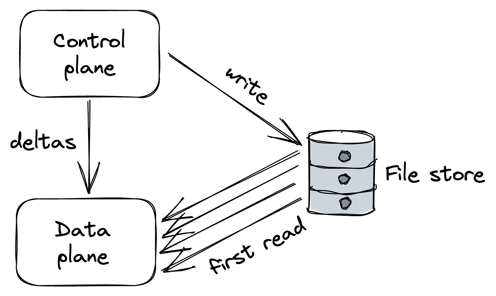

# 控制面板和数据面板

API 网关是单点故障。如果它下降，那么 Cruder 也会下降，这就是它需要高可用性的原因。而且因为每个外部请求都需要经过它，它也必须是可扩展的。这在外部依赖方面产生了一些有趣的挑战。

例如，假设网关有一个特定的"配置"或管理端点来添加、删除和配置用于速率限制请求的 API 密钥。不出所料，配置端点的请求量远低于主端点的请求量，较低的规模就足以处理它。虽然网关需要优先考虑可用性和性能而不是一致性，以便将外部请求路由到内部服务，但它应该更喜欢发送到管理端点的请求的一致性而不是可用性。

由于这些不同且相互竞争的要求，我们可以将 API 网关拆分为一个数据面板服务，该服务为指向我们内部服务的外部请求提供服务，一个控制面板服务，用于管理网关的元数据和配置。事实证明，这种分裂是一种常见的模式[^1]。例如，在 10.4 节的链复制中，控制面板保存了链的配置。在我们在第 17 章讨论过的 Azure 存储中，流管理器和分区管理器是控制面板，它们分别管理流和分区到存储和分区服务器的分配。

更一般地说，数据面板包括关键路径上需要为每个客户端请求运行的任何功能。因此，它必须具有高可用性、快速且可随请求数量扩展。相比之下，控制面板不在关键路径上，并且具有不太严格的扩展要求。它的主要工作是通过管理元数据或配置以及协调复杂和不频繁的操作来帮助数据面板完成其工作。而且由于它通常需要向数据面板提供其状态的一致视图，因此它更倾向于一致性而不是可用性。

一个应用程序可以有多个独立的控制和数据面板。例如，一个控制面板可能负责根据负载向上或向下扩展服务，而另一个控制其配置。

但是将控制面板与数据面板分开会带来复杂性。数据面板需要设计成能够承受控制面板故障，以使分离更加稳健。如果当控制面板不可用时数据面板停止服务请求，我们说前者对后者有硬依赖。直观地说，如果控制面板或数据面板出现故障，整个系统将变得不可用。更正式地说，当我们有一个相互依赖的组件链时，系统的理论可用性是其组件可用性的乘积。

例如，如果数据面板的理论可用性为 99.99%，而控制面板的可用性为 99%，那么整个系统只能达到 98.99% 的组合可用性：

$$
0.9999 * 0.99 = 0.9899
$$
换句话说，一个系统充其量只能与它最不可用的硬依赖一样可用。我们可以尝试让控制面板更可靠，但更重要的是，我们应该确保数据面板能够承受控制面板故障。如果控制面板暂时不可用，则数据面板应继续以陈旧的配置运行，而不是停止。这个概念也被称为静态稳定性。

## 22.1 规模不平衡

通常，数据面板和控制面板往往具有非常不同的规模要求。这会产生风险，因为数据面板可能会使控制面板过载[^2]。

假设控制面板公开了一个 API，数据面板会定期查询该 API 以检索最新配置。在正常情况下，你会期望对控制面板的请求或多或少均匀地分布在时间上。但是，在某些情况下，它们可以在很短的时间间隔内聚集。例如，如果出于某种原因，构成数据面板的进程同时重新启动并且必须从控制面板检索配置，它们可能会使其过载。

尽管控制面板可以通过第 28 章中描述的弹性机制在一定程度上保护自己，但最终它会开始退化。如果控制面板由于过载或任何其他原因（如网络分区）变得不可用，它可以用它来关闭数据面板。

回到前面的例子，如果部分数据面板正在尝试启动，但由于过载而无法到达控制面板，它将无法上线。那么我们如何围绕它进行设计呢？

一种方法是使用可扩展的文件存储（如 Azure 存储或 S3）作为控制面板和数据面板之间的缓冲区。控制面板定期将其整个状态转储到文件存储，无论它是否发生变化，而数据面板则定期从中读取状态（参见图 22.1）。尽管这种方法听起来幼稚且昂贵，但在实践中它往往是可靠且稳健的。而且，根据州的大小，它也可能很便宜。 [^3]

图 22.1：中间数据存储通过吸收数据面板产生的负载来保护控制面板。

引入中间存储作为缓冲区将控制面板与数据面板分离，并保护前者免受过载。如果控制面板变得不可用，它还使数据面板能够继续运行（或启动）。但这是以更高的延迟和更弱的一致性保证为代价的，因为将更改从控制面板传播到数据面板所需的时间必然会增加。

为了减少传播延迟，需要一种没有中介的不同架构。这个想法是让数据面板连接到控制面板，就像我们最初的方法一样，但是让控制面板在配置发生变化时推送配置，而不是受制于来自数据面板的定期查询。因为控制面板控制了步伐，所以跟不上时会减速而不是摔倒。 [^4]

为了进一步减少延迟和负载，控制面板可以版本更改并仅将更新/增量推送到数据面板。虽然这种方法实现起来更复杂，但当状态非常大时，它显着减少了传播时间。

但是，如果许多数据面板实例大约在同一时间启动（由于大规模横向扩展或重启）并尝试第一次从控制面板读取整个配置，则控制面板仍可能受到重创。为了防止这种情况，我们可以重新引入一个中间数据存储，其中包含控制面板状态的最新快照。这允许数据面板在启动时从存储中读取快照，然后仅从控制面板请求一个小的增量（参见图 22.2）。

图 22.2：中间数据存储吸收批量读取的负载，而当状态发生变化时，控制面板将小的增量推送到数据面板。

### 22.2 控制理论

控制理论为我们提供了另一种思考控制面板和数据面板的方法[^5]。在控制理论中，目标是创建一个控制器来监控动态系统，将其状态与所需状态进行比较，并采取纠正措施使系统更接近它，同时最大限度地减少途中的任何不稳定性。

在我们的例子中，数据面板是我们希望驱动到所需状态的动态系统，而控制器是控制面板，负责监控数据面板，将其与所需状态进行比较，并在需要时执行纠正措施。

控制面板和数据面板是反馈回路的一部分。如果没有所有三个要素（监控、比较和操作），你就没有闭环，数据面板也无法达到所需的状态[^6]。监控部分是实现闭环最常见的缺失要素。

以链复制为例。控制面板的工作不应该只是将链的配置推送到数据面板。它还应该监控数据面板是否在合理的时间内实际应用了配置。如果没有，它应该执行一些纠正措施，这可能就像重新启动具有陈旧配置的节点或将它们排除在任何链的一部分之外一样天真。

控制面板的一个更普通的示例是 CI/CD 管道，用于发布新版本的服务而不会造成任何中断。实现管道的一种方法是在不监视正在运行的服务的情况下盲目地部署和发布新构建——构建可能会在启动时引发异常，从而阻止服务启动，从而导致灾难性故障。相反，管道应该在监控服务的同时逐步发布新的构建，如果有明确的证据表明出现问题，则停止推出，并可能自动回滚。

总而言之，在处理控制面板时，问问自己缺少什么来关闭循环。我们几乎没有触及该主题的表面，如果你想了解更多有关它的信息，"设计分布式控制系统"[^7] 是一本不错的读物。

--------------------

[^1]: "控制面板与数据面板": https://broker.co.za/blog/2019/03/17/control.html
[^2]: "通过控制较小的服务来避免分布式系统的过载": https://aws.amazon.com/builders-library/avoiding-overload-in-distributed-systems-by-putting-the-smaller-service-in -控制/
[^3]: 这是 CQRS 模式在实践中应用的另一个例子。
[^4]: 也就是说，如果控制面板需要处理太多连接，仍然有可能使控制面板超载。
[^5]: "AWS re:Invent 2018：闭环与开放思维：如何控制系统，大小 ARC337，"https://www.youtube.com/watch?v=O8xLxNje30M
[^6]: 也就是说，有一个闭环也不能保证，它只是一个先决条件。
[^7]: "设计分布式控制系统": https://www.amazon.com/gp/product/1118694155