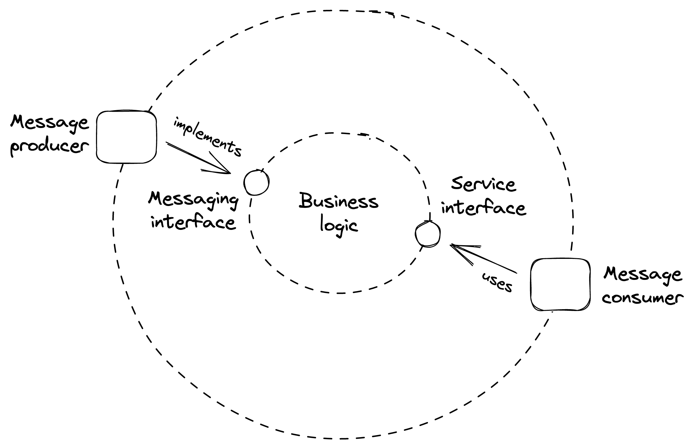
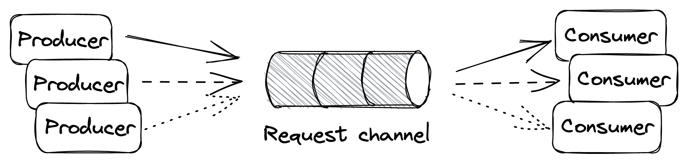
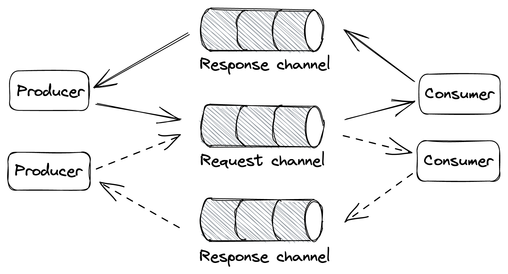
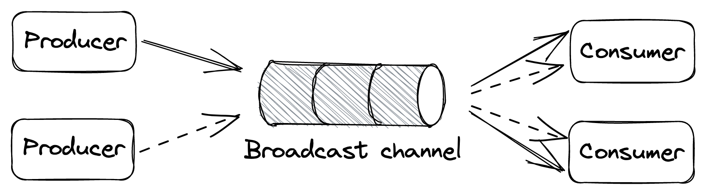

# 消息传递

假设 Cruder 有一个端点，允许用户上传视频并以针对特定设备（电视、手机、平板电脑等）量身定制的不同格式和分辨率对其进行编码。当 API 网关收到来自客户端的请求时，它会将视频上传到文件存储（如 S3），并向编码服务发送请求以处理文件。

由于编码可能需要几分钟才能完成，我们希望 API 网关将请求发送到编码服务而不等待响应。但是，如果在另一端处理请求的编码服务实例由于任何原因崩溃或失败，那么简单的实现（即发即弃）会导致请求丢失。

更健壮的解决方案是在 API 网关和编码服务之间引入消息通道。消息传递是在第 5 章讨论 API 时首次介绍的。这是一种间接通信形式，其中生产者将消息写入通道（或消息代理），然后将消息传递给另一端的消费者。

消息通道充当接收者的临时缓冲区。与迄今为止我们一直使用的直接请求-响应通信方式不同，消息传递本质上是异步的，因为发送消息不需要接收服务在线。消息本身具有明确定义的格式，由标题和正文组成。消息头包含元数据，例如唯一的消息 ID，而正文包含实际内容。

通常，消息可以是一个命令，它指定接收者要调用的操作，也可以是一个事件，它向接收者发出信号，表明发送者发生了感兴趣的事情。服务可以使用入站适配器从通道接收消息，使用出站适配器将消息发送到通道，如图 23.1 所示。

图 23.1：消息消费者（入站适配器）是服务 API 表面的一部分。

API 网关将视频上传到文件存储后，它会向通道写入一条消息，其中包含指向上传文件的链接，并以 202 Accepted 响应，向客户端发出已接受处理但尚未完成的请求的信号然而。最终，编码服务将从通道中读取消息并进行处理。因为请求只有在成功处理后才会从通道中删除，所以如果编码服务处理失败，请求最终会被重新拾取并重试。

使用通道将 API 网关（生产者）与编码服务（消费者）解耦提供了许多好处。即使消费者暂时不可用，生产者也可以向消费者发送请求。此外，请求可以跨消费者实例池进行负载平衡，从而轻松扩展消费端。而且因为消费者可以按照自己的节奏从通道中读取数据，所以通道可以消除负载峰值，防止它过载。

另一个好处是消息传递能够在单个批次或工作单元中处理多个消息。大多数消息代理通过允许客户端使用单个读取请求获取多达 N 条消息来支持此模式。尽管批处理降低了单个消息的处理延迟，但它显着提高了应用程序的吞吐量。因此，当我们能够承受额外的延迟时，批处理是轻而易举的事。

通常，消息通道允许任意数量的生产者和消费者实例对其进行写入和读取。但是根据通道传递消息的方式，它被分类为点对点或发布订阅。在点对点通道中，消息只传递给一个消费者实例。相反，在发布-订阅通道中，每个消费者实例都会收到消息的副本。

毫不奇怪，引入消息通道会增加复杂性。消息代理是另一个需要维护和操作的服务。而且由于生产者和消费者之间有额外的一跳，通信延迟必然会更高；如果通道有大量等待处理的消息积压，则更是如此。与往常一样，这都是关于权衡的。

因为消息传递是分布式系统的核心模式，我们将在本章中仔细研究它，从它支持的最常见的通信方式开始。

#### 单向消息传递

在这种消息传递方式中，生产者将消息写入点对点通道，并期望消费者最终会读取并处理它（见图 23.2）。这是我们在前面的示例中使用的样式。

图 23.2：单向消息传递方式

#### 请求-响应消息

这种消息传递风格类似于我们熟悉的直接请求-响应风格，尽管不同之处在于请求和响应消息通过渠道流动。消费者有一个点对点的请求通道，它可以从中读取消息，而每个生产者都有其专用的响应通道（见图 23.3）。

当生产者向请求通道写入消息时，它会用请求 ID 和对其响应通道的引用来装饰它。然后，在消费者读取并处理完消息后，它会向生产者的响应通道写入回复，并用请求的 ID 标记它，这允许生产者识别它所属的请求。

图 23.3：请求-响应消息样式

广播消息

在这种消息传递方式中，生产者将消息写入发布-订阅通道以将其广播到所有消费者实例（参见图 23.4）。此样式通常用于通知一组进程发生了特定事件。例如，我们在 13.1 节讨论发件箱模式时已经遇到过这种模式。

图 23.4：广播消息样式

## 23.1 保证

消息通道由消息服务或代理（如 AWS SQS1 或 Kafka）实现，它们缓冲消息并将生产者与消费者分离。不同的消息代理根据其实现做出的权衡提供不同的保证。例如，你会认为通道应该尊重其消息的插入顺序，但你会发现某些实现，如 SQS 标准队列[^2]，不提供任何强排序保证。这是为什么？

因为消息代理需要像使用它的应用程序一样水平扩展，所以它的实现必然是分布式的。当涉及多个节点时，保证顺序变得具有挑战性，因为需要某种形式的协调。一些代理，如 Kafka，将一个通道划分为多个子通道。因此，当消息写入通道时，它们会根据其分区键被路由到子通道。由于每个分区足够小，可以由单个代理进程处理，因此强制对路由到它的消息进行排序是微不足道的。但是为了保证消息顺序是端到端保留的，只允许单个消费者进程从子通道读取[^3]。

因为通道是分区的，所以第 16 章中讨论的所有注意事项都适用于它。例如，一个分区可能变得足够热（由于传入消息的数量），从它读取的消费者无法跟上负载。在这种情况下，可能必须通过添加更多分区来重新平衡通道，这可能会在消息跨分区洗牌时降低代理性能。现在应该清楚为什么不保证消息的顺序会使代理的实现变得更加简单。

订购只是经纪人需要做出的众多权衡之一，例如：

- 交付保证，例如最多一次或至少一次；
- 消息持久性保证；
- 延时;
- 支持消息传递标准，如 AMQP[^4]；
- 支持竞争消费者实例；
- 代理限制，例如支持的最大消息大小。

因为实现通道的方式有很多，所以在本节的其余部分，为了简单起见，我们将做一些假设：

- 通道是点对点的，支持许多生产者和消费者实例。
- 消息至少传递给消费者一次。
- 当消费者实例处理消息时，消息仍保留在通道中，但其他实例在可见性超时期间无法读取它。可见性超时保证如果消费者实例在处理消息时崩溃，则在超时触发时消息将对其他实例可见。当消费者实例处理完消息后，它会将其从通道中删除，以防止将来被任何其他消费者实例接收。

上述保证类似于 Amazon 的 SQS 和 Azure Queue Storage[^5] 等托管服务提供的保证。

## 23.2 精确一次处理

如前所述，消费者实例必须在处理完消息后从通道中删除消息，以便另一个实例不会读取它。如果消费者实例在处理消息之前删除了消息，那么在删除消息之后但在处理之前它可能会崩溃，从而导致消息永远丢失。另一方面，如果消费者实例在处理完消息后才删除消息，则存在处理完消息但在删除之前崩溃的风险，导致稍后再次读取相同的消息。

正因为如此，没有完全一次的消息传递这样的事情[^6]。因此，消费者可以做的最好的事情是通过要求消息是幂等的并仅在它们被处理后才从通道中删除它们来模拟一次性消息处理。

## 23.3 故障

当消费者实例无法处理消息时，会触发可见性超时，并且消息最终会被传递到另一个实例。但是，如果处理特定消息始终失败并出现错误会发生什么？为了防止消息被永久重复拾取，我们需要限制从通道中读取同一消息的最大次数。

为了实施最大重试次数，代理可以使用计数器标记消息，该计数器跟踪消息已传递给消费者的次数。如果代理不支持这个功能，消费者可以实现它。

一旦我们有办法计算一条消息被重试的次数，我们仍然必须决定当达到最大值时要做什么。消费者不应该在未处理的情况下删除消息，因为这会导致数据丢失。但它可以做的是在将消息写入死信通道后将其从通道中删除 - 一个缓冲已重试多次的消息的通道。

这样，始终失败的消息不会永远丢失，而只是放在一边，以免污染主通道，浪费消费者的资源。然后，人们可以检查这些消息以调试故障，一旦确定并修复了根本原因，将它们移回主通道进行重新处理。

## 23.4 积压

使用消息代理的主要优点之一是它使系统对中断更加健壮。这是因为即使消费者暂时降级或不可用，生产者也可以继续向通道写入消息。只要消息的到达率低于或等于它们的删除率，一切都很好。但是，当这种情况不再正确并且消费者无法跟上生产者的速度时，就会积压。

消息传递通道在系统中引入了双峰行为。在一种模式下，没有积压，一切都按预期工作。另一方面，积压工作积压，系统进入降级状态。积压的问题在于积压的时间越长，消耗它所需的资源和/或时间就越多。

积压有几个原因，例如：

更多生产者实例上线，和/或它们的吞吐量增加，而消费者无法跟上到达率；
消费者性能下降，消息处理时间变长，降低了删除率；
消费者无法处理一小部分消息，这些消息会再次被拾取，直到它们最终进入死信通道。这浪费了消费者的资源并延迟了健康消息的处理。
为了检测和监控积压，我们可以测量一条消息在通道中等待第一次被读取的平均时间。通常，代理会附上消息首次写入它的时间戳。消费者可以使用该时间戳来计算消息在通道中等待的时间，方法是将其与读取消息时所用的时间戳进行比较。尽管这两个时间戳是由两个不完全同步的物理时钟生成的（参见第 8.1 节），但这种测量通常提供了一个很好的积压警告信号。

## 23.5 故障隔离

单个生产者实例发出重复无法处理的"有毒"消息可能会使消费者降级，并可能产生积压，因为这些消息在最终进入死信通道之前会被处理多次。因此，在此之前找到处理有毒信息的方法非常重要。

如果消息使用生成它们的源的标识符进行修饰，则消费者可以不同地对待它们。例如，假设来自特定用户的消息始终失败。在这种情况下，消费者可以决定将这些消息写入备用的低优先级通道，然后将它们从主通道中删除而不进行处理。消费者从慢速通道读取，但读取频率低于主通道，从而隔离了单个不良用户可能对其他人造成的损害。

--------------------

[^1]: "亚马逊简单队列服务": https://aws.amazon.com/sqs/
[^2]: "Amazon SQS 标准队列": https://docs.aws.amazon.com/AWSSimpleQueueService/latest/SQSDeveloperGuide/standard-queues.html
[^3]: 这也称为竞争消费者模式，使用领导者选举来实现。
[^4]: "高级消息队列协议": https://en.wikipedia.org/wiki/Advanced_Message_Queuing_Protocol
[^5]: "Azure 队列存储": https://azure.microsoft.com/en-us/services/storage/queues/
[^6]: "你不能有 Exactly-Once Delivery Redux": https://bravenewgeek.com/you-cannot-have-exactly-once-delivery-redux/↩︎