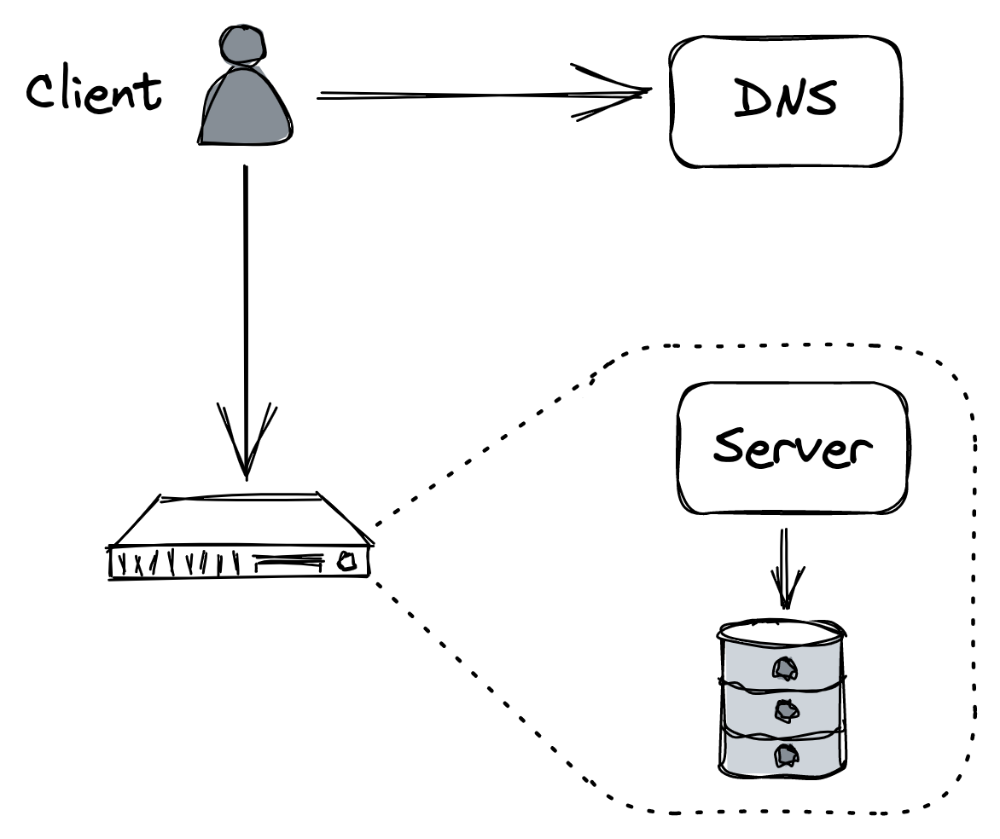
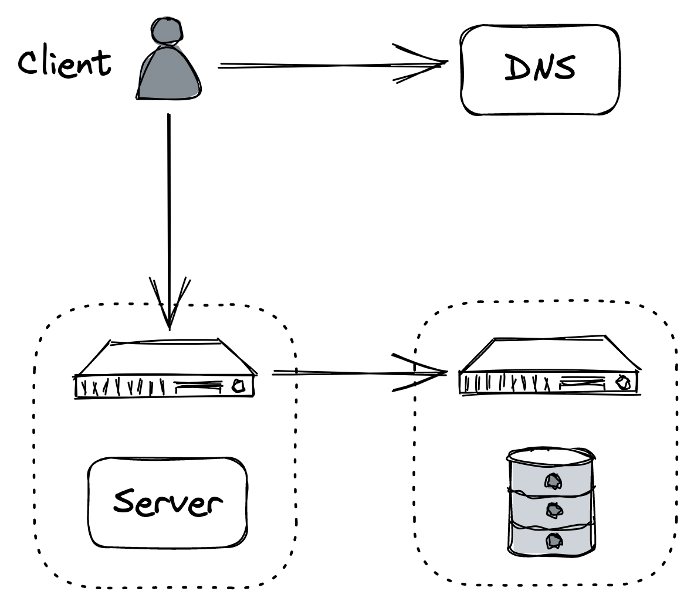

# 介绍

> "像牛一样对待服务器，而不是宠物。"
>
> — 比尔·贝克

在过去的几十年中，可以访问互联网的人数稳步攀升。 1996 年，全球只有 1% 的人可以访问互联网，而今天，这一比例超过了 65%。反过来，这增加了在线业务的总目标市场，并导致需要能够处理数百万并发用户的可扩展系统。

对于要扩展的应用程序，它必须在负载增加时不降低性能的情况下运行。如第 1 章所述，增加应用程序容量的唯一长期解决方案是对其进行架构，使其可以水平扩展。

在这一部分中，我们将介绍扩展一个名为 Cruder 的简单 CRUD Web 应用程序的过程。 Cruder 由一个单页 JavaScript 应用程序组成，该应用程序通过 RESTful HTTP API 与应用程序服务器通信。服务器使用本地磁盘存储大文件，如图像和视频，并使用关系数据库来保存应用程序的状态。数据库和应用程序服务器都托管在同一台机器上，由 AWS EC2 等计算平台管理。此外，服务器的公共 IP 地址由托管 DNS 服务（如 AWS Route 531）公布。

用户通过浏览器与 Cruder 进行交互。通常，浏览器发出 DNS 请求以将域名解析为 IP 地址（如果它尚未缓存），打开与服务器的 TLS 连接，并向其发送第一个 HTTP GET 请求（参见图 13.2 ）。

图 13.2：Cruder的架构

尽管这种架构对于概念验证来说已经足够好了，但它不是可扩展的或容错的。当然，并不是所有的应用程序都需要高可用性和可扩展性，但是由于你正在阅读本书以了解如何构建此类应用程序，因此我们可以假设应用程序的后端最终需要每秒处理数百万个请求。

因此，随着请求数量的增加，应用服务器将需要更多的资源（例如 CPU、内存、磁盘、网络）并最终达到其容量，其性能将开始下降。同样，随着数据库存储更多数据和服务更多查询，它不可避免地会因为与应用服务器竞争资源而变慢。

增加容量的最简单和最快的方法是扩展托管应用程序的机器。例如，我们可以：

- 通过配置更多处理器或内核来增加能够同时运行的线程数，
- 通过配置更多磁盘 (RAID) 来增加磁盘吞吐量，
- 通过配置更多 NIC 来增加网络吞吐量，
- 通过配置固态磁盘 (SSD) 减少随机磁盘访问延迟，
- 或通过提供更多内存来减少页面错误。

需要注意的是，应用程序需要能够利用可用的附加硬件。例如，向单线程应用程序添加更多内核不会产生太大影响。更重要的是，当我们在硬件方面达到极限时，应用程序最终将达到一个硬物理极限，无论我们愿意投入多少资金都无法克服。

扩展的替代方法是通过将应用程序分布在多个节点上来扩展。尽管这使应用程序更加复杂，但最终它会得到回报。例如，我们可以将数据库移动到专用机器作为第一步。通过这样做，我们增加了服务器和数据库的容量，因为它们不再需要竞争资源。这是一个称为功能分解的更通用模式的示例：将应用程序分解为单独的组件，每个组件都有自己明确定义的职责（参见图 13.3）。

图 13.3：将数据库移动到自己的专用机器上是功能分解的一个例子

正如我们将在接下来的章节中反复看到的那样，我们可以利用（和组合）其他两种通用模式来构建可扩展的应用程序：将数据拆分为分区并将它们分布在节点之间（分区）以及跨节点复制功能或数据。称为水平缩放（复制）。在接下来的章节中，我们将探索基于这些模式的技术，以进一步提高 Cruder 的容量，这需要越来越多的努力来加以利用。

第 14 章讨论了使用客户端缓存来减少访问应用程序的请求数量。

第 15 章描述了如何使用内容交付网络 (CDN)，一个由托管反向代理组成的地理分布网络，以进一步减少应用程序需要处理的请求数量。

第 16 章深入探讨了分区，这是 CDN 和几乎所有分布式数据存储使用的一种技术，用于处理大量数据。本章探讨了不同的分区策略，例如范围和哈希分区，以及分区带来的挑战。

第 17 章讨论了将大型静态文件（例如图像和视频）的存储卸载到托管文件存储的好处。然后，它描述了 Azure 存储的体系结构，这是一种高度可用和可扩展的文件存储。

第 18 章讨论了如何通过跨服务器池的负载平衡请求来增加应用程序的容量。本章从基于 DNS 的简单方法开始，然后探索在网络堆栈的传输层和应用层运行的更灵活的解决方案。

第 19 章介绍了如何使用复制和分区来扩展应用程序的关系数据库以及随之而来的挑战。然后，它介绍了 NoSQL 数据存储作为应对这些挑战的解决方案，并讲述了它们自最初在行业中采用以来的演变。

第 20 章通过深入探讨将缓存放在应用程序数据存储之前的好处和缺陷，从更一般的角度讨论缓存。尽管缓存是一种看似简单的技术，但它会产生微妙的一致性和操作问题，这些问题很容易被忽略。

第 21 章讨论了通过将应用程序分解为可独立部署的服务来跨多个团队扩展应用程序的开发。接下来，它引入了 API 网关的概念，作为外部客户端在将其分解为独立的服务后与后端进行通信的一种手段。

第 22 章描述了将客户端请求的服务（数据平面）与系统元数据和配置（控制平面）的管理分离的好处，这是大型系统中的常见模式。

第 23 章探讨了使用异步消息传递通道来解耦服务之间的通信，允许两个服务进行通信，即使其中一个服务暂时不可用。消息传递提供了许多其他好处，我们将在本章中对其最佳实践和陷阱进行探讨。

[1] "亚马逊 53 号公路"，https://aws.amazon.com/route53/