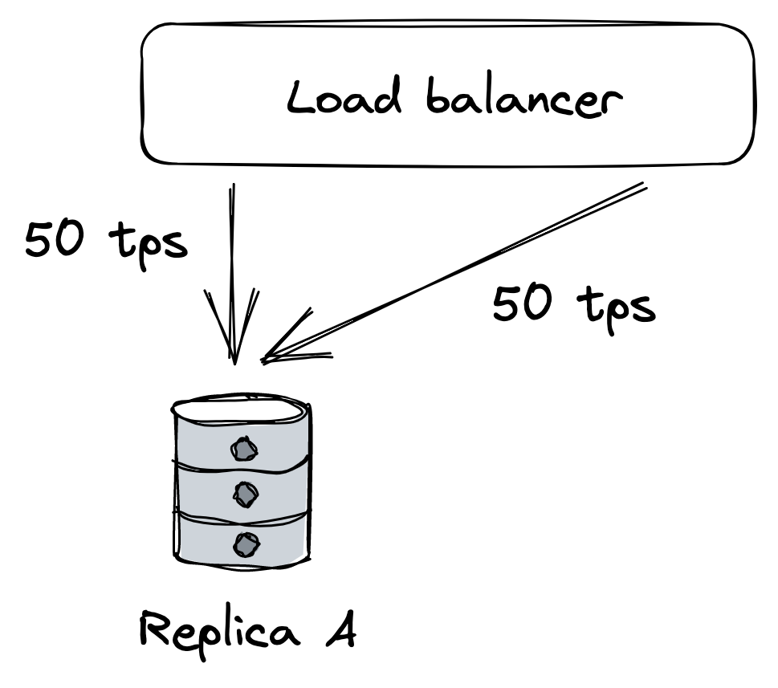

# 常见故障原因

当系统不再向其用户提供满足其规范的服务时，我们说系统出现故障[^1]。故障是由故障引起的：内部组件故障或系统所依赖的外部依赖项故障。有些故障是可以容忍的，根本不会对用户造成可见影响，而另一些故障会导致失败。

要构建容错应用程序，我们首先需要知道什么地方可能出错。在接下来的几节中，我们将探讨一些最常见的故障根本原因。到最后，你可能想知道如何容忍所有这些不同类型的故障。答案将在接下来的几章中揭晓。

## 24.1 硬件故障

机器的任何物理部分都可能发生故障。 HDD、内存模块、电源、主板、SSD、NIC 或 CPU 都可能因各种原因停止工作。在某些情况下，硬件故障也会导致数据损坏。如果这还不够，整个数据中心可能会因为停电或自然灾害而宕机。

正如我们稍后将讨论的那样，我们可以通过冗余来解决许多此类基础设施故障。你会认为这些故障是导致分布式应用程序失败的主要原因，但实际上，它们经常因非常平凡的原因而失败。

## 24.2 不正确的错误处理

2014[^2] 年对五个流行的分布式数据存储中用户报告的故障进行的一项研究发现，大多数灾难性故障是由于对非致命错误的不正确处理造成的。

在大多数情况下，可以通过简单的测试检测到错误处理中的错误。例如，一些处理程序完全忽略了错误。其他人捕获了一个过于通用的异常，比如 Java 中的 Exception，然后无缘无故地中止了整个过程。而其他一些处理程序仅部分实现，甚至包含"FIXME”和"TODO”注释。

事后看来，这也许并不太令人惊讶，因为错误处理往往是事后才想到的。[^3]稍后，在第 29 章中，我们将仔细研究测试大型分布式应用程序的最佳实践。

## 24.3 配置更改

配置更改是导致灾难性故障的主要原因之一[^4]。导致问题的不仅是错误配置，还有有效的配置更改以启用不再按预期工作（或从未按预期工作）的很少使用的功能。

使配置更改特别危险的是它们的影响可能会延迟 [^5]。如果应用程序仅在实际需要时才读取配置值，则无效值可能会在更改后数小时或数天后生效，从而逃避早期检测。

这就是为什么配置更改应该像代码更改一样进行版本控制、测试和发布，并且应该在更改发生时预防性地进行验证。在第 30 章中，我们将讨论在持续部署的上下文中代码和配置更改的安全发布实践。

## 24.4 单点故障

单点故障 (SPOF) 是一个组件，其故障会导致整个系统崩溃。实际上，系统可以有多个 SPOF。

人会造成严重的 SPOF，如果你将他们置于他们自己可能导致灾难性故障的位置，你可以打赌他们最终会的。例如，当有人需要按照特定顺序手动执行一系列操作步骤而不出错时，经常会发生人为故障。另一方面，计算机擅长执行指令，这就是为什么应尽可能利用自动化。

另一个常见的 SPOF 是 DNS[^6]。如果客户端无法解析应用程序的域名，他们将无法连接到该应用程序。发生这种情况的原因有很多，从域名过期[^7]到整个根级域都关闭[^8]。

同样，应用程序为其 HTTP 端点使用的 TLS 证书也是 SPOF[^9]。如果证书过期，客户端将无法打开与应用程序的安全连接。

理想情况下，应该在设计系统时识别 SPOF。检测它们的最佳方法是检查每个系统组件并询问如果它发生故障会发生什么。一些 SPOF 可以通过架构消除，例如，通过引入冗余，而其他则不能。在这种情况下，剩下的唯一选择就是减小 SPOF 的爆炸半径，即 SPOF 发生故障时对系统造成的损害。我们稍后将讨论的许多弹性模式都会减少故障的爆炸半径。

## 24.5 网络故障

当客户端向服务器发送请求时，它希望稍后收到服务器的响应。在最好的情况下，它会在发送请求后不久收到响应。如果没有发生，客户端有两个选择：继续等待或因超时异常或错误而使请求失败。

正如第 7 章所讨论的，当引入故障检测和超时的概念时，没有得到及时响应的原因有很多。例如，服务器在处理请求时可能非常慢或崩溃；或者网络可能丢失了一小部分数据包，导致大量重传和延迟。

缓慢的网络调用是分布式系统的无形杀手[^10]。因为客户端不知道响应是否最终会到达，它可能会在放弃之前花费很长时间等待，如果它完全放弃，则会导致性能下降，这对调试具有挑战性。这种故障也称为灰色故障[^11]：一种非常细微的故障，无法快速或准确地检测到。由于其性质，灰色故障很容易使整个系统崩溃。

在下一节中，我们将探讨灰色故障的另一个常见原因。

## 24.6 资源泄漏

从观察者的角度来看，一个非常缓慢的进程与一个根本没有运行的进程没有太大区别——两者都不能执行有用的工作。资源泄漏是进程缓慢的最常见原因之一。

内存可以说是受泄漏影响的最著名的资源。内存泄漏会导致内存消耗随时间稳定增加。即使是具有垃圾收集功能的语言也容易发生泄漏：如果对不再需要的对象的引用保存在某处，垃圾收集器将无法删除它。当泄漏消耗了如此多的内存以致所剩无几时，操作系统将开始积极地将内存页面交换到磁盘。此外，垃圾收集器将更频繁地启动，试图释放内存。所有这些都会消耗 CPU 周期并使过程变慢。最终，当没有更多物理内存剩余，交换文件中也没有更多空间时，进程将无法分配内存，大多数操作都会失败。

内存只是可能泄漏的众多资源之一。以线程池为例：如果从池中获取的线程在没有超时的情况下进行同步阻塞 HTTP 调用并且调用永远不会返回，则该线程不会返回到池中。由于池的最大大小有限，如果它不断丢失线程，它最终会耗尽线程。

您可能认为进行异步调用而不是同步调用在前一种情况下会有所帮助。然而，现代 HTTP 客户端使用套接字池来避免重新创建 TCP 连接和支付性能费用，如第 2 章所述。如果在没有超时的情况下发出请求，则连接永远不会返回到池中。由于池的最大大小有限，最终不会有任何连接。

最重要的是，您的代码并不是唯一访问内存、线程和套接字的东西。您的应用程序所依赖的库使用相同的资源，并且它们可能会遇到我们刚刚讨论过的相同问题。

## 24.7 负载压力

每个系统都有它能承受多少负载的限制，即它的容量。因此，当指向系统的负载继续增加时，它迟早会达到该限制。但是负载的有机增加，使系统有时间相应地扩展并增加其容量，是一回事，而突然和意外的洪水则是另一回事。

例如，考虑应用程序在一段时间内收到的请求数。传入请求的速率和类型可能会随着时间的推移而发生变化，有时甚至会突然发生变化，原因有多种：

- 这些请求可能具有季节性。因此，例如，根据一天中的不同时间，不同国家/地区的用户会访问该应用程序。
- 有些请求比其他请求昂贵得多，并且以意想不到的方式滥用系统，例如爬虫以超人的速度吞噬数据。
- 有些请求是恶意的，例如 DDoS 攻击，它们试图使应用程序的带宽饱和以拒绝合法用户访问它。

虽然一些负载激增可以通过增加容量的自动化来处理（例如，自动缩放），但其他负载激增需要系统拒绝请求以防止过载，使用我们将在第 28 章中讨论的模式。

## 24.8 级联故障

您可能会认为，如果一个系统有数百个进程，那么即使一小部分进程缓慢或无法访问也不会造成太大影响。关于故障的事情是它们有可能像病毒一样传播并从一个过程级联到另一个过程，直到整个系统崩溃。当系统组件相互依赖时，就会发生这种情况，其中一个组件的故障会增加其他组件故障的可能性。

例如，假设多个客户端在负载均衡器后面查询两个数据库副本 A 和 B。每个副本每秒处理大约 50 个事务（见图 24.1）。

图 24.1：负载均衡器后面的两个副本；每个都处理一半的负载。

突然，由于网络故障，副本 B 变得不可用。负载均衡器检测到 B 不可用并将其从池中删除。正因为如此，副本 A 必须为 B 弥补不足，并在每单位时间内服务两倍于它之前服务的请求（参见图 24.2）。

图 24.2：当副本 B 变得不可用时，A 将承受更多负载，这可能会超出其容量。

如果副本 A 难以跟上传入的请求，客户端将遇到越来越多的超时并开始重试请求，从而给系统增加更多负载。最终，副本 A 将承受如此多的负载，以至于大多数请求都会超时，从而迫使负载均衡器将其从池中删除。换句话说，导致副本 B 变得不可用的原始网络故障级联为副本 A 的故障。

假设现在副本 B 再次可用并且负载均衡器将其放回池中。因为它是池中唯一的副本，它会被请求淹没，导致它过载并最终再次被删除。

您可以看到即使在网络故障消失后，应用程序仍会继续挣扎，因为反馈循环会导致负载从一个副本跳到另一个副本。具有此特征的故障也称为亚稳态[^12]。

通常需要采取足够大的纠正措施来打破循环，比如首先暂时阻止流量到达副本。不幸的是，这些故障一旦开始就很难缓解，而防止它们的最佳方法是首先阻止故障从一个组件传播到另一个组件。

## 24.9 管理风险

现在应该很明显，分布式应用程序需要接受故障是不可避免的，并准备好在它们发生时检测、响应和修复它们。

在这一点上，您可能会对可能出错的事情数量之多感到不知所措。但仅仅因为特定故障有可能发生，并不意味着我们必须对此采取措施。我们首先要考虑它出现的概率，以及出现时对系统用户造成的影响。通过将这两个因素相乘，我们得到一个风险评分[^13]，我们可以使用它来优先处理哪些故障（参见图 24.3）。例如，发生概率大、影响大的故障，要迎头处理；另一方面，低可能性和低影响的故障可以等待。

图 24.3：风险矩阵

一旦我们决定需要对特定故障采取措施，我们就可以尝试降低其发生概率和/或减少其影响。这将是下一章的重点。

--------------------

[^1]: "系统容错的概念框架": https://resources.sei.cmu.edu/asset_files/TechnicalReport/1992_005_001_16112.pdf
[^2]: "简单的测试可以防止大多数关键故障：分布式数据密集型系统中生产故障的分析": https://www.usenix.org/system/files/conference/osdi14/osdi14-paper-yuan.pdf
[^3]: 这就是 Go 语言如此重视错误处理的原因。
[^4]: "事后分析列表：配置错误": https://github.com/danluu/post-mortems#config-errors
[^5]: "及早检测配置错误以减少故障损害": https://www.usenix.org/system/files/conference/osdi16/osdi16-xu.pdf
[^6]: "它总是 DNS，”https://twitter.com/ahidalgosre/status/1315345619926609920?lang=en-GB
[^7]: "Foursquare 也变黑了。无意中。”https://techcrunch.com/2010/03/27/foursquare-offline
[^8]: "停止将 .IO 域名用于生产流量，”https://hackernoon.com/stop-using-io-domain-names-for-production-traffic-b6aa17eeac20
[^9]: "Microsoft Teams 在 Microsoft 忘记续订证书后出现故障，”https://www.theverge.com/2020/2/3/21120248/microsoft-teams-down-outage-certificate-issue-status
[^10]: "分布式计算的谬误": https://en.wikipedia.org/wiki/Fallacies_of_distributed_computing
[^11]: "灰色失败：云规模系统的致命弱点": https://www.microsoft.com/en-us/research/wp-content/uploads/2017/06/paper-1.pdf
[^12]: "分布式系统中的亚稳态故障": https://sigops.org/s/conferences/hotos/2021/papers/hotos21-s11-bronson.pdf
[^13]: "风险矩阵": https://en.wikipedia.org/wiki/Risk_matrix
