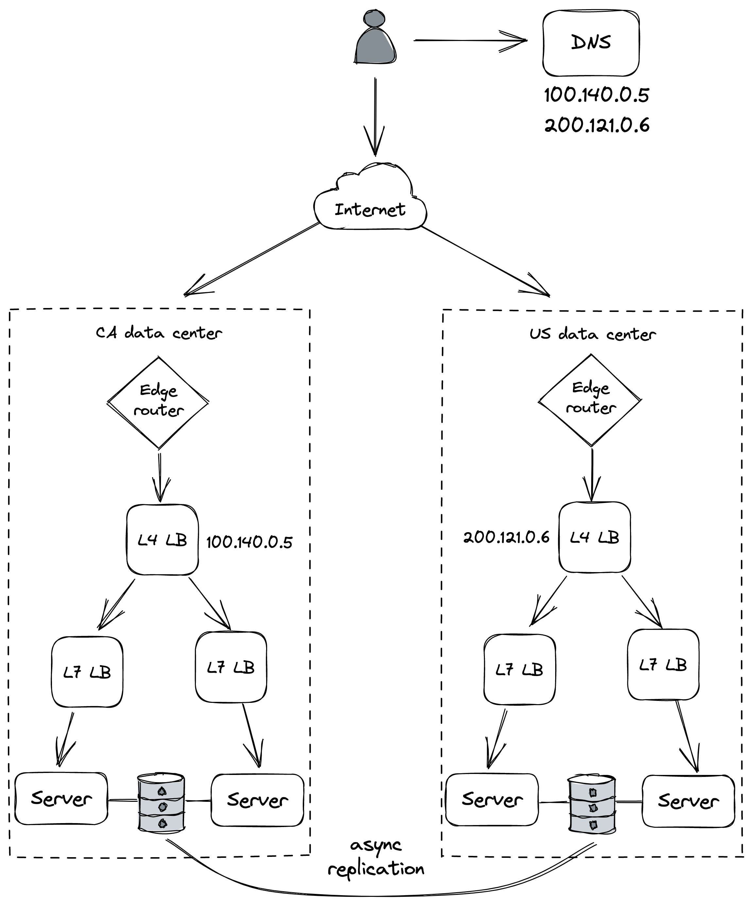

# 冗余

冗余，功能或状态的复制，可以说是防止故障的第一道防线。当功能或状态在多个节点上复制并且一个节点发生故障时，其他节点可以接管。此外，如第 III 部分所述，复制也是使我们的应用程序能够水平扩展的核心模式。

冗余是分布式应用程序比单节点应用程序可以获得更好可用性的主要原因。但实际上只有某些形式的冗余可以提高可用性。 Marc Brooker 列出了四个先决条件[^1]：

- 引入冗余所增加的复杂性所付出的可用性成本不应超过其所增加的成本。
- 系统必须可靠地检测哪些冗余组件是健康的，哪些是不健康的。
- 系统必须能够在降级模式下运行。
- 系统必须能够返回到完全冗余模式。

让我们看看这些先决条件如何应用于具体示例。磁盘、内存和网络故障等硬件故障可能导致节点崩溃、降级或变得不可用。在无状态服务中，负载均衡器可以使用冗余节点池来掩盖这些故障。尽管负载均衡器增加了系统的复杂性，因此增加了系统失败的方式，但在可扩展性和可用性方面的好处几乎总是超过它引入的风险（例如，负载均衡器失败）。

负载均衡器需要检测哪些节点健康，哪些节点不健康，以便将故障节点从池中移除。正如我们在第 18 章中了解到的那样，它通过健康检查来做到这一点。健康检查对于实现高可用性至关重要；如果池中有十台服务器，其中一台由于某种原因没有响应，那么 10% 的请求将失败，导致可用性下降。因此，负载均衡器检测无响应服务器所需的时间越长，故障对客户端可见的时间就越长。

现在，当负载均衡器从池中取出一台或多台不健康的服务器时，假设其他服务器有足够的容量来处理负载的增加。换句话说，系统必须能够在降级模式下运行。然而，这本身还不够；还需要将新服务器添加到池中以替换已删除的服务器。否则，最终将没有足够的服务器来应对负载。

在有状态服务中，屏蔽节点故障要复杂得多，因为它涉及复制状态。我们在前面的章节中详细讨论了复制，现在不应该感到惊讶的是，满足上述要求对于有状态服务来说比无状态服务更具挑战性。

## 25.1 相关性

冗余仅在冗余节点不能同时出于相同原因发生故障时才有用，即，当故障不相关时。例如，如果有故障的内存模块导致服务器崩溃，其他服务器不太可能因为同样的原因同时发生故障，因为它们运行在不同的机器上。但是，如果服务器托管在同一个数据中心，并且光纤中断或雷电风暴会导致整个数据中心范围内的中断，则无论有多少服务器，整个应用程序都将变得不可用。换句话说，由数据中心中断引起的故障是相互关联的，并限制了应用程序的可用性。所以如果我们想提高可用性，我们必须通过使用多个数据中心来降低故障之间的相关性。

正是出于这个原因，AWS 和 Azure 等云提供商在多个地区复制了他们的整个堆栈。每个区域都包含多个称为可用区 (AZ) 的数据中心，这些数据中心与高速网络链路交叉连接。 AZ 彼此之间的距离足够远，可以最大限度地降低相关故障（例如，停电）的风险，但仍然足够近，可以降低网络延迟，这受限于光速。事实上，延迟设计得足够低，可以支持同步复制协议，而不会造成明显的延迟损失。

借助 AZ，我们可以创建能够应对数据中心中断的应用程序。例如，无状态服务可以在共享负载均衡器后面的多个 AZ 中运行实例，这样即使 AZ 不可用，也不会影响服务的可用性。另一方面，有状态服务需要使用复制协议来保持其状态在可用区之间同步。但是由于 AZ 之间的延迟足够低，复制协议可以是部分同步的，如 Raft，甚至是完全同步的，如链复制。

在极端情况下，灾难性事件可能会摧毁整个区域及其所有可用区。为了容忍这种情况，我们可以在多个区域复制整个应用程序堆栈。为了将流量分配到位于不同区域的不同数据中心，我们可以使用全局 DNS 负载平衡。与之前不同，考虑到区域之间的高网络延迟，应用程序的状态需要跨区域[^2]异步复制（参见图 25.1）。

图 25.1：一个简单的多区域架构

也就是说，整个区域被摧毁的可能性极低。 在着手让你的应用程序对区域故障具有弹性之前，你应该有充分的理由这样做。 出于合规原因，你的应用程序更有可能被迫在多个地区出现。 例如，有法律规定必须在欧洲境内处理和存储欧洲客户的数据[^3]。

[^1]: "当冗余真正有用时": https://brooker.co.za/blog/2019/06/20/redundancy.html
[^2]: "多区域弹性的双活": https://netflixtechblog.com/active-active-for-multi-regional-resiliency-c47719f6685b
[^3]: "欧洲法院对 Schrems II 案的判决": https://www.europarl.europa.eu/RegData/etudes/ATAG/2020/652073/EPRS_ATA(2020)652073_EN.pdf
