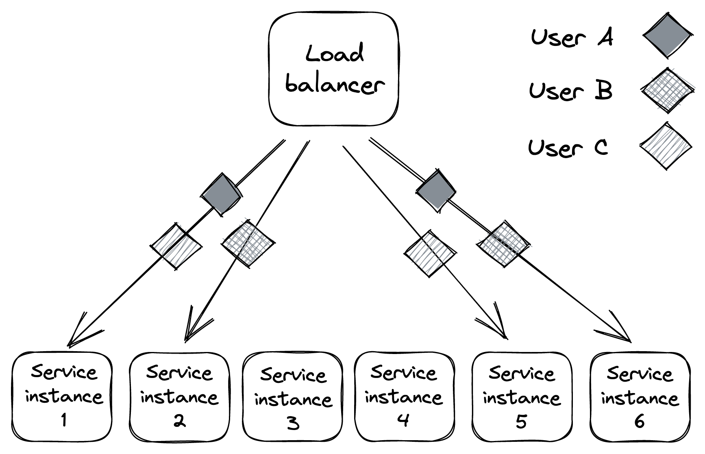

# 误隔离

到目前为止，我们已经讨论了如何通过冗余来解决基础设施故障，但还有一些其他类型的故障是我们无法仅通过冗余来容忍的，因为它们之间的关联度很高。

例如，假设特定用户发送格式错误的请求（有意或无意），导致处理它们的服务器因错误而崩溃。由于错误在代码中，因此我们的应用程序部署到多少 DC 和区域都无关紧要；如果用户的请求可以到达任何地方，它们就会影响所有 DC 和区域。由于其性质，这些请求有时被称为毒丸。

同样，如果特定用户的请求比其他用户需要更多的资源，它们会降低每个其他用户的性能（也称为嘈杂的邻居效应）。

前面例子中的主要问题是毒丸和嘈杂邻居的爆炸半径是整个应用程序。为了减少它，我们可以按用户对应用程序堆栈进行分区，以便特定用户的请求只能影响分配给它的分区。[^1] 这样，即使用户正在降级分区，问题也与系统的其余部分。

例如，假设我们在负载均衡器后面有 6 个无状态服务实例，分为 3 个分区（见图 26.1）。在这种情况下，嘈杂或有毒的用户只能影响 33% 的用户。并且随着分区数量的增加，爆炸半径进一步减小。

图 26.1：划分为 3 个分区的服务实例

使用隔板进行故障隔离也称为舱壁模式，以船体的隔间命名。如果一个舱室损坏并充满水，泄漏将被隔离到该分区，不会扩散到船的其他部分。

## 26.1 随机分片

分区的问题在于，不幸落入降级分区的用户也会受到影响。对于无状态服务，有一种非常简单但功能强大的分区变体，称为 shuffle sharding[^2]，可以帮助缓解这种情况。

这个想法是引入由服务实例的随机（但永久）子集组成的虚拟分区。这使得两个用户不太可能被分配到彼此相同的分区。

让我们回到之前的 6 个实例的无状态服务示例。我们可以从 6 个实例中构建多少种具有 2 个实例的虚拟分区组合？如果你还记得高中统计课上的组合公式，答案是 15：
$$
\frac{n!}{r!(n-r)!} = \frac{6!}{2!4!} = 15
$$
现在有 15 个分区供用户分配，而以前我们只有 3 个，这使得两个用户最终进入同一分区的可能性大大降低。需要注意的是虚拟分区部分重叠（参见图 26.2）。但是通过将随机分片与删除故障实例的负载均衡器以及重试失败请求的客户端相结合，我们可以构建一个比单独使用物理分区的系统具有更好的故障隔离的系统。

图 26.2：虚拟分区彼此完全重叠的可能性要小得多。

## 26.2 蜂窝结构

在前面的示例中，我们讨论了无状态服务上下文中的分区。我们可以更上一层楼，将整个应用程序堆栈（包括其依赖项（负载均衡器、计算服务、存储服务等））按用户[^3]划分到单元[^4]中。每个单元完全独立于其他单元，网关服务负责将请求路由到正确的单元。

在第 17 章讨论 Azure 存储时，我们已经看到了一个"蜂窝”架构的示例。在 Azure 存储中，一个单元是一个存储集群，帐户跨存储集群进行分区（参见图 26.3）。

图 26.3：每个存储集群（标记）是 Azure 存储中的一个单元。

蜂窝架构的一个意想不到的好处来自于对单元的最大容量设置限制。这样，当系统需要横向扩展时，会添加一个新单元而不是扩展现有单元。由于单元格具有最大尺寸，我们可以在该尺寸下对其进行彻底测试和基准测试，因为我们知道将来不会有任何意外，也不会撞到一些意想不到的砖墙。

------------------

[^1]: 我们在第 16 章中从可伸缩性的角度讨论了分区。
[^2]: "随机分片：大规模和神奇的故障隔离": https://aws.amazon.com/blogs/architecture/shuffle-sharding-massive-and-magical-fault-isolation/
[^3]: 按用户划分只是一个例子；我们也可以按物理位置、工作负载或对应用程序有意义的任何其他维度进行分区。
[^4]: "New Relic 案例：大规模、小集群：使用 Cells 在云中扩展": https://www.youtube.com/watch?v=eMikCXiBlOA
