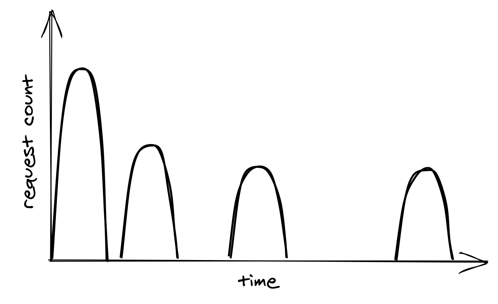
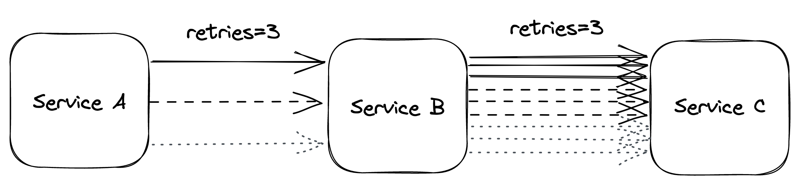
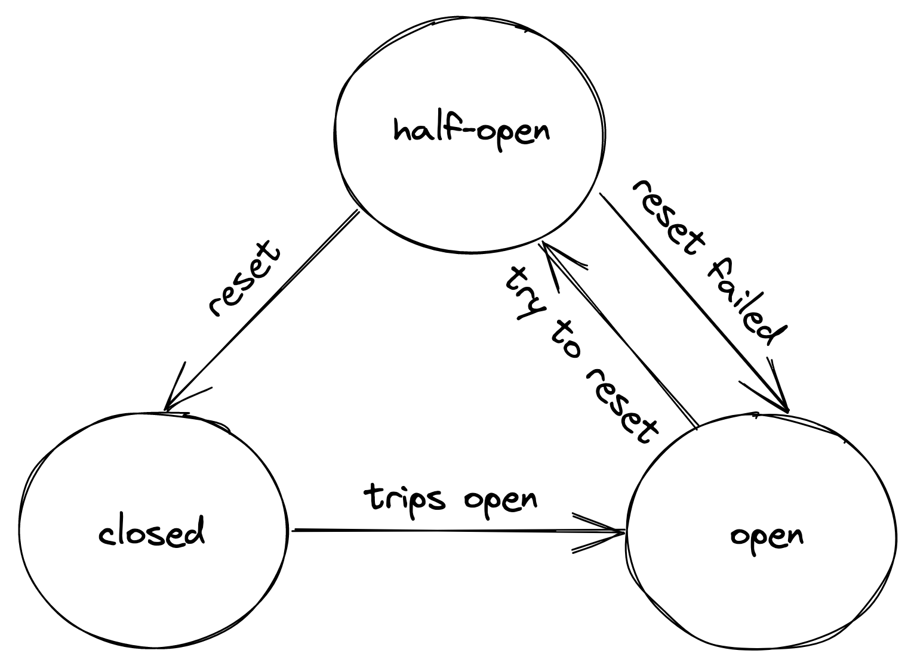

# 下游弹性

既然我们已经讨论了如何通过冗余和分区减少架构级别故障的影响，我们将深入探讨阻止故障从一个组件或服务传播到另一个组件或服务的战术弹性模式。在本章中，我们将讨论保护服务免受下游依赖项故障影响的模式。

## 27.1 超时

进行网络调用时，如果在一定时间内未收到响应，最好配置超时以使调用失败。如果调用没有超时，它有可能永远不会返回，并且如第 24 章所述，不返回的网络调用会导致资源泄漏。因此，超时的作用是检测连接故障并阻止它们从一个组件级联到另一个组件。通常，超时是可能永远不会返回的操作的必备条件，例如获取互斥锁。

不幸的是，一些网络 API 没有办法一开始就设置超时，而另一些则没有默认配置的超时。例如，JavaScript 的 XMLHttpRequest 是从服务器异步获取数据的 Web API，其默认超时为 zero[^1]，即没有超时：

```javascript
var xhr = new XMLHttpRequest();
xhr.open("GET", "/api", true);
// No timeout by default, so it needs to be set explicitly!
xhr.timeout = 10000; // 10K milliseconds
xhr.onload = function () {
    // Request finished
};
xhr.ontimeout = function (e) {
    // Request timed out
};
xhr.send(null);
```

fetch Web API 是使用 Promises 的 XMLHttpRequest 的现代替代品。最初引入 fetch API 时，根本没有办法设置超时[^2]。浏览器后来才通过 Abort API[^3]添加了对超时的支持。 Python 的情况并不乐观；流行的请求库使用默认超时时间 infinity[^4]。 Go 的 HTTP 包默认不使用 timeouts[^5]。

用于 Java 和 .NET 的现代 HTTP 客户端做得更好，并且通常带有默认超时。例如，.NET Core HttpClient 的默认超时为 100 秒[^6]。这很松散，但可以说比根本没有超时要好。

根据经验，在进行网络调用时始终设置超时，并警惕进行网络调用但不公开超时设置的第三方库。

但是我们如何确定一个好的超时时间呢？一种方法是基于所需的错误超时率[^7]。例如，假设我们有一个服务调用另一个服务，我们愿意接受 0.1% 的下游请求最终会返回响应超时（即 0.1 % 错误超时率）。为此，我们可以根据下游服务响应时间的第 99.9 个百分位来配置超时。

我们还希望有良好的监控来衡量网络调用的整个生命周期，例如调用的持续时间、收到的状态代码以及是否触发了超时。我们将在本书后面更多地讨论监控，但我想在这里指出的一点是，我们必须衡量在我们系统的集成点发生的事情，否则我们将很难调试生产问题。

理想情况下，网络调用应该包含在设置超时和监视请求的库函数中，这样我们就不必记住为每次调用都执行此操作。或者，我们也可以使用位于同一台机器上的反向代理，它会拦截我们进程进行的远程调用。代理可以强制超时并监控调用，从而减轻我们的流程责任。我们在 18.3 节讨论 Sidecar 模式和服务网格时谈到了这一点。

## 27.2 重试

我们现在知道客户端在发出网络请求时应该配置超时。但是当请求失败或者超时时，它应该怎么办呢？此时客户端有两个选择：要么快速失败，要么重试请求。如果短暂的连接问题导致失败或超时，则在一些退避时间后重试很可能会成功。但是，如果下游服务不堪重负，立即重试只会让事情变得更糟。这就是为什么重试需要放慢，每次重试之间的延迟越来越长，直到达到最大重试次数或自初始请求以来已经过了足够的时间。

### 27.2.1 指数退避

要设置重试之间的延迟，我们可以使用上限指数函数，其中延迟是通过将初始退避持续时间乘以一个常数得出的，该常数在每次尝试后呈指数增长，直到某个最大值（上限）：

$$
delay=min(cap,initial-backoff⋅2^{attempt} )
$$
例如，如果上限设置为 8 秒，并且初始退避持续时间为 2 秒，则第一次重试延迟为 2 秒，第二次为 4 秒，第三次为 8 秒，任何进一步的延迟将被限制为8 秒。

虽然指数退避确实减少了下游依赖的压力，但它仍然存在一个问题。当下游服务暂时降级时，多个客户端可能会同时看到他们的请求失败。这将导致客户端同时重试，用负载峰值冲击下游服务，进一步降低它的性能，如图 27.1 所示。



为了避免这种羊群行为，我们可以在延迟计算中引入随机抖动[^8]。这会随着时间的推移分散重试次数，从而平滑下游服务的负载：

$$
delay=random(0,min(cap,initial-backoff⋅^{2attempt} ))
$$
主动等待和重试失败的网络请求并不是实现重试的唯一方法。在没有严格实时要求的批处理应用程序中，进程可以将失败的请求放入重试队列。同一个进程，或者可能是另一个进程，稍后可以从同一个队列中读取并重试失败的请求。

仅仅因为可以重试网络调用并不意味着它应该重试。如果错误不是短暂的，例如，因为进程没有被授权访问远程端点，重试请求是没有意义的，因为它会再次失败。在这种情况下，进程应该快速失败并立即取消调用。正如第 5.7 章所讨论的，我们还应该了解重试非幂等网络调用的后果，其副作用会影响应用程序的正确性。

### 27.2.2 重试放大

假设处理用户请求需要通过三个服务链。用户客户端调用服务A，服务A调用服务B，服务B又调用服务C。如果服务B向服务C的中间请求失败，B是否重试请求？好吧，如果 B 确实重试了，A 会认为其请求的执行时间更长，从而更有可能达到 A 的超时。如果发生这种情况，A 会重试请求，使客户端更有可能达到超时并重试。

在依赖链的多个级别进行重试可以放大重试的总数——服务在链中越深，由于重试放大而暴露的负载就越高（见图 27.2）。



图 27.2：重试放大操作

如果压力变得足够大，这种行为很容易使下游服务超载。这就是为什么当我们有很长的依赖链时，我们应该考虑在链的单个级别重试并在所有其他级别快速失败。

## 27.3 断路器

假设服务使用超时来检测下游依赖项是否不可用并重试以减轻瞬态故障。如果故障不是暂时的并且下游依赖项仍然没有响应，那么它应该做什么？如果服务不断重试失败的请求，它的客户端必然会变慢。反过来，这种缓慢会传播到系统的其余部分。

为了处理非暂时性故障，我们需要一种机制来检测下游依赖项的长期退化，并首先阻止向下游发送新请求。毕竟，最快的网络呼叫是我们不必拨打的电话。所讨论的机制是断路器，其灵感来自于电路中实现的相同功能。

断路器的目标是允许子系统失败而不减慢调用者的速度。为了保护系统，对故障子系统的调用被暂时阻止。稍后，当子系统恢复并且故障停止时，断路器允许呼叫再次通过。

与重试不同，断路器完全阻止网络调用，使该模式对于非瞬态故障特别有用。换句话说，当预期下一次调用会成功时，重试很有用，而当预期下一次调用会失败时，断路器很有用。

断路器可以实现为具有三种状态的状态机：打开、关闭和半打开（见图 27.3）。



图 27.3：断路器状态机

在关闭状态下，断路器仅充当网络调用的传递。在此状态下，断路器会跟踪故障次数，例如错误和超时。如果该数字在预定义的时间间隔内超过某个阈值，断路器将跳闸并打开电路。

当电路打开时，不会尝试网络调用并会立即失败。由于断路器可能会产生业务影响，因此我们需要考虑当下游依赖项关闭时应该发生什么。如果依赖关系不是关键的，我们希望我们的服务优雅地降级而不是完全停止。想想一架在飞行中失去其非关键子系统之一的飞机；它不应该坠毁，而应该优雅地降级到飞机仍然可以飞行和降落的状态。另一个例子是亚马逊的首页；如果推荐服务不可用，则页面呈现时没有推荐。这比未能完全呈现整个页面要好。

一段时间后，断路器给下游依赖另一个机会并转换到半开状态。在半开状态下，允许下一个调用传递到下游服务。如果调用成功，则断路器转换为关闭状态；如果调用失败，它会转换回打开状态。

你可能认为这就是了解断路器工作原理的全部内容，但细节决定成败。例如，有多少次故障足以考虑下游依赖性下降？断路器应等待多长时间才能从打开状态转换为半打开状态？这实际上取决于具体情况；只有通过使用有关过去失败的数据，我们才能做出明智的决定。

-------------------

[^1]: "Web API：XMLHttpRequest.timeout": https://developer.mozilla.org/en-US/docs/Web/API/XMLHttpRequest/timeout
[^2]: "添加超时选项，以防止挂起": https://github.com/whatwg/fetch/issues/951
[^3]: "Web API：AbortController": https://developer.mozilla.org/en-US/docs/Web/API/AbortController
[^4]: "请求快速入门：超时": https://requests.readthedocs.io/en/master/user/quickstart/#timeouts
[^5]: "net/http：使默认配置具有更好的超时": https://github.com/golang/go/issues/24138
[^6]: "HttpClient.Timeout 属性": https://docs.microsoft.com/en-us/dotnet/api/system.net.http.httpclient.timeout?view=net-6.0#remarks
[^7]: "超时、重试和抖动退避": https://aws.amazon.com/builders-library/timeouts-retries-and-backoff-with-jitter/
[^8]: "指数退避和抖动": https://aws.amazon.com/blogs/architecture/exponential-backoff-and-jitter/
