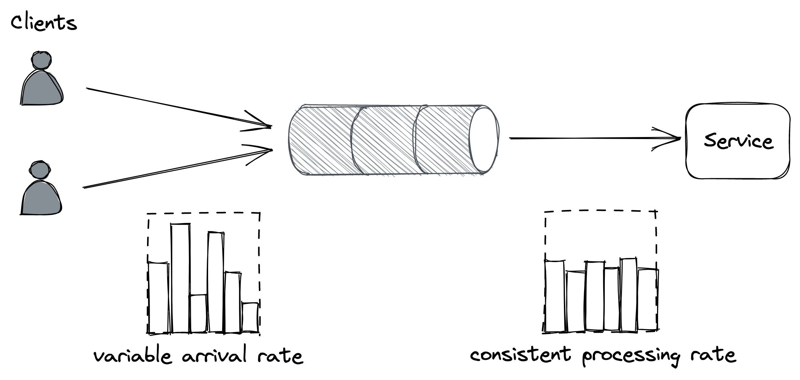
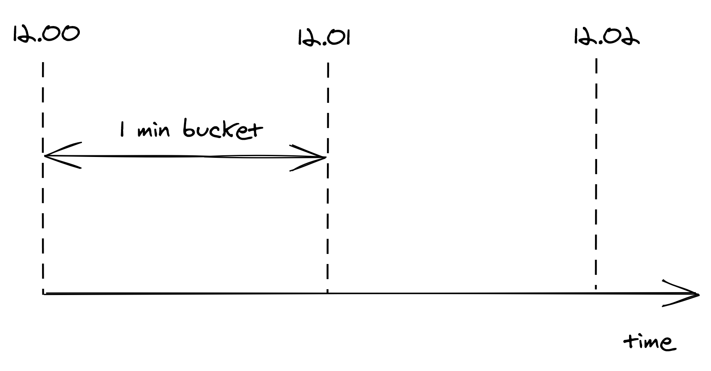
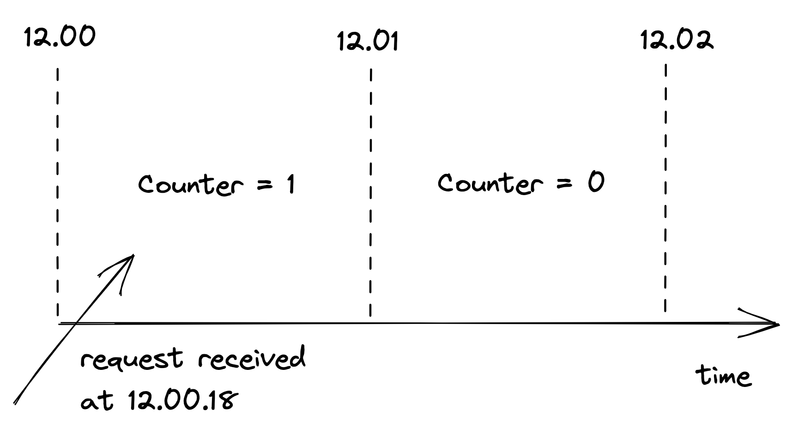
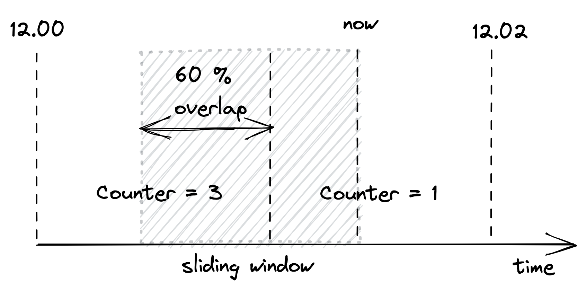
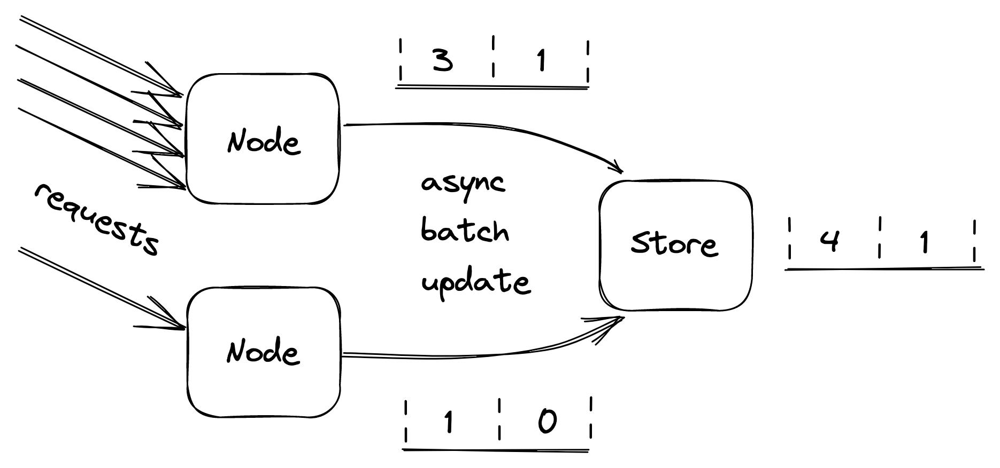

# 上游弹性

上一章讨论了保护服务免受下游故障影响的模式，例如无法达到外部依赖性。在本章中，我们将换档并讨论防止上游压力的机制。 [^1]

## 28.1 卸载

服务器几乎无法控制它在任何给定时间接收到多少请求。操作系统的每个端口都有一个容量有限的连接队列，当达到该容量时，会立即拒绝新的连接尝试。但通常情况下，在极端负载下，服务器会在达到该限制之前停止爬行，因为它会耗尽内存、线程、套接字或文件等资源。这会导致响应时间增加，直到最终服务器对外界不可用。

当服务器满负荷运行时，它应该拒绝多余的请求[^2]，以便它可以将其资源专用于它已经处理的请求。例如，服务器可以使用计数器来测量正在处理的并发请求的数量，当新请求进入时该数量会增加，而当响应被发送时该数量会减少。然后服务器可以通过将计数器与接近服务器容量的阈值进行比较来推断它是否过载。

当服务器检测到它过载时，它可以通过快速失败并返回状态代码 503（服务不可用）的响应来拒绝传入的请求。这种技术也称为负载卸载。服务器不一定必须拒绝任意请求；例如，如果不同的请求有不同的优先级，服务器可以只拒绝低优先级的请求。或者，服务器可以首先拒绝最早的请求，因为这些请求将最先超时并重试，因此处理它们可能会浪费时间。

不幸的是，拒绝请求并不能完全避免服务器处理它的成本。根据拒绝的实现方式，服务器可能仍然需要付出代价来打开 TLS 连接并读取请求以拒绝它。因此，减载的作用有限，如果负载持续增加，拒绝请求的成本最终将接管并降低服务器性能。

## 28.2 负载均衡

有一种替代负载卸载的方法，当客户不希望得到及时响应时可以利用它。这个想法是在客户端和服务之间引入一个消息通道。通道将指向服务的负载与其容量分离，使其能够按照自己的节奏处理请求。

这种模式被称为负载均衡，它非常适合抵御短暂的尖峰，通道可以消除这种尖峰（见图 28.1）。但是，如果服务最终没有跟上，就会积累大量积压，这会带来自己的问题，如第 23 章所述。

图 28.1：通道平滑了消费服务的负载。

减载和负载均衡并不直接解决负载增加的问题，而是保护服务免于过载。为了处理更多负载，需要扩展服务。这就是为什么这些保护机制通常与自动缩放[^3]结合使用的原因，它会检测到服务正在热运行并自动增加其规模以处理额外的负载。

## 28.3 速率限制

速率限制或节流是一种在超过特定配额时拒绝请求的机制。一个服务可以有多个配额，例如，一个时间间隔内接收到的请求数或字节数。配额通常应用于特定用户、API 密钥或 IP 地址。

例如，如果配额为每个 API 密钥每秒 10 个请求的服务平均每秒接收来自特定 API 密钥的 12 个请求，则它平均每秒会拒绝来自该 API 密钥的 2 个请求。

当服务对请求进行速率限制时，它需要返回带有特定错误代码的响应，以便发送方知道它失败是因为配额已用完。对于使用 HTTP API 的服务，最常见的方法是返回状态代码为 429（请求过多）的响应。响应应包括有关哪些配额已用完以及用了多少的其他详细信息；它还可以包含一个 Retry-After 标头，指示在发出新请求之前等待多长时间：

如果客户端应用程序遵守规则，它将在一段时间内停止攻击该服务，从而保护该服务不被非恶意用户错误地垄断。此外，这可以防止客户端中的错误导致客户端出于某种原因反复访问下游服务。

速率限制也用于执行定价等级；如果用户想要使用更多的资源，他们也应该愿意支付更多的费用。这就是你可以将服务成本分摊给用户的方式：让他们按比例支付他们的使用费用，并强制执行带配额的定价层级。

你可能会认为速率限制还可以提供针对 DDoS 攻击的强大保护，但它只能部分保护服务免受 DDoS 攻击。没有什么可以禁止受限的客户在收到 429 后继续提供服务。限速请求也不是免费的——例如，要通过 API 密钥限速请求，服务必须支付打开 TLS 连接的代价，并且至少，下载请求的一部分以读取钥匙。虽然速率限制不能完全防止 DDoS 攻击，但它确实有助于减少它们的影响。

规模经济是抵御 DDoS 攻击的唯一真正保护措施。如果你在一个大型网关服务后面运行多个服务，那么无论它后面的哪个服务受到攻击，网关服务都可以通过拒绝上游流量来抵御攻击。这种方法的美妙之处在于，运行网关的成本被分摊到使用它的所有服务上。

尽管限速与减载有一些相似之处，但它们是不同的概念。 Load shedding 根据进程的本地状态拒绝流量，比如它同时处理的请求数；速率限制改为根据系统的全局状态来减少流量，例如跨所有服务实例为特定 API 密钥同时处理的请求总数。并且由于涉及到全球状态，因此需要某种形式的协调。

### 28.3.1 单进程实现

速率限制的分布式实现本身就很有趣，值得花一些时间来讨论它。我们将首先从单进程实现开始，然后将其扩展到分布式实现。

假设我们想要为每个 API 密钥强制执行每分钟 2 个请求的配额。一种天真的方法是为每个 API 密钥使用一个双向链表，其中每个列表存储最后收到的 N 个请求的时间戳。每当有新请求进入时，都会将一个条目及其相应的时间戳附加到列表中。然后，周期性地从列表中清除超过一分钟的条目。

通过跟踪列表的长度，进程可以通过将其与配额进行比较来限制传入请求的速率。这种方法的问题在于它需要每个 API 密钥的列表，随着接收到的请求数量的增加，这在内存方面很快就会变得昂贵。

为了减少内存消耗，我们需要想出一种方法来减少存储需求。一种方法是将时间分成固定持续时间的桶，例如 1 分钟，并跟踪在每个桶中看到了多少请求（参见图 28.2）。

图 28.2：桶将时间划分为 1 分钟的间隔，跟踪看到的请求数。

桶包含一个数字计数器。当一个新的请求进来时，它的时间戳用于确定它所属的桶。例如，如果请求在 12.00.18 到达，则"12.00”分钟的存储桶计数器将递增 1（参见图 28.3）。

图 28.3：当一个新请求进来时，它的时间戳用于确定它属于哪个桶。

通过分桶，我们可以以不随请求数量增长的方式压缩有关请求数量的信息。现在我们有了内存友好的表示，我们如何使用它来实现速率限制？这个想法是使用一个实时在桶中移动的滑动窗口，跟踪其中的请求数量。

滑动窗口表示用于决定是否限速的时间间隔。窗口的长度取决于用于定义配额的时间单位，在我们的例子中是 1 分钟。但有一个警告：滑动窗口可以与多个桶重叠。为了得出滑动窗口下的请求数，我们必须计算桶计数器的加权和，其中每个桶的权重与其与滑动窗口的重叠成正比（见图 28.4）。

图 28.4：桶的重量与其与滑动窗口的重叠成正比。

尽管这是一个近似值，但对于我们的目的而言，这是一个相当不错的近似值。并且可以通过增加桶的粒度来使其更准确。因此，例如，我们可以使用 30 秒的桶而不是 1 分钟的桶来减少近似误差。

我们只需要存储滑动窗口在任何给定时间可以重叠的桶数。例如，对于 1 分钟的窗口和 1 分钟的桶长度，滑动窗口最多可以与 2 个桶重叠。因此，存储第三旧的桶、第四旧的桶等是没有意义的。

总而言之，这种方法需要每个 API 密钥有两个计数器，这在内存方面比存储每个 API 密钥的请求列表的简单实现要高效得多。

### 28.3.2 分布式实现

当多个进程接受请求时，本地状态不再足够好，因为需要对所有服务实例中每个 API 密钥的请求总数强制执行配额。这需要一个共享数据存储来跟踪看到的请求数量。

如前所述，我们需要为每个 API 密钥存储两个整数，每个存储桶一个。当一个新的请求进来时，接收它的进程可以获取当前的桶，更新它并将它写回数据存储。但这行不通，因为两个进程可以同时更新同一个存储桶，这会导致更新丢失。获取、更新和写入操作需要打包到单个事务中以避免任何竞争条件。

虽然这种方法在功能上是正确的，但成本很高。这里有两个问题：事务很慢，并且每个请求执行一个事务会非常昂贵，因为数据存储必须随请求数量线性扩展。此外，由于数据存储是硬依赖，如果无法访问，服务将变得不可用。

让我们来解决这些问题。我们可以使用大多数数据存储提供的单个原子获取和递增操作，而不是使用事务。或者，同样可以通过比较和交换来模拟。这些原子操作比事务有更好的性能。

现在，不是在每个请求上更新数据存储，进程可以在内存中批量更新存储桶一段时间，并在结束时将它们异步刷新到数据存储（参见图 28.5）。这降低了共享状态的准确性，但这是一个很好的权衡，因为它减少了数据存储的负载和发送给它的请求数量。

图 28.5：服务器在一段时间内在内存中批量更新数据桶，并在结束时将它们异步刷新到数据存储中。

如果数据存储关闭会发生什么？ 请记住 CAP 定理的本质：当出现网络故障时，我们要么牺牲一致性并保持系统正常运行，要么保持一致性并停止为请求提供服务。 在我们的例子中，仅仅因为用于速率限制的数据存储不可访问而暂时拒绝请求可能会损害业务。 相反，根据从商店读取的最后状态继续服务请求更安全。 [^4]

## 28.4 持续工作

当过载、配置更改或故障迫使应用程序的行为与平时不同时，我们称该应用程序具有多模态行为。其中一些模式可能会触发罕见的错误，与假设快乐路径的机制发生冲突，并且更普遍地使操作员的生活更加艰难，因为他们对应用程序行为方式的心理模型不再有效。因此，作为一般的经验法则，我们应该努力减少模式的数量。

例如，简单的键值存储在数据平面中比关系数据库更受青睐，因为它们往往具有可预测的性能[^5]。由于隐藏的优化，关系数据库具有许多操作模式，这可以改变特定查询从一种执行到另一种执行的方式。相反，哑键值存储对于给定查询的行为是可预测的，这保证不会有任何意外。

系统改变行为的一个常见原因是过载，这会导致系统变慢并在最坏的时候降级。理想情况下，最坏情况和平均情况下的行为应该没有区别。实现这一目标的一种方法是利用恒定工作模式，使单位时间的工作量保持恒定。

这个想法是让系统在高负载下执行与平均负载下相同的工作量[^6]。而且，如果在压力下有任何变化，那应该是因为系统表现更好，而不是更差。这样的系统也被认为是反脆弱的。这是与弹性不同的属性；弹性系统在极端负载下保持运行，而抗脆弱系统表现更好。

在第 22 章讨论配置更改从控制平面到数据平面的传播时，我们已经看到了持续工作模式的一个应用。例如，假设我们有一个配置存储（控制平面），它存储了一组设置每个用户，例如 API 网关（数据平面）用于限制请求速率的配额。当特定用户的设置发生变化时，控制平面需要将其广播到数据平面。但是，由于每个更改都是一个单独的独立工作单元，因此数据平面需要执行与更改数量成比例的工作。

如果你看不出这可能是个问题，请想象同时为大多数用户更新大量设置（例如，由于业务决策而更改配额）。这可能会导致意外大量的单独更新消息被发送到每个数据平面实例，而这些实例可能难以处理它们。

此问题的解决方法简单但功能强大。控制平面可以定期将所有用户的设置转储到可扩展且高度可用的文件存储（如 Azure 存储或 AWS S3）中的文件中。转储包括所有用户的配置设置，甚至是没有更改的用户。然后，数据平面实例可以定期批量读取转储并刷新其系统配置的本地视图。因此，无论有多少设置更改，控制平面都会定期将文件写入数据存储，而数据平面会定期读取它。

我们可以将这种模式发挥到极致，并为最大数量的受支持用户预分配空配置槽。这保证了随着用户数量的增长，传播更改所需的工作保持稳定。此外，这样做允许对系统进行压力测试并了解其行为，因为知道它在所有情况下都会表现相同。虽然这限制了用户数量，但无论是否使用持续工作模式，都存在限制。这种方法通常用于蜂窝体系结构（参见 26.2），其中单个单元具有明确定义的最大大小，并且系统通过创建新单元进行扩展。

使用持续工作模式的好处在于，无论有多少配置设置发生变化，数据平面都会定期批量执行相同数量的工作。这使得更新设置可靠且可预测。此外，与只发送更改内容的复杂机制相比，定期写入和读取大文件更容易正确实现。

这种方法的另一个优点是，由于其自我修复特性，它可以抵抗各种故障。如果配置转储因任何原因损坏，不会造成任何损害，因为下一次更新会修复它。如果错误的更新被错误地推送给所有用户，恢复它就像创建一个新的转储并等待它结束一样简单。相比之下，发送单独更新的解决方案更难正确实施，因为数据平面需要复杂的逻辑来处理和修复损坏的更新。

总而言之，持续不断的工作比只做必要的工作更昂贵。尽管如此，考虑到它能够提高可靠性并降低复杂性，它通常还是值得考虑的。

-----------------------

[^1]: 当我们在第 18 章讨论负载均衡器的健康检查时，我们已经遇到了一种机制来防止上游压力。
[^2]: "使用减载来避免过载": https://aws.amazon.com/builders-library/using-load-shedding-to-avoid-overload
[^3]: "自动缩放": https://en.wikipedia.org/wiki/Autoscaling
[^4]: 这是第 22 章首次介绍的静态稳定性概念的另一个应用。
[^5]: "关于 SQL 数据库的一些自以为是的想法”: https://blog.nelhage.com/post/some-opinionated-sql-takes/
[^6]: "可靠性、持续工作和一杯好咖啡": https://aws.amazon.com/builders-library/reliability-and-constant-work/