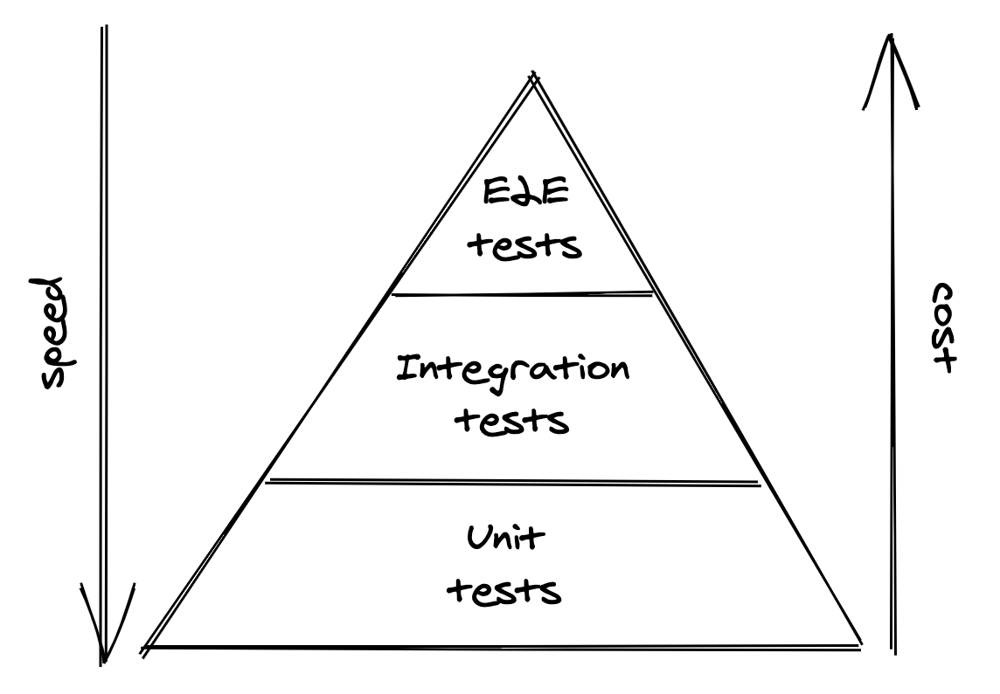
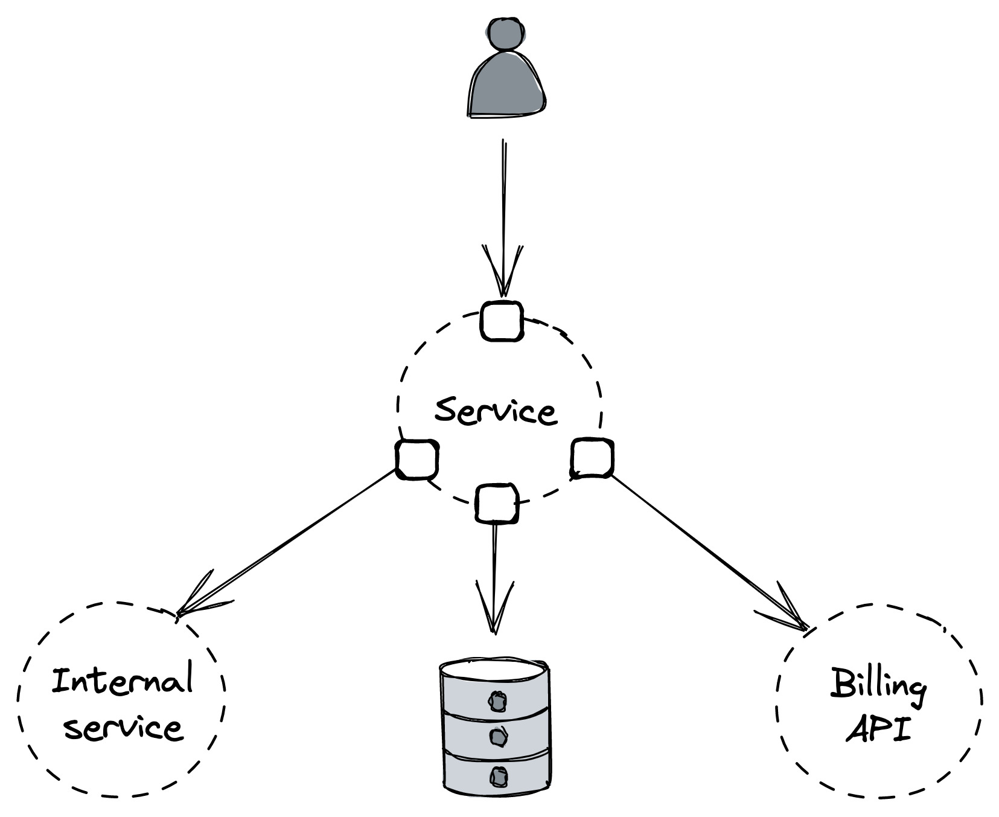
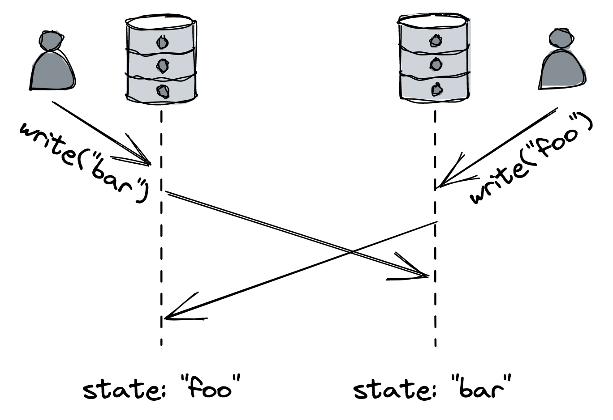

# 测试

检测错误所需的时间越长，修复它的成本就越高。软件测试可以验证应用程序的某些部分是否按预期工作，并在过程的早期发现错误。但是，只有当开发人员希望在不破坏预期行为的情况下对现有实现进行更改（例如，错误修复、重构和新功能）时，测试才能带来真正的好处。测试还充当始终最新的文档并提高公共接口的质量，因为开发人员必须设身处地为用户着想才能有效地测试它们。

不幸的是，测试并不是灵丹妙药，因为不可能预测复杂的分布式应用程序可能进入的所有状态。它仅提供最大努力保证被测试的代码是正确的和容错的。无论测试覆盖率多么详尽，测试都只能覆盖开发人员可以想象的故障，而不是生产中表现出来的那种复杂的紧急行为[^1]。

尽管测试不能保证代码没有错误，但它们确实可以很好地验证预期的行为。因此，根据经验，如果你想确信你的实现以某种方式运行，则必须为其添加测试。

## 29.1 范围

测试有不同的形状和大小。首先，我们需要区分测试实际测试的代码路径（也称为被测系统或 SUT）和正在运行的代码路径。 SUT 表示测试的范围。它确定测试是被归类为单元测试、集成测试还是端到端测试。

单元测试验证一小部分代码库的行为，例如单个类[^2]。一个好的单元测试在时间上应该是相对静态的，并且只有在 SUT 的行为发生变化时才会发生变化——重构、错误修复或新功能不应该破坏它。为此，单元测试应该：

- 仅使用 SUT 的公共接口；
- 测试 SUT 中的状态变化（不是预先确定的动作序列）；
- 测试行为，即 SUT 在特定状态下如何处理给定输入。

集成测试的范围比单元测试大，因为它验证服务是否可以按预期与外部依赖项交互。令人困惑的是，集成测试对不同的人有不同的含义。 Martin Fowler[^3] 区分了狭义集成测试和广义集成测试。窄集成测试仅测试与特定外部依赖项（如适配器及其支持类）通信的服务的代码路径。相比之下，广泛的集成测试会跨多个实时服务练习代码路径。在本章的其余部分，我们将把这些更广泛的集成测试称为端到端测试。

端到端测试验证跨越系统中多个服务的行为，例如面向用户的场景。这些测试通常在共享环境中运行，例如暂存或生产环境，因此不应影响共享同一环境的其他测试或用户。由于它们的范围，它们很慢并且更容易出现间歇性故障。

端到端测试的维护也可能很痛苦且昂贵。例如，当端到端测试失败时，通常不清楚是哪个服务导致了失败，需要进行更深入的调查。但是这些测试对于确保面向用户的场景在整个应用程序中按预期工作是必不可少的。他们可以发现小范围测试无法发现的问题，例如意外的副作用和突发行为。

最小化端到端测试数量的一种方法是将它们构建为用户旅程测试。用户旅程测试模拟用户与系统的多步交互（例如，对于电子商务服务：创建订单、修改订单，最后取消订单）。与将单独的旅程部分拆分为单独的端到端测试相比，这样的测试通常需要更少的时间来运行。

随着测试范围的扩大，它变得更加脆弱、缓慢和昂贵。间歇性失败的测试几乎和根本没有测试一样糟糕，因为开发人员不再信任他们并最终忽略他们的失败。如果可能，最好进行较小范围的测试，因为它们往往更可靠、更快且成本更低。一个好的权衡是进行大量的单元测试，进行少量的集成测试，甚至更少的端到端测试（见图 29.1）。

图 29.1：测试金字塔

## 29.2 大小

Test[^4]的大小反映了它需要运行多少计算资源，比如节点的数量。通常，这取决于测试运行环境的真实程度。尽管测试的范围和大小往往是相关的，但它们是不同的概念，这有助于将它们分开。

小型测试在单个进程中运行，不执行任何阻塞调用或 I/O。因此，它速度非常快，具有确定性，而且间歇性失败的可能性非常小。

中间测试在单个节点上运行并执行本地 I/O，例如从磁盘读取或对本地主机的网络调用。这为延迟和不确定性引入了更多空间，增加了间歇性故障的可能性。

大型测试需要运行多个节点，从而引入更多的不确定性和更长的延迟。

不出所料，测试越大，运行所需的时间就越长，也就越不稳定。这就是为什么我们应该为给定的行为编写尽可能小的测试。我们可以使用测试替身代替真实的依赖项，例如假的、存根或模拟，以减少测试的大小，使其更快并且更不容易出现间歇性故障：

- 伪造是接口的轻量级实现，其行为类似于真实接口。例如，数据库的内存版本是假的。
- 存根是一个函数，无论传递给它的参数是什么，它总是返回相同的值。
- 最后，mock 对它应该如何被调用有期望，它被用来测试对象之间的交互。

测试替身的问题在于它们与真实实现的行为方式及其所有细微差别都不相似。相似性越弱，我们对使用 double 的测试实际上有用的信心就越小。因此，当真正的实现是快速的、确定的并且几乎没有依赖时，我们应该使用它而不是 double。当无法使用真实实现时，我们可以使用由依赖项的相同开发人员维护的假实现（如果可用）。 Stubbing 或 mocking 是不得已的选择，因为它们与实际实现最不相似，这使得使用它们的测试变得脆弱。

对于集成测试，一个好的折衷方案是将模拟与契约测试结合起来[^5]。合同测试定义了对具有相应预期响应的外部依赖项的请求。然后测试使用这个契约来模拟依赖。例如，REST API 的合同由 HTTP 请求和响应组成。为确保合约有效且在未来不被破坏，外部依赖的测试套件使用相同的合约定义来模拟客户端请求并确保返回预期的响应。

## 29.3 实际考虑

与其他一切一样，测试需要做出权衡。假设我们想要端到端测试服务公开的特定 API 端点的行为。该服务与：

- 数据存储
- 另一个团队拥有的内部服务
- 以及用于计费的第三方 API（见图 29.2）

如前所述，我们应该尝试为所需范围编写尽可能小的测试，同时尽量减少与实际实现行为方式不同的测试替身的使用。

图 29.2：我们应该如何测试服务？

假设被测特定端点不与内部服务通信，因此我们可以安全地使用模拟代替它。如果数据存储带有内存中实现（假的），我们可以在测试中使用它来避免发出网络调用。最后，我们不能轻易调用第三方计费 API，因为这需要发出真实交易。然而，假设假货不可用，计费服务可能仍会提供发出假交易的测试端点。

这是一个更细微的示例，其中进行较小的测试风险更大。假设我们需要测试在整个应用程序堆栈中清除属于特定用户的数据是否按预期工作。在欧洲，此功能由法律 (GDPR) 强制执行，不遵守该功能可能会被处以最高 2000 万欧元或年营业额 4% 的罚款，以较高者为准。在这种情况下，由于功能无声中断的风险很高，我们希望尽可能确信它按预期工作。这保证了使用在生产中定期运行的端到端测试，并使用实时服务而不是测试替身。

## 29.4 形式验证

软件测试并不是及早发现错误的唯一方法。花时间编写系统行为的高级描述，即规范，可以在编写一行代码之前检测到细微的错误和体系结构缺陷。

规范的范围可以从非正式的单页纸到计算机可以检查的正式数学描述。由于很难指定我们不完全理解的内容，因此规范可以帮助我们推断我们正在设计的系统的行为。它还充当其他人的文档和实际实施的指南。除了到目前为止提到的好处之外，通过用正式语言编写规范，我们还获得了通过算法验证规范是否有缺陷的能力（模型检查）。

编写规范并不意味着详细描述系统的每个角落。该规范的目标是在修复成本仍然很低的时候发现错误。因此，我们只想指定那些最有可能包含错误且难以通过其他方式（如传统测试）检测到的部分。一旦我们决定要指定什么，我们还需要选择抽象级别，即要省略哪些细节。

TLA+[^6] 是一种众所周知且广泛使用的形式化规范语言[^7]。 Amazon 或 Microsoft 之类的公司使用它来描述他们的一些最复杂的分布式系统，例如 S3 或 Cosmos DB[^8]。

在 TLA+ 中，系统的行为由一系列状态表示，其中状态是对全局变量的赋值。因此，系统的规范是所有可能行为的集合。

编写规范的目标之一是验证它是否满足我们希望系统具有的属性，例如安全性和活性。安全属性断言对于行为的所有状态都为真（不变）。相反，活性属性断言某些事情最终会发生。 TLA+ 允许描述和验证规范的所有可能状态和行为应满足的属性。这是非常强大的，因为大规模运行的系统最终会遇到所有可能的状态和行为，而人类不擅长想象同时发生几个罕见事件的行为。

例如，假设我们有一个使用键值存储 X 的服务，我们希望将其迁移到使用成本更低且已证明在基准测试中表现更好的键值存储 Y。在高层次上，我们可以在不停机的情况下实施此迁移的一种方法如下：

1. 该服务写入数据存储 X 和 Y（双写入），同时从 X 独占读取。
2. 一次性批处理过程使用在服务开始写入 Y 之前创建的来自 X 的数据回填 Y。
3. 应用程序切换为以独占方式读写 Y。

这种方法可能看起来很合理，但它能保证数据存储最终以相同的状态结束吗？

如果我们用 TLA+ 对此进行建模，模型检查器将能够识别出几个问题，例如当服务实例在写入 A 之后但在写入 B 之前崩溃时导致系统处于不一致状态的活性违规。自动模型检查是它返回一个错误跟踪，其中包含在失败时违反属性的行为（即状态序列）。

尽管建模写入为原子（即，要么两次写入都成功，要么都失败）修复了活性问题，但该模型还不正确。例如，如果两个服务实例同时写入 A 和 B，这两个数据存储可能会以不同的状态结束，因为写入的顺序可能不同，如图 29.3 所示。

图 29.3：数据存储可以看到不同顺序的写入。

如果你还记得 13.1 节中关于事务的讨论，你就会知道我们可以通过在服务和数据存储之间引入一个消息通道来解决这个问题，该通道可以序列化所有写入并保证单一的全局顺序。不管实际的解决方案是什么，关键是正式的模型使我们能够测试难以通过其他方式验证的架构决策。

----------------------

[^1]: Cindy Sridharan 写了一篇关于该主题的精彩博客文章系列，请参阅"测试微服务，理智的方式"，https://copyconstruct.medium.com/testing-microservices-the-sane-way-9bb31d158c16
[^2]: 我心目中的单元测试是社交型的；请参阅"关于测试的多样化和奇妙的形状"，https://martinfowler.com/articles/2021-test-shapes.html
[^3]: "集成测试"，https://martinfowler.com/bliki/IntegrationTest.html
[^4]: "谷歌的软件工程：随着时间的推移从编程中吸取的教训，"https://www.amazon.com/dp/B0859PF5HB
[^5]: "ContractTest"，https://martinfowler.com/bliki/ContractTest.html
[^6]: "TLA+ 主页"，https://lamport.azurewebsites.net/tla/tla.html
[^7]: TLA 代表动作的时间逻辑。
[^8]: "TLA+ 的工业用途"，https://lamport.azurewebsites.net/tla/industrial-use.html