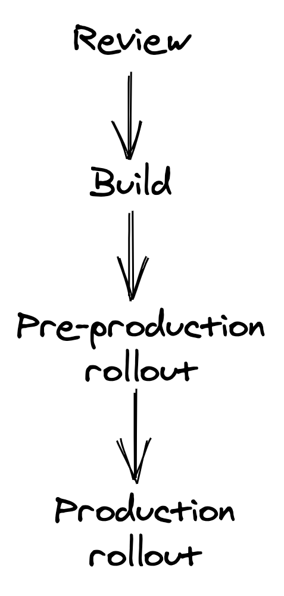

# 持续交付和部署

一旦更改及其新引入的测试已合并到存储库中，就需要将其发布到生产环境中。当发布更改需要手动过程时，它不会经常发生。这意味着可能需要数天甚至数周的数个更改最终会被分批一起发布，从而增加了发布失败的可能性。当发布失败时，更难查明重大变更[^1]，从而减慢团队的速度。此外，发起发布的开发人员需要通过监控仪表板和警报来密切关注它，以确保它按预期工作或回滚。

手动部署是对工程时间的糟糕利用。当有许多服务时，问题会进一步恶化。最终，安全有效地发布变更的唯一方法是自动化整个过程。一旦更改被合并到存储库中，它应该自动安全地推出到生产环境中。然后开发人员可以自由地切换到他们的下一个任务，而不是引导部署。整个发布过程，包括回滚，可以通过持续交付和部署 (CD) 管道实现自动化。

因为发布更改是失败的主要来源之一，CD 需要在保障、监控和自动化方面进行大量投资。如果检测到回归，正在发布的工件——即包含更改的可部署组件——要么回滚到以前的版本，要么转发到下一个版本，假设它包含一个修补程序。

在推出的安全性和将变更发布到生产环境所需的时间之间存在平衡。一个好的 CD 流水线应该努力在两者之间做出很好的权衡。在本章中，我们将探索如何。

## 30.1 查看和构建

在高层次上，代码更改需要经过四个阶段的流水线才能发布到生产环境：审核、构建、预生产部署和生产部署。

图 30.1：持续交付和部署流水线阶段

这一切都始于开发人员提交给存储库以供审查的拉取请求 (PR)。当提交 PR 进行审查时，需要对其进行编译、静态分析并通过一系列测试进行验证，所有这些都不会超过几分钟。为了提高测试速度并最大程度地减少间歇性故障，在此阶段运行的测试应该足够小以在单个进程或节点上运行，而较大的测试将在管道中稍后运行。

PR 需要经过团队成员的审查和批准，然后才能合并到存储库中。审阅者必须验证更改是否正确且安全，以便通过 CD 管道自动发布到生产环境。清单可以帮助审稿人不要忘记任何重要的事情，例如：

- 更改是否包括所需的单元、集成和端到端测试？
- 更改是否包括指标、日志和跟踪？
- 此更改是否会通过引入向后不兼容的更改或达到某些服务限制来破坏生产？
- 如果需要，是否可以安全地回滚更改？

代码更改不应该是唯一经过此审查过程的更改。例如，静态资产、端到端测试和配置文件都应该在存储库中进行版本控制（不一定是同一个存储库），并像代码一样对待。然后，同一个服务可以有多个 CD 管道，一个用于每个存储库，可能并行运行。

使用 CD 管道审查和发布配置更改的重要性怎么强调都不为过。正如第 24 章所讨论的，生产失败的最常见原因之一是在没有任何事先审查或测试的情况下全局应用配置更改。

此外，在云中运行的应用程序应使用 Terraform[^3] 等工具通过代码（又名基础设施即代码 (IaC)[^2]）声明其基础设施依赖项，如虚拟机、数据存储和负载平衡器。这使得基础设施的供应能够自动化，并且基础设施的变化就像任何其他软件变化一样被对待。

一旦更改已合并到其存储库的主分支中，CD 管道就会进入构建阶段，在该阶段构建存储库的内容并将其打包到可部署的发布工件中。

## 30.2 前期制作

在此阶段，工件被部署并发布到合成预生产环境。尽管这种环境缺乏生产的真实性，但它有助于验证没有触发硬故障（例如，由于缺少配置设置而导致启动时出现空指针异常）并且端到端测试成功。由于将新版本发布到预生产所需的时间明显少于将其发布到生产的时间，因此可以更早地检测到错误。

可以有多个预生产环境，从为每个工件从头创建并用于运行简单的冒烟测试的环境开始，到类似于生产的持久环境，从中接收一小部分镜像请求。例如，AWS 以使用多个预生产环境而闻名[^4]。

理想情况下，CD 管道应该使用生产中使用的相同健康信号来评估预生产中工件的健康状况。预生产中使用的指标、警报和测试应与生产中使用的相同，以避免前者成为健康保险低于标准的二等公民。

## 30.3 生产

一旦工件成功推出预生产，CD 管道就可以进入最后阶段并将工件发布到生产中。它应该首先将其发布到少量生产实例5。目标是在问题有机会在生产中造成广泛损害之前尽快发现尚未检测到的问题。

如果一切顺利并且所有健康检查都通过，则工件将逐步发布给舰队的其余部分。在推出过程中，由于正在进行的部署，一部分机队无法为任何流量提供服务，因此其余实例需要填补空缺。为了不导致任何性能下降，需要有足够的容量来维持增量发布。

如果该服务在多个区域可用，则 CD 管道应首先从低流量区域开始，以减少错误发布的影响。然后，释放剩余区域应分为顺序阶段，以进一步降低风险。自然地，阶段越多，CD 管道将工件发布到生产环境所需的时间就越长。缓解此问题的一种方法是在早期阶段成功完成并建立足够的信心后提高发布速度。例如，第一阶段可以将工件释放到单个区域，第二阶段可以释放到更大的区域，第三阶段可以同时释放到 N 个区域。

## 30.4 回滚

在每个步骤之后，CD 管道需要评估部署的工件是否健康，如果不健康，则停止发布并将其回滚。可以使用各种健康信号来做出该决定，例如端到端测试的结果、延迟、错误和警报等健康指标。

仅监控正在推出的服务的健康信号是不够的。 CD 管道还应监控上游和下游服务的健康状况，以检测推出的任何间接影响。管道应允许在一个步骤和下一个步骤之间有足够的时间（烘烤时间）以确保它成功，因为有些问题只会在一段时间后出现。例如，性能下降可能仅在高峰时间可见。为了加快发布速度，可以在每一步成功并建立信心后减少烘烤时间。 CD 管道还可以根据针对特定 API 端点看到的请求数量来控制烘焙时间，以确保 API 表面已得到正确执行。

当健康信号报告降级时，CD 管道停止。届时，它可以自动回滚工件或触发警报以联系值班工程师，他们需要决定是否需要回滚[^6]。根据工程师的输入，CD 管道重试失败的阶段（例如，可能是因为当时有其他东西正在投入生产）或完全回滚发布。

操作员还可以停止管道并等待带有修补程序的新工件前滚。如果由于向后不兼容的更改而无法回滚版本，则这可能是必要的。由于前滚比回滚风险更大，根据经验，引入的任何更改都应始终向后兼容。向后不兼容的最常见原因之一是更改用于持久性或 IPC 目的的序列化格式。

为了安全地引入向后不兼容的更改，需要将其分解为多个向后兼容的更改[^7]。例如，假设生产者和消费者服务之间的消息传递模式需要以向后不兼容的方式进行更改。在这种情况下，更改被分解为三个较小的更改，可以单独安全地回滚：

- 在准备更改中，消费者被修改为支持新旧消息传递格式。
- 在激活更改中，生产者被修改为以新格式写入消息。
- 最后，在清理更改中，消费者完全停止支持旧的消息传递格式。只有当有足够的信心相信激活的更改不需要回滚时，才会发布此更改。

预生产中 CD 管道的自动升级-降级测试部分可用于验证更改是否真的可以安全回滚。

-------------------------

[^1]: 实际上，可能会有多个重大变化。
[^2]: “什么是基础设施即代码？": https://docs.microsoft.com/en-us/devops/deliver/what-is-infrastructure-as-code
[^3]: “Terraform：一种开源基础架构即代码软件工具": https://www.terraform.io/
[^4]: “自动化安全、无需干预的部署": https://aws.amazon.com/builders-library/automating-safe-hands-off-deployments/
[^5]: 这也称为金丝雀测试。
[^6]: CD 管道可以配置为仅在工作时间运行，以最大限度地减少对值班工程师的干扰。
[^7]: “确保部署期间的回滚安全": https://aws.amazon.com/builders-library/ensuring-rollback-safety-during-deployments/
