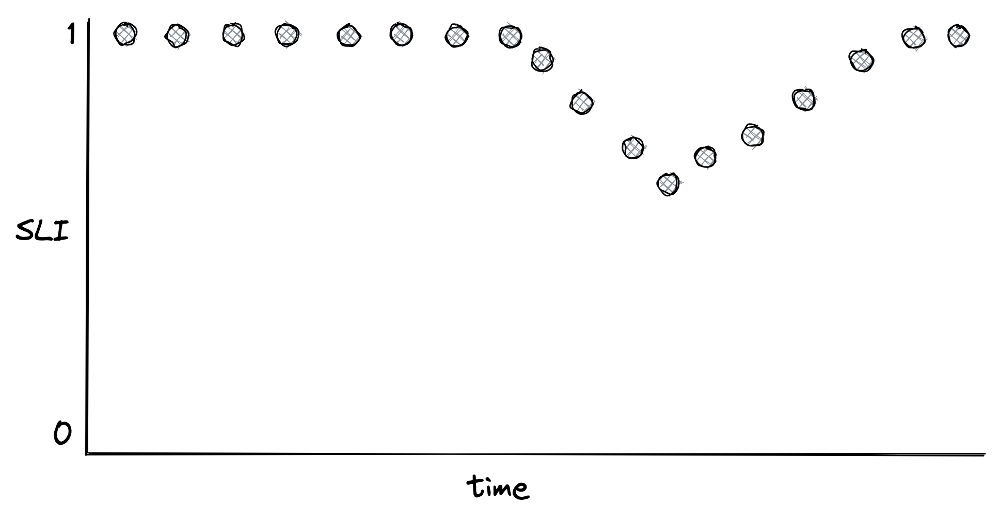
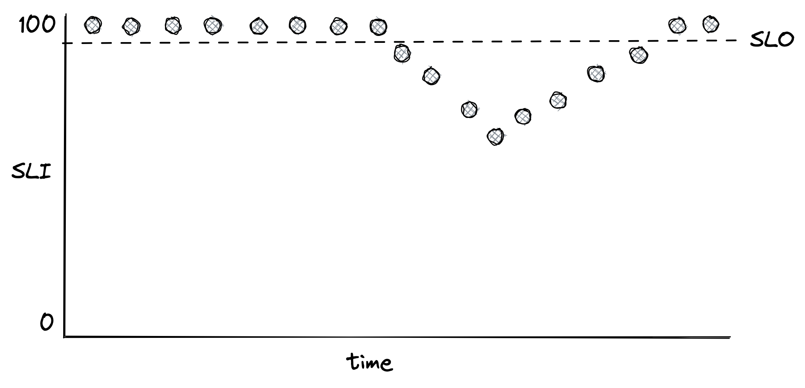
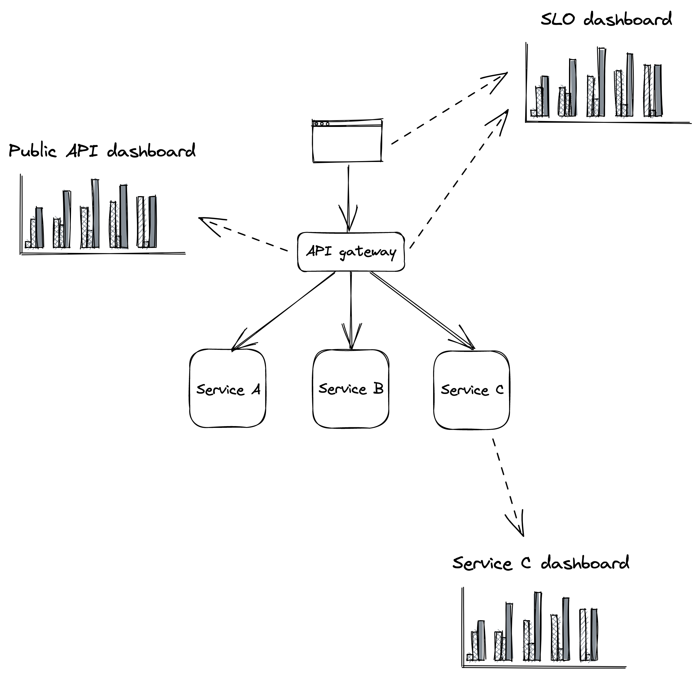

# 监控

监控主要用于检测影响生产中用户的故障，并向负责系统的操作员触发通知（或警报）。另一个重要的监控用例是通过仪表板提供系统健康状况的高级概览。

在早期，监控主要用于报告服务是否启动，对内部发生的事情没有太多可见性（黑盒监控）。随着时间的推移，开发人员也开始检测他们的应用程序以报告特定功能是否按预期工作（白盒监控）。这随着 Etsy 引入 statsd[^1] 而流行起来，它标准化了应用程序级测量的收集。虽然黑盒监控对于检测故障症状很有用，但白盒监控可以帮助识别根本原因。

黑盒监控的主要用例是监控外部依赖项，例如第三方 API，并验证用户如何从外部感知服务的性能和健康状况。一种常见的黑盒方法是定期运行脚本 (synthetics[^2])，向外部 API 端点发送测试请求，并监控它们花费了多长时间以及它们是否成功。合成部署在应用程序用户所在的相同区域，并访问相同的端点。因为它们从外部运行系统的公共表面，所以它们可以捕获从应用程序内部看不到的问题，例如连接问题。合成对于检测用户不经常使用的 API 问题也很有用。

例如，如果某项服务的 DNS 服务器出现故障，合成人会发现该问题，因为他们无法解析其 IP 地址。然而，服务本身会认为一切都很好，只是收到的请求比平时少。

## 31.1 指标

指标是资源使用（例如，CPU 利用率）或行为（例如，失败的请求数）的原始测量（样本）的时间序列，其中每个样本由浮点数和时间戳表示。

通常，一个指标也可以用一组键值对（标签）来标记。例如，标签可以表示服务运行的区域、数据中心、集群或节点。标签使对数据进行切片和切块变得容易，并消除了为每个标签组合手动创建度量的仪器成本。然而，由于每个不同的标签组合都是不同的度量，标记会生成大量度量，使它们难以存储和处理。

至少，服务应该发出有关其负载（例如，请求吞吐量）、内部状态（例如，内存缓存大小）及其依赖项的可用性和性能（例如，数据存储响应时间）的指标。结合下游服务发出的指标，这使运营商能够快速识别问题。但这需要明确的代码更改和开发人员刻意的努力来检测他们的代码。

例如，假设一个返回资源的虚构 HTTP 处理程序。一旦它在生产[^3]中运行，我们将希望能够回答一系列问题：

```python
def get_resource(id):
    resource = self._cache.get(id)  # in-process cache
    # Is the id valid?
    # Was there a cache hit?
    # How long has the resource been in the cache?

    if resource is not None:
        return resource

    resource = self._repository.get(id)
    # Did the remote call fail, and if so, why?
    # Did the remote call time out?
    # How long did the call take?

    self._cache[id] = resource
    # What's the size of the cache?

    return resource
    # How long did it take for the handler to run?
```

现在，假设我们要记录处理程序未能提供服务的请求数。 一种方法是使用基于事件的方法——每当处理程序无法处理请求时，它都会在事件[^4]中向本地遥测代理报告失败计数 1，例如：

```json
{
    "failureCount": 1,
    "serviceRegion": "EastUs2",
    "timestamp": 1614438079
}
```

代理对这些事件进行批处理并定期将它们发送到远程遥测服务，远程遥测服务将它们保存在事件日志的专用数据存储中。例如，这是 Azure Monitor 基于日志的指标所采用的方法5。

可以想象，这是非常昂贵的，因为遥测服务的负载随着摄取的事件数量的增加而增加。在查询时聚合事件的成本也很高——假设我们要检索过去一个月北欧的故障数量；我们将不得不发出一个查询，该查询需要在该时间段内获取、过滤和聚合潜在的数万亿个事件。

那么有没有办法降低查询时的成本呢？由于指标是时间序列，因此可以使用数学工具对其进行建模和操作。例如，时间序列样本可以在固定时间段（例如 1 分钟、5 分钟、1 小时等）内预先聚合，并用总和、平均值或百分位数等汇总统计数据表示。

回到我们的示例，遥测服务可以在摄取时预先聚合失败计数事件。如果聚合（即我们示例中的总和）在一小时内发生，我们将为每个服务区域有一个 failureCount 指标，每个指标每小时包含一个样本，例如：

```
"00:00", 561,
"01:00", 42,
"02:00", 61,
...
```

摄取服务还可以创建多个具有不同时期的预聚合。这样，可以在查询时选择具有满足查询的最佳周期的预聚合指标。例如，CloudWatch[^6]（AWS 使用的遥测服务）在摄取数据时预先聚合数据。

我们可以将这个想法更进一步，还可以通过让本地遥测代理在客户端预先聚合指标来降低摄取成本。通过结合客户端和服务器端的预聚合，我们可以大大降低指标的带宽、计算和存储要求。然而，这是有代价的：我们失去了在摄取后重新聚合指标的能力，因为我们无法再访问生成它们的原始事件。例如，如果一个指标在 1 小时内预先聚合，则在没有原始事件的情况下，它不能在 5 分钟内重新聚合。

由于指标主要用于警报和可视化目的，因此它们通常以预先聚合的形式保存在专门用于高效时间序列存储的数据存储中[^7]。

## 31.2 服务水平指标

如前所述，指标的主要用例之一是警报。但这并不意味着我们应该为每个可能的指标创建警报——例如，在半夜发出警报是没有用的，因为服务在几分钟前出现了内存消耗的大峰值。

在本节中，我们将讨论一个非常适合警报的特定指标类别：服务级别指标 (SLI)。 SLI 是一种指标，用于衡量服务向其用户提供的服务水平的一个方面，例如响应时间、错误率或吞吐量。 SLI 通常在滚动时间窗口内聚合，并用汇总统计数据表示，例如平均值或百分位数。

SLI 最好定义为两个指标的比率："好事件”的数量与事件总数之比。这使得该比率易于解释：0 表示服务完全中断，1 表示正在测量的任何内容都按预期工作（参见图 31.1）。正如我们将在本章后面看到的那样，比率还简化了警报的配置。一些常用的服务 SLI 是：

- 响应时间——完成速度快于给定阈值的请求的比例。
- 可用性——服务可用时间的比例，定义为成功请求数占请求总数的比例。



图 31.1：SLI 定义为良好事件与事件总数的比率

一旦我们决定要衡量什么，我们就需要决定在哪里衡量它。以响应时间为例。我们应该测量服务、负载均衡器或客户端看到的响应时间吗？理想情况下，我们应该选择最能代表用户体验的指标。如果收集起来成本太高，我们应该选择下一个最佳候选者。在前面的示例中，客户端指标是最有意义的，因为它说明了整个请求路径中的延迟和中断。

现在，我们应该如何衡量响应时间？测量会受到许多因素的影响，例如网络延迟、页面错误或大量上下文切换。由于每个请求不会花费相同的时间量，因此响应时间最好用分布表示，通常是右偏和长尾[^8]。

分布可以用统计量来概括。以平均值为例。虽然它有它的用处，但它并没有告诉我们太多关于经历特定响应时间的请求的比例，而且要扭曲平均值所需要的只是一个大的异常值。例如，假设我们收集了 100 个响应时间，其中 99 个是 1 秒，一个是 10 分钟。在这种情况下，平均值接近 7 秒。因此，尽管 99% 的请求的响应时间为 1 秒，但平均值比这高 7 倍。

表示响应时间分布的更好方法是使用百分位数。百分位数是响应时间百分比低于该值的值。例如，如果第 99 个百分位数为 1 秒，则 99% 的请求的响应时间低于或等于 1 秒。响应时间分布的上百分位数，如第 99 和 99.9 个百分位数，也称为长尾延迟。尽管只有一小部分请求会遇到这些极端延迟，但它会影响业务中最重要的用户。它们发出的请求数量最多，因此更有可能出现尾部延迟。有研究[^9]表明，高延迟会对收入产生负面影响：加载时间仅 100 毫秒的延迟就会使转化率降低 7%。

此外，长尾延迟会极大地影响服务。例如，假设服务平均使用大约 2K 线程每秒处理 10K 请求。根据利特尔定律[^10]，线程的平均响应时间为 200 毫秒。现在，如果突然有 1% 的请求开始需要 20 秒才能完成（例如，由于拥塞的切换和宽松的超时），则需要 2K 额外的线程来处理缓慢的请求。所以服务使用的线程数必须加倍才能维持负载！

测量长尾延迟并加以控制，不仅能让我们的用户满意，还能显着提高我们系统的弹性，同时降低运营成本。直观地说，通过减少长尾延迟（最坏情况），我们也恰好改善了平均情况。

## 31.3 服务水平目标

服务级别目标 (SLO) 定义 SLI 的可接受值范围，在该范围内服务被视为处于健康状态（参见图 31.2）。 SLO 为服务用户设定了服务正常运行时应该如何表现的期望。服务所有者还可以使用 SLO 与他们的用户定义服务级别协议 (SLA) - 一种合同协议，规定在不满足 SLO 时会发生什么，通常会导致财务后果。

例如，SLO 可以定义 99% 的对端点 X 的 API 调用应该在 200 毫秒以下完成，这是在 1 周的滚动窗口中测量的。另一种看待它的方式是，在滚动的一周内，最多 1% 的请求具有高于 200 毫秒的延迟是可以接受的。那1%也叫错误预算，代表可以容忍的失败次数。



图 31.2：SLO 定义 SLI 可接受值的范围。

SLO 有助于提醒目的，还可以帮助团队确定维修任务的优先级。例如，团队可以同意，当错误预算用尽时，修复项目将优先于新功能，直到 SLO 得到修复。此外，事件的重要性可以通过消耗了多少错误预算来衡量。例如，消耗 20% 错误预算的事件比只消耗 1% 的事件更重要。

较小的时间窗口迫使团队更快地采取行动并确定错误修复和修复项目的优先级，而较长的时间窗口更适合就投资哪些项目做出长期决策。因此，拥有多个具有不同窗口大小的 SLO 是有意义的。

SLO 应该有多严格？选择正确的目标范围比看起来更难。如果太宽松，我们将无法检测到面向用户的问题；如果它太严格，工程时间将被浪费在微观优化上，从而产生递减的回报。即使我们可以保证我们的系统 100% 可靠（这是不可能的），我们也无法保证我们的用户依赖于访问我们的服务并且在我们控制之外的任何事情，比如他们的最后一英里连接。因此，100% 的可靠性并不能转化为 100% 可靠的用户体验。

在为 SLO 设定目标范围时，从舒适的范围开始并在我们建立信心时收紧它们是合理的。我们不应该只选择我们的服务今天满足的目标，这些目标在负载增加后一年可能无法实现。相反，我们应该从用户关心的事情开始倒推。一般来说，任何高于 3 个九的可用性的实现成本都非常高，而且收益递减。

此外，我们应该努力让事情变得简单，尽可能少的 SLO 提供足够好的指示所需的服务水平，并定期审查它们。例如，假设我们发现一个特定的面向用户的问题产生了许多支持票，但我们的 SLO 都没有显示出任何降级。在这种情况下，SLO 可能过于宽松或根本无法捕获特定用例。

SLO 需要与多个利益相关者达成一致。如果错误预算消耗得太快或已经用完，修复项目必须优先于功能。工程师们需要认同目标是可以在不付出过多努力的情况下实现的。产品经理还必须同意目标保证良好的用户体验。正如谷歌的 SRE 书中提到的那样[^11]："如果你不能通过引用特定的 SLO 来赢得关于优先级的对话，那么拥有该 SLO 可能就不值得了。”

值得一提的是，用户可能会过度依赖我们服务的实际行为，而不是其记录的 SLA。为防止这种情况，我们可以定期在生产中注入受控故障[^12]——也称为混沌测试。这些受控故障确保依赖项可以应对目标服务级别，并且不会做出不切实际的假设。作为一个额外的好处，它们还有助于验证弹性机制是否按预期工作。

## 31.4 警报

警报是监控系统的一部分，它会在特定情况发生时触发操作，例如指标超过阈值。根据警报的严重程度和类型，操作的范围可以从运行某些自动化（如重启服务实例）到拨打待命接线员的电话。在本节的其余部分，我们将主要关注后一种情况。

要使警报有用，它必须是可操作的。操作员不应花时间浏览仪表板来评估警报的影响和紧迫性。例如，表示 CPU 使用率峰值的警报没有用，因为如果不进行进一步调查，尚不清楚它是否对系统有任何影响。另一方面，SLO 是一个很好的警报候选者，因为它量化了对用户的影响。可以监控 SLO 的错误预算，以便在它的大部分被消耗时触发警报。

在讨论如何定义警报之前，重要的是要了解其精确度和召回率之间存在权衡。形式上，精度是重要事件（即实际问题）占警报总数的比例，而召回率是触发警报的重要事件的比率。精度低的警报嘈杂且通常不可操作，而召回率低的警报并不总是在中断期间触发。虽然拥有 100% 的准确率和召回率会很好，但提高一个通常会降低另一个，因此需要做出妥协。

假设我们的可用性 SLO 在 30 天内为 99%，我们想为其配置警报。一种天真的方法是在相对较短的时间窗口（例如一个小时）内每当可用性低于 99% 时触发警报。但是在警报触发时，实际消耗了多少错误预算？因为警报的时间窗口是一小时，并且 SLO 错误预算定义超过 30 天，警报触发时已花费的错误预算百分比是
```1 hour / 30 days = 0.14%```.系统永远不会 100% 健康，因为在任何给定时间总会出现故障。因此，被告知 0.14% 的 SLO 错误预算已被烧毁是没有用的。在这种情况下，我们的召回率很高，但准确率很低。

我们可以通过增加条件为真所需的时间来提高警报的精度。问题是现在警报将需要更长的时间才能触发，即使在实际中断期间也是如此。另一种方法是根据错误预算燃烧的速度发出警报，也称为燃烧率，这会缩短检测时间。消耗率定义为消耗的错误预算占已用 SLO 时间窗口百分比的百分比——它是错误预算的耗尽率。因此，使用我们之前的示例，燃烧率为 1 意味着错误预算将在 30 天内用完；如果费率为 2，则为 15 天；如果费率为 3，则为 10 天，依此类推。

为了提高召回率，我们可以有多个具有不同阈值的警报。例如，低于 2 的燃烧率可以归类为低严重性警报，需要在工作时间内进行调查，而高于 10 的燃烧率可能会触发自动呼叫工程师。 SRE 工作簿有一些很好的示例[^13]，说明如何根据消耗率配置警报。

虽然大多数警报应该基于 SLO，但有些警报应该针对我们没有时间设计或调试的已知故障模式触发。例如，假设我们知道一项服务遭受内存泄漏，这在过去曾导致过一次事故，但我们还没有设法找到根本原因。在这种情况下，作为临时缓解措施，我们可以定义一个警报，在服务实例内存不足时触发自动重启。

## 31.5 仪表盘

在发出警报之后，指标的另一个主要用例是为显示系统整体健康状况的实时仪表板提供支持。不幸的是，仪表板很容易成为图表的垃圾场，这些图表最终会被遗忘、有用性受到质疑或者简直令人困惑。好的仪表盘不是巧合。在本节中，我们将讨论创建有用仪表板的一些最佳实践。

创建仪表板时，我们必须做出的第一个决定是确定受众是谁[^14] 以及他们在寻找什么。然后，根据受众，我们可以回过头来决定要包括哪些图表，以及指标。

此处显示的仪表板类别（参见图 31.3）绝不是标准的，但应该让你了解如何组织仪表板。



图 31.3：仪表板应该适合他们的受众。

#### SLO仪表板

SLO 摘要仪表板旨在供来自整个组织的各种利益相关者使用，以了解其 SLO 所代表的系统健康状况。在事件期间，此仪表板量化事件对用户的影响。

#### 公共 API 仪表板

此仪表板显示有关系统公共 API 端点的指标，可帮助操作员在事件期间识别有问题的路径。对于每个端点，仪表板公开了几个与请求消息、请求处理和响应消息相关的指标，例如：

- 接收到的请求数或从消息传递代理提取的消息数、请求大小统计信息、身份验证问题等。
- 外部依赖的请求处理时长、可用性和响应时间等。
- 每个响应类型、响应大小等的计数。

#### 服务仪表板

服务仪表板显示特定于服务的实施细节，这需要深入了解其内部工作原理。与以前的仪表板不同，这个仪表板主要由拥有该服务的团队使用。除了特定于服务的指标外，服务仪表板还应包含上游依赖项（如负载均衡器和消息队列）以及下游依赖项（如数据存储）的指标。

该仪表板提供了调试时了解服务内部情况的第一个入口点。正如我们稍后在讨论可观察性时将了解到的，这种高级视图只是起点。操作员通常通过进一步细分指标来深入了解指标，并最终获取原始日志和跟踪以获取更多详细信息。

### 31.5.1 最佳实践

随着新指标的添加和旧指标的删除，图表和仪表板需要修改并在多个环境（例如，预生产和生产）中保持同步。实现这一目标的最有效方法是使用特定领域的语言定义仪表板和图表，并像代码一样对它们进行版本控制。这允许从包含相关代码更改的同一拉取请求更新仪表板，而无需手动更新仪表板，而手动更新仪表板很容易出错。

由于仪表板从上到下呈现，最重要的图表应始终位于最顶部。此外，图表应使用默认时区（如 UTC）呈现，以便在查看相同数据时简化位于世界不同地区的人们之间的交流。

同一仪表板中的所有图表应使用相同的时间分辨率（例如 1 分钟、5 分钟、1 小时等）和范围（24 小时、7 天等）。这使得在同一仪表板中直观地关联图表中的异常变得容易。我们可以根据仪表板最常见的用例选择默认时间范围和分辨率。例如，1 小时的范围和 1 分钟的解决方案最适合监控正在进行的事件，而 1 年的范围和 1 天的解决方案最适合容量规划。

我们应该将同一图表上的数据点和指标的数量保持在最低限度。呈现太多点不仅会使图表下载/呈现速度变慢，还会使解释它们和发现异常变得困难。

图表应仅包含具有相似范围（最小值和最大值）的指标；否则，范围最大的指标可以完全隐藏范围较小的其他指标。出于这个原因，将同一指标的相关统计数据拆分到多个图表中是有意义的。例如，一个指标的第 10 个百分位、平均值和第 90 个百分位可以显示在一个图表中，而第 0.1 个百分位、第 99.9 个百分位、最小值和最大值显示在另一个图表中。

图表还应包含有用的注释，例如：

- 图表说明，其中包含运行手册、相关仪表板和升级联系人的链接；
- 每个配置的警报阈值的水平线，如果有的话；
- 每个相关部署的垂直线。

仅在发生错误情况时才发出的指标可能难以解释，因为图表会显示数据点之间的巨大差距，让操作员想知道服务是否由于错误而停止发出该指标。为避免这种情况，最佳做法是在没有错误的情况下使用 0 值并在出现错误时使用 1 值来发出指标。

## 31.6 随叫随到

只有在考虑可靠性和可操作性的情况下从头开始构建服务时，才有可能实现健康的随叫随到轮换。通过让开发人员负责运营他们构建的内容，他们被激励将运营成本降至最低。他们也处于随叫随到的最佳位置，因为他们非常熟悉系统的架构、砖墙和权衡。

随叫随到可能会给你带来很大压力。即使没有召集，只要想到在正常工作时间之外没有通常的自由，就会引起极大的焦虑。这就是为什么随叫随到应该得到补偿，并且不应该期望随叫随到的工程师在功能工作上取得任何进展。由于他们会被警报打断，因此他们应该充分利用它并自由发挥，通过例如修改仪表板或改进弹性机制来改善随叫随到的体验。

只有当警报可操作时，才能实现健康的随叫随到轮换。当警报触发时，至少，它应该链接到相关的仪表板和一本列出工程师应该采取的行动的操作手册[^15]。除非警报是误报，否则操作员采取的所有操作都应传达到共享渠道，例如其他团队可以访问的全球聊天。这允许其他工程师参与进来，跟踪事件的进展，并更轻松地将正在进行的事件移交给其他人。

解决警报的第一步是减轻它，而不是修复产生它的根本原因。推出新神器，降级服务？回滚。负载没增加服务也应付不了？扩大规模。

一旦事件得到缓解，下一步就是了解根本原因并想出防止再次发生的方法。根据 SLO 衡量，影响越大，我们应该花更多的时间在这上面。消耗 SLO 错误预算很大一部分的事件需要进行正式的事后分析。事后分析的目的是了解事件的根本原因，并提出一套修复项目，以防止事件再次发生。理想情况下，团队中还应该达成共识，如果 SLO 的错误预算被烧毁或警报数量失控，整个团队将停止开发新功能，专注于可靠性，直到健康的 on-call 轮换完成已恢复。

SRE BOOK[^16]提供了有关设置健康的 on-call 轮换的大量信息和最佳实践。

-----------------------------

[^1]: "测量一切，测量一切": https://codeascraft.com/2011/02/15/measure-anything-measure-everything/
[^2]: "使用综合监控": https://docs.aws.amazon.com/AmazonCloudWatch/latest/monitoring/CloudWatch_Synthetics_Canaries.html
[^3]: 为简单起见，我省略了错误处理。
[^4]: 我们将在 32.1 节详细讨论事件日志；现在，假设一个事件只是一本字典。
[^5]: "Application Insights 中基于日志的指标": https://docs.microsoft.com/en-us/azure/azure-monitor/app/pre-aggregated-metrics-log-metrics#log-based-metrics
[^6]: "Amazon CloudWatch 概念": https://docs.aws.amazon.com/AmazonCloudWatch/latest/monitoring/cloudwatch_concepts.html
[^7]: 像，例如，德鲁伊；请参阅"实时分析数据存储": http://static.druid.io/docs/druid.pdf
[^8]: "延迟：入门": https://igor.io/latency/
[^9]: "Akamai 在线零售业绩报告：毫秒至关重要": https://www.akamai.com/newsroom/press-release/akamai-releases-spring-2017-state-of-online-retail-performance-report
[^10]: Little 定律说系统中的平均项目数等于新项目到达的平均速率乘以项目在系统中花费的平均时间；请参阅"信封估计黑客的背面": https://robertovitillo.com/back-of-the-envelope-estimation-hacks/
[^11]: "服务水平目标": https://sre.google/sre-book/service-level-objectives/
[^12]: "混沌工程": https://en.wikipedia.org/wiki/Chaos_engineering
[^13]: "SLO 警报": https://sre.google/workbook/alerting-on-slos/
[^14]: "构建操作可见性的仪表板": https://aws.amazon.com/builders-library/building-dashboards-for-operational-visibility
[^15]: 理想情况下，我们应该尽可能自动化，以尽量减少操作员需要执行的手动操作。事实证明，机器善于遵循指令。
[^16]: "SRE Book": https://sre.google/books/
