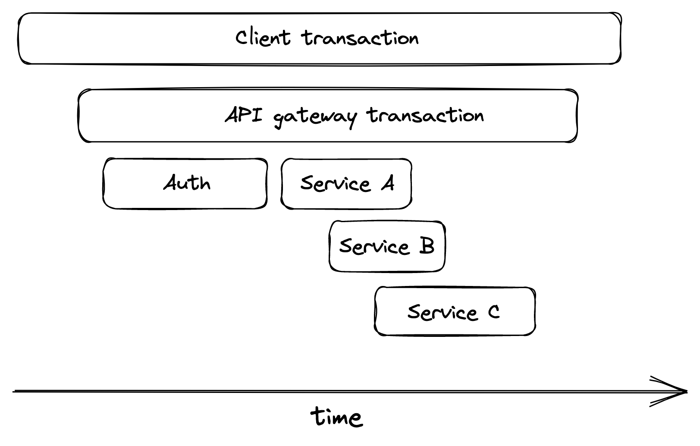

# 可观察性

分布式系统从来都不是 100% 健康的，因为在任何给定时间，总会出现故障。由于宽松的一致性模型和弹性机制（如速率限制、重试和断路器），可以容忍各种故障模式。但是，不幸的是，它们也增加了系统的复杂性。随着复杂性的增加，越来越难以推断出系统可能会经历的大量突发行为，而这些行为是无法预先预测的。

如前所述，人工操作员仍然是运营服务的基本组成部分，因为有些事情无法自动化，比如调试故障的根本原因。调试时，操作员会做出假设并尝试验证它。例如，在注意到过去几周他们的服务响应时间的差异缓慢但稳定地增加后，操作员可能会产生怀疑，这表明某些请求比其他请求花费的时间长得多。将方差的增加与流量的增加相关联后，运营商假设服务越来越接近约束，如资源限制。但单靠指标和图表无助于验证这一假设。

可观察性是一组工具，可提供对生产系统的细粒度洞察力，使人们能够了解其紧急行为。一个好的可观察性平台会尽量减少验证假设所需的时间。这需要具有丰富上下文的细粒度事件，因为不可能预先知道将来有什么用。

在可观察性的核心，我们找到了指标、事件日志和跟踪等遥测资源。指标存储在具有高吞吐量但难以处理高维度的时间序列数据存储中。相反，事件日志和跟踪最终存储在可以处理高维数据[^1]但难以满足高吞吐量的存储中。指标主要用于监控，而事件日志和跟踪主要用于调试。

可观察性是监控的超集。虽然监控只专注于跟踪系统的健康状况，但可观察性还提供了了解和调试系统的工具。例如，监控本身擅长检测故障症状，但不善于解释其根本原因（见图 32.1）。


图 32.1：可观察性是监控的超集。

## 32.1 日志

日志是随时间发生的带有时间戳的事件的不可变列表。事件可以有不同的格式。在最简单的形式中，它只是自由格式的文本。它也可以用文本格式（如 JSON）或二进制格式（如 Protobuf）进行结构化和表示。当结构化时，事件通常用一袋键值对表示：

```json
{
  "failureCount": 1,
  "serviceRegion": "EastUs2",
  "timestamp": 1614438079
}
```

日志可以源自我们的服务或外部依赖项，例如消息代理、代理、数据存储等。大多数语言都提供了可以轻松发出结构化日志的库。日志通常会转储到磁盘文件中，这些文件由代理异步发送到外部日志收集器，例如 ELK stack[^2] 或 AWS CloudWatch 日志。

日志提供了关于服务中发生的一切的大量信息，假设它被正确地检测。它们对于调试目的特别有用，因为它们允许我们从症状（如服务实例崩溃）中追溯根本原因。它们还有助于调查长尾行为，这些行为对于用平均值和百分位数汇总的指标是不可见的，这些指标无法解释特定用户请求失败的原因。

日志很容易发出，尤其是自由格式的文本日志。但这几乎是他们与指标和其他遥测数据相比的唯一优势。如果日志库被误用，会增加我们服务的开销，尤其是当它们不是异步的并且在写入磁盘时会阻塞。此外，如果磁盘由于过多的日志记录而填满，最好的情况是我们会丢失日志，最坏的情况是，服务实例将停止正常工作。

摄取、处理和存储海量数据也不便宜，无论我们是计划在内部进行还是使用第三方服务。尽管结构化二进制日志比文本日志更有效，但由于其高维性，它们仍然很昂贵。

最后，但同样重要的是，日志具有低信噪比，因为它们是细粒度和特定于服务的，这使得提取有用信息具有挑战性。

#### 最佳实践

为了减轻工程师钻探日志的痛苦，有关特定工作单元的所有数据应存储在单个事件中。工作单元通常对应于从队列中拉出的请求或消息。为了有效地实现此模式，处理工作单元的代码路径需要传递包含正在构建的事件的上下文对象。

事件应该包含有关工作单元的有用信息，例如创建者、用途以及成功还是失败。它还应包括测量值，例如特定操作花费的时间。此外，工作单元内执行的每个网络调用都需要进行检测和记录，例如，其响应时间和状态代码。最后，记录到事件中的数据应该经过清理并去除开发人员不应访问的潜在敏感属性，例如用户的个人数据。

在一个工作单元的单个事件中整理所有数据可以最大限度地减少对连接的需求，但并不能完全消除它。例如，如果一个服务调用另一个下游服务，我们将必须执行连接以将调用者的事件日志与被调用者的事件日志相关联，以了解远程调用失败的原因。为了使之成为可能，每个事件都应该包含工作单元的请求（或消息）的标识符。

#### 成本

有多种方法可以控制日志记录的成本。一种简单的方法是让不同的日志记录级别（例如，调试、信息、警告、错误）由动态旋钮控制，该旋钮决定发出哪些日志记录。这允许操作员出于调查目的增加日志记录的详细程度，并在不需要细粒度日志时降低成本。

Sampling[^3] 是我们可以使用的另一个减少冗长的工具。例如，服务可以仅记录每第 n 个事件。此外，还可以根据事件的预期信噪比对事件进行优先级排序：记录失败请求的采样频率应该高于记录成功请求的采样频率。

到目前为止讨论的选项只能减少单个节点上的日志记录冗长程度。随着我们向外扩展并添加更多节点，日志记录量必然会增加。即使有最好的意图，也可能有人会检查导致过度日志记录的错误。为了避免成本飙升或使我们的日志收集器服务超载，日志收集器需要能够对请求进行速率限制。

当然，我们总是可以决定根据事件中收集的测量结果创建内存中的聚合（例如，指标），并只发出那些而不是原始日志。但是，通过这样做，我们权衡了在需要时向下钻取聚合的能力。

##  32.2 踪迹

当请求在分布式系统的服务中传播时，跟踪会捕获请求的整个生命周期。跟踪是表示系统中请求的执行流程的因果关系范围的列表。跨度表示映射到逻辑操作或工作单元的时间间隔，并包含一袋键值对（参见图 32.2）。



图 32.2：执行流程可以用跨度表示。

当请求开始时，它会被分配一个唯一的跟踪 ID。跟踪 ID 在本地执行流中的每个分支处从一个阶段传播到另一个阶段，从一个线程传播到另一个线程，并在网络调用中从调用者传播到被调用者（例如，通过 HTTP 标头）。每个阶段都用一个跨度表示——一个包含跟踪 ID 的事件。

当一个跨度结束时，它被发送到一个收集器服务，该服务通过将它与属于同一跟踪的其他跨度拼接在一起来将它组装成一个跟踪。流行的分布式跟踪收集器包括 Open Zipkin[^4] 和 AWS X-ray[^5]。

跟踪允许开发人员：

- 调试影响非常具体请求的问题，可用于调查客户在支持票中提出的失败请求；
- 调试只影响极小部分请求的罕见问题；
- 调试影响大部分具有共同点的请求的问题，例如命中特定服务实例子集的请求的高响应时间；
- 识别端到端请求路径中的瓶颈；
- 识别哪些用户点击了哪些下游服务以及所占比例（也称为资源归属），可用于限速或计费目的。

跟踪很难改造到现有系统中，因为它需要修改请求路径中的每个组件，以将跟踪上下文从一个阶段传播到另一个阶段。不仅是我们控制下的组件需要支持跟踪；第三方框架、库和服务也需要。[^6]。

## 32.3 组合起来

事件日志的主要缺点是它们是细粒度的和特定于服务的。当一个用户请求流经一个系统时，它可以通过几个服务。一个特定的事件只包含一个特定服务的工作单元的信息，因此它对调试整个请求流没有多大用处。同样，单个事件不会提供有关特定服务的健康或状态的太多信息。

这就是指标和跟踪的用武之地。我们可以将它们视为抽象或派生视图，从事件日志构建并针对特定用例进行优化。指标是通过汇总计数器或对多个事件的观察得出的汇总统计信息的时间序列。例如，我们可以在事件中发出计数器，并让后端在摄取它们时将它们汇总到指标中。事实上，这就是一些指标收集系统的工作方式。

类似地，可以通过将属于特定用户请求生命周期的所有事件聚合到有序列表中来派生跟踪。就像在前一个案例中一样，我们可以发出单独的 span 事件并让后端将它们聚合在一起形成跟踪。

-----------------------

[^1]: Azure Data Explorer 就是这样一种事件存储，请参阅"Azure Data Explorer：大数据分析云平台，针对结构化、半结构化和非结构化数据的交互式、即席查询进行了优化": https://azure.microsoft.com/mediahandler/files/resourcefiles/azure-data-explorer/Azure_Data_Explorer_white_paper.pdf
[^2]: "什么是 ELK Stack？": https://www.elastic.co/what-is/elk-stack
[^3]: "示例动态采样": https://www.honeycomb.io/blog/dynamic-sampling-by-example/
[^4]: "Zipkin：分布式跟踪系统": https://zipkin.io/
[^5]: "AWS X 射线": https://aws.amazon.com/xray/
[^6]: 服务网格模式可以帮助改造跟踪。